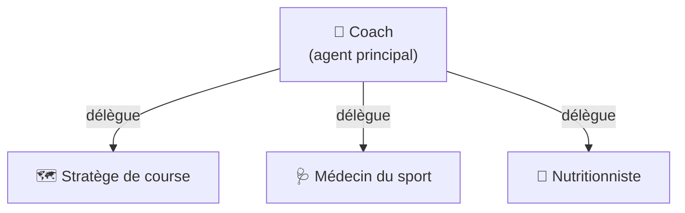

# Agents

<div class="arc-page-banner" markdown>

</div>

`ai-running-coach` fournit **4 agents spécialisés** qui collaborent pour vous aider à préparer votre objectif. Vous choisissez lesquels installer.

## Choisir son staff

Seuls les agents que vous retenez sont déployés, et le coach ne délègue qu'à eux.

```bash
./install.sh --no-medical                  # tout sauf le médecin
./install.sh --agents coach,nutritionist   # staff explicite
```

Le choix est écrit dans `config/workspace.user.toml` → `[agents].enabled`, donc une
réinstallation sans option le respecte. Réactiver un agent le réinstalle ; le
désactiver le retire des dossiers d'agents de tous les IDE.

`coach` est indispensable : c'est lui qui planifie et pousse vers Garmin.
Le détail de ce que vous perdez agent par agent est dans
[Configuration](configuration.md#le-staff-agents).

!!! warning "Retirer le médecin ne désactive pas le bilan santé"
    Le bilan matinal (HRV, FC de repos, readiness) est un mandat porté par le
    **coach**. Pour le désactiver, utilisez
    [`[health].morning_check`](configuration.md#le-bilan-matinal-health).

## Vue d'ensemble



## Les agents

<div class="arc-team" markdown>

<div class="arc-agent" markdown>

### 🏃 Coach

`coach.md` — L'agent **principal**. Il gère :

- La **définition et le suivi de l'objectif** (`planning/active_objective.md`)
- La **planification hebdomadaire** et l'ajustement des séances
- Les **garde-fous** (`scripts/arc_guardrails.py`) avant toute écriture/push, et le **journal de décisions** qui en garde la trace (`planning/YYYY-MM-DD_decision_<slug>.md`)
- Les **cibles personnelles d'une séance** (zones FC, allure GAP, D+ de côte — `scripts/arc_workout_targets.py`) avant chaque push Garmin
- Le score **Trail Shape** (préparation à l'objectif actif), la **projection de forme jusqu'à la course** (estimation à partir du planifié) et le **kilométrage des chaussures**
- Les **indices de performance ITRA/UTMB**, en lecture seule
- Le **débrief post-course** plan vs réalisé, par segment
- Le **push des séances dans le calendrier Garmin Connect**
- L'analyse **météo** avant chaque validation
- La **récupération cardiaque (HRR)** dans chaque analyse de séance
- La **dépense énergétique** modèle vs Garmin dans chaque retour de séance (Garmin reste la référence)
- La coordination des autres agents

[→ Détails de l'agent coach](agents/coach.md)

</div>

<div class="arc-agent" markdown>

### 🗺️ Stratège de course

`course-strategist.md` — Spécialiste de la **stratégie de course** :

- Analyse du **parcours** (GPX ou URL)
- Points d'eau et ravitaillement (OpenStreetMap)
- **Allures par segment**, depuis le modèle personnel pente → allure de l'athlète (`scripts/arc_race_pacing.py`), en **3 scénarios** (ambitieux, réaliste, sécurité)
- **Dépense énergétique prévue par section** (kcal/h, cumul), en regard du plan de ravitaillement
- Plan de **nutrition** et **hydratation** en course
- Préparation **météo** et **matériel**
- Téléversement du **GPX enrichi** vers Garmin (points d'eau en waypoints)
- Le **débrief post-course** (calcul), remis au coach pour l'écriture dans `rapports/`

[→ Détails de l'agent stratège](agents/course-strategist.md)

</div>

<div class="arc-agent" markdown>

### 🩺 Médecin

`medical.md` — Spécialiste de la **récupération** et de la **santé** :

- Analyse des métriques de santé (HRV, sommeil, stress)
- **Gatekeeper** de la disponibilité à l'entraînement
- Le **drapeau composite de risque de blessure** (`scripts/arc_guardrails.py injury-risk`) — 3 paliers, jamais un diagnostic, seuil de consultation
- La **dette de sommeil sur 7 jours**
- La **douleur déclarée** comme donnée structurée (via `/log`)
- Prévention des blessures
- Coordination avec le coach et le nutritionniste

[→ Détails de l'agent médecin](agents/medical.md)

</div>

<div class="arc-agent" markdown>

### 🥗 Nutritionniste

`nutritionist.md` — Spécialiste de la **nutrition sportive** :

- Suivi des **macros** (glucides, protéines, lipides)
- Stratégie de **poids de course**
- Le **plafond de glucides/h** réellement toléré à l'entraînement (`scripts/arc_index.py fueling`)
- Le **taux de sudation** (dérivé des pesées avant/après séance)
- Le **débrief post-course** : suit les écarts de glucides/h relevés vs objectif/plafond
- Recharge en glycogène après les séances intenses
- Comparaison apports / dépenses (calories Garmin, référence par défaut ; le modèle indépendant n'est qu'un contrôle, jamais un double comptage)

[→ Détails de l'agent nutritionniste](agents/nutritionist.md)

</div>

</div>

## Comment les agents collaborent

1. Vous demandez à l'agent **`coach`** de définir votre objectif
2. Le coach établit le plan d'entraînement et le pousse dans **Garmin Connect**
3. Le coach **délègue** aux agents spécialisés selon les besoins :
   - **Stratège de course** : analyse du parcours et stratégie
   - **Médecin** : évaluation de la récupération et de la santé
   - **Nutritionniste** : plan nutritionnel
4. Chaque agent **persiste** ses résultats dans les dossiers dédiés (`planning/`, `medical/`, `nutrition/`, `rapports/`)

## Dossiers de travail

| Dossier | Contenu |
|---|---|
| `planning/` | Objectif actif, plans hebdomadaires, profil du coureur, plans de course, **décisions tracées** (`YYYY-MM-DD_decision_<slug>.md` — garde-fou, bilan matinal, blessure…) |
| `activities/` | Activités Garmin synchronisées |
| `medical/` | Santé, sommeil, récupération, météo |
| `nutrition/` | Journaux nutritionnels |
| `rapports/` | Rapports de synthèse hebdomadaires et **débriefs post-course** (`YYYY-MM-DD_debrief_<course>.md`) |
| `gear/` | Inspections photo des chaussures (`YYYY-MM-DD_<gear_id>_inspection.md`, photos dans `gear/photos/`) — coach |
| `resources/` | Documents de référence (fournis par l'utilisateur) |
