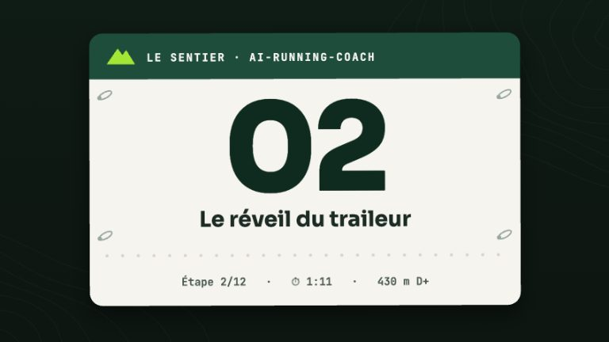
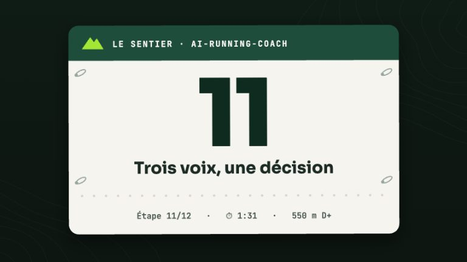

# Configuration

Tout se règle dans deux fichiers TOML, et un profil en Markdown.

| Fichier | Rôle | Versionné ? |
|---|---|---|
| `config/workspace.toml` | Défauts partagés, livrés avec le projet | oui |
| `config/workspace.user.toml` | **Vos** réglages — ils priment, clé par clé | non (gitignoré) |
| `planning/Runner_Profile.md` | Votre profil : physiologie, blessures, matériel, préférences | non |

La façon normale de les remplir est [`/coach-setup`](skills/coach-setup.md).
Rien n'interdit de les éditer à la main ensuite.

!!! tip "Annuler un héritage"
    Une clé **présente mais vide** dans `workspace.user.toml` gagne sur la valeur
    partagée. C'est ainsi qu'on efface une valeur au lieu de la remplacer.

## Le staff — `[agents]`

```toml
[agents]
enabled = ["coach", "medical", "nutritionist", "course-strategist"]
```

Seuls les agents listés sont installés, et le coach ne délègue qu'à eux. `coach`
est indispensable : c'est lui qui planifie et pousse vers le calendrier Garmin.

```bash
./install.sh --no-medical                  # tout sauf le médecin
./install.sh --agents coach,nutritionist   # staff explicite
```

L'option écrit `[agents].enabled`, si bien qu'une réinstallation sans option
respecte votre choix. Réactiver un agent le réinstalle ; le désactiver le retire
pour de bon des dossiers `.claude/agents`, `.opencode/agents` et
`.github/agents`.

Ce que vous perdez en retirant un agent :

| Retiré | Conséquence |
|---|---|
| `medical` | Plus de gatekeeper ni de protocole blessure. Le coach applique lui-même `[health].morning_check` et vous renvoie vers un vrai médecin pour tout ce qui est clinique. |
| `nutritionist` | Plus de plan de macros ni de poids de forme. Le coach garde des conseils de ravitaillement génériques dans les notes de séance. |
| `course-strategist` | Plus de plan de course détaillé. Le coach analyse quand même un GPX avec le skill `gpx-analysis`. |

## Le bilan matinal — `[health]`

<!-- arc-video:bilan-matinal -->
<div class="arc-video-card" markdown>

[](video/bilan-matinal/index.html)

<div markdown>

<span class="arc-video__meta">En vidéo · Étape 02 · 1 min 19</span>

**[Le réveil du traileur](video/bilan-matinal/index.html)** — HRV, FC de repos et readiness lues ensemble chaque matin : le verdict, sa raison, et comment régler le bilan.

[Regarder](video/bilan-matinal/index.html) · [English](video/bilan-matinal/index.html?lang=en) · [Toutes les vidéos](videos.md)

</div>

</div>
<!-- /arc-video -->


```toml
[health]
morning_check = "full"   # full | minimal | off
```

| Valeur | Ce que fait le coach |
|---|---|
| `full` | HRV + FC de repos + readiness avant toute décision de séance. Défaut, recommandé. |
| `minimal` | Readiness seule, en une ligne. Aucune annulation sur les seules données de santé. |
| `off` | Aucune donnée de santé récupérée. Planification sur la charge d'entraînement et votre ressenti. |

!!! warning "Ce n'est pas la même chose que retirer l'agent `medical`"
    Le bilan matinal est un mandat porté par le **coach**, pas par le médecin.
    Retirer l'agent `medical` ne le désactive pas — il faut `morning_check`.
    Inversement, `off` n'empêche pas le médecin de répondre à une question de
    santé que vous posez.

Passez à `minimal` ou `off` si votre montre ne mesure pas la HRV, ou si vous ne
souhaitez pas que votre entraînement dépende de ces données.

## Le seuil de chaleur — `[health].heat_threshold_c`

```toml
[health]
heat_threshold_c = 25.0   # °C, borne INCLUSE
```

Une séance outdoor compte comme « chaude » (KPI d'acclimatation à la chaleur,
#38) quand la température maximale du jour au lieu de la séance est **≥** ce
seuil. Défaut 25 °C. Indépendant de `morning_check` ci-dessus : le calcul joint
les activités et la météo, il ne dépend pas du bilan matinal — il tourne même
avec `morning_check = "off"`.

!!! warning "Une valeur invalide ne casse jamais l'index"
    `heat_threshold_c = "chaud"` (ou tout autre texte non numérique, ou un
    booléen) ne fait planter ni `scripts/arc_index.py`, ni le tableau de bord :
    un avertissement est affiché et le défaut (25 °C) s'applique à la place.

## Les coefficients de pacing personnels — `[pacing.personal]`

```toml
[pacing.personal]
night_penalty_pct = 6.5    # pénalité de nuit à pleine nuit, % (défaut 5.0 ; 0 à 30)
technicity_scale = 1.2     # échelle du surcoût de technicité (défaut 1.0 ; 0,25 à 3)
heat_hot_factor = 1.14     # facteur de temps au-dessus du seuil chaud (défaut 1.10 ; 1,0 à 1,4)
altitude_scale = 1.1       # échelle du surcoût d'altitude (défaut 1.0 ; 0,25 à 3) — #185
evidence = ["2026-09-27|trail-x|night|14|7.8"]   # preuves cumulées, une par course et facteur
```

Section **absente par défaut**, dans `config/workspace.user.toml` (jamais le
fichier versionné). Elle est écrite par
`arc_race_debrief.py … --calibrate --apply`, **uniquement après la confirmation
explicite de l'athlète** au débrief d'une course (voir
[le stratège de course](agents/course-strategist.md#recalibrage-des-coefficients-au-debrief-188)) ;
vous pouvez aussi la renseigner à la main. `arc_race_pacing.py` la lit à chaque
plan : **drapeau CLI** (`--night-penalty-pct`, `--altitude-loss-pct`) **>**
`[pacing.personal]` **>** défaut du projet. `technicity_scale` et `altitude_scale`
multiplient le **surcoût** de chaque section (facteur − 1) : avec
`altitude_scale = 1.1`, une section à +8 % devient +8,8 % ; c'est la grandeur
que mesure le recalibrage. `altitude_scale` ne joue que si la pénalité
d'altitude s'applique (section au-dessus du seuil, sans `--no-altitude`) et
s'efface devant `--altitude-loss-pct`. Sans la section, le plan est identique octet pour octet.
`evidence` est tenue par le script : ne la modifiez pas à la main.

!!! warning "Une valeur invalide ne casse jamais le plan"
    Une valeur non numérique ou hors bornes est ignorée avec un avertissement
    et le défaut s'applique.

## Le cycle menstruel — `[health].cycle_tracking` (#166)

```toml
[health]
cycle_tracking = "off"   # off (défaut) | garmin | intervals | manual
```

**Opt-in strict.** À `off` (défaut, ou clé absente), aucune donnée de cycle n'est lue, aucun outil
n'est exposé et aucun agent n'en parle. `garmin` ajoute à la liste blanche `GARMIN_ENABLED_TOOLS`
les outils `get_menstrual_data_for_date` et `get_menstrual_calendar_data` — **relancez
`./install.sh`** après le changement (ou installez avec `--cycle-tracking garmin`, qui écrit la
clé) ; `intervals` lit le champ `menstrualPhase` d'intervals.icu, `manual` la déclaration via
`/log`. Avec `[data].source = "strava"` (#164), seul `manual` a un effet : Strava n'expose
aucune donnée de cycle. Le cycle n'est qu'un **contexte** de lecture du bilan matinal : jamais une règle, jamais un
diagnostic, jamais un assouplissement d'un verdict rouge.

!!! warning "Une valeur invalide ne casse rien"
    Une valeur hors de `off`/`garmin`/`intervals`/`manual` est traitée comme `off`, avec un
    avertissement : jamais d'exception, jamais de suivi activé par accident.

Détail, vérifications et sources : [Cycle menstruel](cycle-menstruel.md).

## La poussée des apports vers Garmin — `[nutrition].garmin_sync` (#167)

```toml
[nutrition]
garmin_sync = "off"   # off (défaut) | ask
```

**Opt-in strict.** À `off` (défaut, ou clé absente), rien n'est poussé, aucun outil n'est exposé et
aucun agent n'en parle. `ask` : après un `/log` ou un rapport nutrition, le coach **propose** de
pousser l'apport vers le journal alimentaire et l'hydratation de Garmin Connect ; chaque poussée
exige un « oui » explicite, n'a jamais lieu en headless (`/garmin-daily-sync`) et reste idempotente.
Les outils ne sont ajoutés à la liste blanche qu'à l'installation : **relancez `./install.sh`**
après le changement (ou installez avec `--nutrition-sync ask`, qui écrit la clé). Indisponible avec
`[data].source = "intervals"` ou `"strava"`, et en mode passerelle `--use-leanproxy` (refusé : les écritures n'y
sont pas filtrables en headless). Une seule source de vérité par jour (fichiers du dépôt **ou** journal
Garmin, jamais les deux) : voir [Apports vers Garmin](nutrition-garmin.md).

!!! warning "Une valeur invalide ne casse rien"
    Une valeur hors de `off`/`ask` est traitée comme `off`, avec un avertissement.

## La source de données — `[data].source` (#68)

```toml
[data]
source = "garmin"   # garmin (défaut) | intervals | strava
```

Écrite automatiquement par `./install.sh --source garmin|intervals|strava` — voir
[Configuration Garmin](garmin-setup.md),
[Configuration Intervals.icu](intervals-setup.md) et
[Configuration Strava](strava-setup.md). Change les outils MCP
appelés par `coach`/`medical`/`garmin-daily-sync` pour les activités, la
santé et le calendrier planifié (table de correspondance complète dans
`AGENTS.md`). Sans montre Garmin, `intervals` ouvre le projet aux données
COROS/Suunto/Polar/Apple synchronisées sur Intervals.icu.

!!! warning "Fonctionnalités indisponibles avec `intervals`"
    Le score de readiness algorithmique de Garmin, le téléchargement FIT (et
    les KPI qui en dépendent) et l'upload de parcours n'ont pas d'équivalent
    câblé dans ce projet côté Intervals.icu — l'agent le dit explicitement
    plutôt que d'inventer une valeur. Détail dans
    [Configuration Intervals.icu](intervals-setup.md).

!!! warning "Avec `strava` (#164)"
    Strava n'expose ni HRV, ni FC de repos, ni sommeil, ni readiness : le bilan matinal
    (`[health].morning_check`) est dit **indisponible** (jamais simulé), même à `full`, et il
    n'y a ni calendrier ni push de séances. En revanche les flux par seconde alimentent les KPI
    du FIT (zones, GAP, découplage, VAM…) via `download_fit.py --source strava`. Prérequis :
    Node.js 18+. Détail dans [Configuration Strava](strava-setup.md).

## Le style de coaching — `[coaching]`

<!-- arc-video:styles-coaching -->
<div class="arc-video-card" markdown>

[](video/styles-coaching/index.html)

<div markdown>

<span class="arc-video__meta">En vidéo · Étape 11 · 1 min 46</span>

**[Trois voix, une décision](video/styles-coaching/index.html)** — La même décision dite par trois styles de coaching : le ton, la fermeté et la longueur se règlent, jamais le verdict.

[Regarder](video/styles-coaching/index.html) · [English](video/styles-coaching/index.html?lang=en) · [Toutes les vidéos](videos.md)

</div>

</div>
<!-- /arc-video -->


```toml
[coaching]
style     = "bienveillant"   # bienveillant | exigeant | factuel | pedagogue
intensity = "balanced"       # gentle | balanced | strong
verbosity = "standard"       # brief | standard | detailed
```

### Styles de coaching

| Style | Ce que ça change |
|---|---|
| `bienveillant` | Chaleureux, valorise la régularité, explique le pourquoi. |
| `exigeant` | Direct, vous tient à vos engagements, nomme les séances manquées, ne console pas. |
| `factuel` | Verdict d'abord, chiffres, zéro remplissage motivationnel. |
| `pedagogue` | Développe la physiologie derrière chaque décision. |

`intensity` règle la fermeté (proposer / recommander / trancher), `verbosity` la
longueur. Le catalogue complet, avec les règles qui s'appliquent quel que soit le
style, est dans [`config/coaching-styles.md`](https://github.com/mmornati/ai-running-coach/blob/main/config/coaching-styles.md).

!!! note "Le style ne change jamais le fond"
    Une séance annulée pour raison médicale reste annulée en `bienveillant`
    comme en `exigeant`. Le ton décide de la formulation, jamais du verdict.

Ce qui ne rentre pas dans un identifiant — « ce qui me motive », « ne me parle
jamais de mon poids » — s'écrit dans la section « Préférences de coaching » de
votre profil, **qui prime sur le catalogue**.

## La discipline — `[sport]`

```toml
[sport]
primary     = "trail"    # trail | road
disciplines = ["cycling", "strength"]
```

`primary` charge un profil de sport qui définit l'unité de charge, le vocabulaire
des séances, les corrections de terrain et le matériel par défaut.

| Profil | Raisonne en |
|---|---|
| `trail` | Temps d'effort et D+ ; corrections de terrain ; marche rapide prescrite en forte pente. |
| `road` | Kilomètres et allures dérivées d'une performance récente ; pas d'objectif de D+. |

`disciplines` liste vos sports croisés : ce sont les seuls que le coach s'autorise
à programmer.

## L'athlète — `[athlete]`

```toml
[athlete]
profile = "planning/Runner_Profile.md"
units   = "metric"       # metric | imperial
```

Deux champs du profil changent le quotidien :

- **Lieu par défaut** — sans lui, la météo est redemandée à chaque validation.
- **Créneau habituel** — sans lui, le coach doit vous le demander avant de placer
  vos séances.

Deux champs de la section « Physiologie » alimentent le
[tableau de bord](dashboard/index.md) : **FC max** et **FC de repos de référence**
(la **FC au seuil** et le **sexe**, facultatifs, affinent le calcul de charge).

### Méthode des zones FC — `[athlete].hr_zones`

```toml
[athlete]
hr_zones = "auto"   # auto | lthr | karvonen | percent_max
```

Détermine comment le temps en zone et la polarisation 80/20 (#43) sont
calculés à partir des champs de la section « Physiologie » du profil :

| Valeur | Méthode | Repli si le champ requis manque |
|---|---|---|
| `auto` (défaut) | FC au seuil (LTHR) si connue, sinon Karvonen (FC max/repos), sinon %FCmax (FC max seule) | — c'est la précédence elle-même |
| `lthr` | Force la FC au seuil | Rien (jamais de repli implicite) |
| `karvonen` | Force la réserve FC (FC max − FC repos) | Rien si FC max ou repos absente |
| `percent_max` | Force le %FCmax | Rien si FC max absente |

Une valeur autre que `auto` **force** cette méthode, sans repli automatique
vers une autre si le champ requis manque au profil.

## Les métriques dérivées — `[metrics]`

```toml
[metrics]
climb_min_gain_m = 50.0      # m, gain d'altitude minimal pour détecter une montée
climb_min_grade_pct = 5.0    # points de %, pente moyenne minimale
```

Détection des montées (VAM, #46) : les **deux** critères doivent être atteints
pour qu'une montée soit reconnue. Ajustez au terrain habituel — montez
`climb_min_gain_m` en plaine vallonnée pour ignorer les faux plats,
descendez-le en montagne pour capter de courts raidillons.

## La correction d'altitude — `[elevation]` et `[privacy]` (#176)

```toml
[elevation]
dem = "off"      # "off" (défaut) | "auto"
step_m = 50      # pas d'amincissement des coordonnées envoyées (m)
cache = true     # cache local <workspace>/.arc/dem-cache.json

[privacy]
dem_for_activities = false   # opt-in : comparaison altitude enregistrée / MNT d'une séance
dem_trim_m = 500             # mètres jamais envoyés en début et fin de séance (200 à 5000)
```

Rééchantillonne l'altitude d'un GPX de course sur un modèle numérique de terrain
(IGN RGE ALTI en France, Copernicus GLO-90 via Open-Meteo ailleurs). **Rien n'est
envoyé par défaut** : `dem = "auto"` corrige d'office les parcours de course
(`analyze_gpx.py`, `arc_race_pacing.py`), `--dem` le fait pour un appel ; les
traces de séances ne partent qu'avec `dem_for_activities = true`, sans leurs
`dem_trim_m` premiers et derniers mètres (protection partielle du domicile). Seules des
coordonnées arrondies et amincies sont envoyées. Détails, licences, limites :
[Correction altimétrique](elevation.md).

## Les garde-fous — `[guardrails]`

```toml
[guardrails]
enabled = true
r1_acwr_max = 1.3
r2_volume_increase_max_pct = 10.0
r2_volume_reference = "mean4"           # mean4 (défaut) | previous_week
r3_elevation_increase_max_pct = 10.0
r4_monotony_max = 2.0
r6_long_run_share_max_pct = 35.0
severity_r1_acwr_projected = "warn"     # info | warn | block
severity_r2_weekly_volume_jump = "warn"
severity_r3_weekly_elevation_jump = "warn"
severity_r4_monotony_projected = "warn"
severity_r5_quality_after_red = "block"
severity_r6_long_run_share = "warn"
severity_r7_consecutive_quality = "warn"
```

Chaque règle (R1 à R7) a sa propre clé `severity_<id>` — seule R5 (qualité
après un verdict santé rouge) bloque par défaut, les autres sont `warn`. Le
détail de chaque règle (R2 : hausse de volume, R3 : hausse de D+, R4 :
monotonie de Foster, R6 : part de la plus longue sortie, R7 : deux séances de
qualité rapprochées) est dans [Les garde-fous](guardrails.md#les-sept-regles).

Le moteur de garde-fous déterministe ([`scripts/arc_guardrails.py`](guardrails.md))
est un second avis purement calculé, consulté par le coach avant d'écrire une
semaine et avant de la pousser au calendrier Garmin. Chaque règle (R1 à R7) a son
seuil et sa sévérité propres — voir [la page dédiée](guardrails.md) pour le détail,
les sources et le format de sortie.

!!! note "Le style ne change jamais le fond, ici non plus"
    Une violation `block` (par défaut : qualité après un verdict rouge
    seulement — voir ci-dessous) reste bloquante quel que soit
    `[coaching].style` — voir « Le style ne change jamais le fond » ci-dessus.

!!! warning "R1 (ACWR) est `warn` par défaut, pas `block`"
    Les seuils publiés pour le ratio de charge aiguë/chronique viennent
    d'études en sports collectifs, avec une méthode de calcul différente de
    celle utilisée ici (voyez [la page dédiée](guardrails.md#sources) pour le
    détail) — la preuve est elle-même discutée dans la littérature de course à
    pied. Remettez `severity_r1_acwr_projected` à `"block"` si vous préférez la
    fermeté.

## Le drapeau de risque de blessure

!!! note "Section absente de `config/workspace.toml` par défaut"
    Contrairement aux sections ci-dessus, `[injury_risk]` n'a pas de valeurs
    livrées dans `config/workspace.toml` — chaque seuil a un défaut intégré au
    script (`scripts/arc_guardrails.py`). Le bloc ci-dessous n'est utile que si
    vous voulez **surcharger** un ou plusieurs seuils : ajoutez-le à
    `config/workspace.user.toml` avec uniquement les clés que vous changez.

```toml
[injury_risk]
enabled = true
acwr_max = 1.3
monotony_max = 2.0
pain_score_threshold = 4.0               # (0, 10]
pain_consult_threshold = 7.0             # (0, 10] — douleur sévère : level forcé "high", consult: true
pain_window_days = 3                     # entier >= 1
mismatch_ratio_max = 1.3
sleep_debt_alert_s = 36000               # 10 h, en secondes
```

Section `[injury_risk]`. Drapeau composite ([#57](https://github.com/mmornati/ai-running-coach/issues/57),
[`scripts/arc_guardrails.py injury-risk`](guardrails.md#drapeau-composite-de-risque-de-blessure-57))
qui combine ACWR/monotonie réels, douleur déclarée, écart effort perçu/charge
FC, dette de sommeil et verdict rouge récent en un niveau à 3 paliers
(`low`/`moderate`/`high`), toujours non-diagnostique — voir la page dédiée
pour le détail de chaque facteur, ses conditions de saut (historique
insuffisant, bilan matinal désactivé…) et l'escalade automatique à `high` sur
une douleur sévère. Une valeur hors plage (ex. `pain_score_threshold = 15`,
`pain_window_days = 0.5`) retombe sur son défaut avec un avertissement sur
stderr, jamais silencieusement.

## Le tableau de bord — `[dashboard]`

```toml
[dashboard]
port = 8765
```

Port du [tableau de bord local](dashboard/index.md). S'il est pris, les 9 suivants sont
essayés. L'adresse d'écoute, elle, n'est pas réglable : `127.0.0.1` uniquement. Seul le
[conteneur Docker](dashboard/docker.md) écoute ailleurs, derrière un reverse proxy
authentifié.

## La langue — `[language]`

```toml
[language]
documents = "fr"    # code ISO 639-1 des fichiers Markdown persistés
responses = "auto"  # auto = même langue que la requête de l'utilisateur
```

| Clé | Effet |
|---|---|
| `documents` | Langue des fichiers Markdown écrits par les agents/skills (`activities/`, `medical/`, `nutrition/`, `planning/`, `rapports/`, `gear/`) — titres, tableaux, labels, contenu. Défaut `fr`. |
| `responses` | Langue des réponses à l'utilisateur dans la conversation. `auto` (défaut) reprend la langue de la requête ; une valeur explicite (`en`, `nl`…) la fige, y compris pour les commandes headless (`/garmin-daily-sync`) qui n'ont pas de requête à imiter. |

Les instructions des agents/skills restent en anglais ou en français selon le
fichier — seule la langue de *sortie* (documents persistés, réponses) est
réglée ici.

## La synchronisation — `[sync]`

`scripts/daily-sync.sh` lit ces clés à **chaque** exécution (pas de réinstallation du cron
pour les changer, sauf `mode`/`times`, voir [Le coach dans la poche](mobile.md)).

| Clé | Effet |
|---|---|
| `runner` | `"claude"` (défaut) \| `"codex"` \| `"copilot"` \| `"opencode"` \| `"gemini"` \| `"cursor"`. L'application macOS sélectionne automatiquement l'assistant choisi. |
| `model` | Pour `opencode` en mode API, identifiant `fournisseur/modèle` (ex. `openrouter/deepseek/deepseek-v4.1-flash`). Sans modèle ni clé API, OpenCode réutilise le fournisseur connecté. Optionnel pour `claude` en mode API. |
| `base_url` | Point d'accès d'une API compatible OpenAI autre qu'OpenRouter (runner `opencode`). |
| `api_key_env` | **Nom** de la variable qui porte la clé, lue dans `~/.config/ai-running-coach/llm.env` (mode 600). Non vide = mode API, facturé au token ; vide (défaut) = abonnement. Jamais la clé elle-même. |
| `daily_budget_eur` | Plafond de dépense quotidien (défaut `0.5`), appliqué seulement quand le runner rapporte son coût (`opencode`, `claude` en mode API). Atteint : run sauté, une notification par jour. |

`./install.sh --llm openrouter|anthropic|openai` écrit ces clés (et `[chat]`) ;
`./install.sh --sync-runner CLI` choisit l'assistant headless et `./install.sh --sync-budget EUR` écrit `daily_budget_eur`. Détails, budget et données de
santé : [Synchronisation sur OpenRouter](mobile.md#synchronisation-sur-openrouter-ou-toute-api-compatible-openai).

## Le chat avec le coach — `[chat]`

Service optionnel du tableau de bord ([page dédiée](dashboard/chat.md)), désactivé par
défaut. Installé par `./install.sh --chat` (`scripts/coach-chat.sh`).

| Clé | Effet |
|---|---|
| `enabled` | `false` (défaut) \| `true`. |
| `backend` | `"claude"` (Claude Agent SDK, `pip install claude-agent-sdk`) \| `"opencode"` (OpenRouter, OpenAI, Mistral, Ollama…). |
| `model` | Défaut `claude-sonnet-5-5`. Backend `opencode` : `fournisseur/modèle`. |
| `base_url` | Backend `opencode` + API compatible OpenAI autre qu'OpenRouter. |
| `api_key_env` | Nom de la variable de `llm.env` (défaut `ANTHROPIC_API_KEY`). |
| `port`, `listen` | Port (8766) et interface d'écoute (`127.0.0.1`). |
| `auth` | `"local"` (boucle locale seulement) \| `"proxy"` (identité transmise par le SSO du reverse proxy). |
| `auth_header`, `allowed_users`, `trusted_proxies`, `allowed_hosts` | Mode `proxy` : en-tête d'identité (`X-authentik-username`, Authelia : `Remote-User`), utilisateurs admis (vide = tous), adresses source de Traefik (IP, réseau CIDR ou nom d'hôte résolu par le DNS — ex. le conteneur `traefik`), hôtes acceptés. Voir `deploy/chat/traefik/README.md`. |
| `public_url` | URL publique du tableau de bord, requise pour les boutons ntfy. |
| `daily_budget_eur`, `usd_eur_rate` | Plafond de dépense quotidien (défaut `2.0`) ; conversion USD → EUR (`0.92`). Le reste du jour est réservé par tour en cours (une conversation simultanée est refusée tant qu'il est réservé). |
| `turn_budget_max_eur` | Plafond de dépense d'un tour (défaut `1.0` €) ; le reste du budget du jour reste disponible pour une autre conversation ou une approbation tardive. `0` = un tour peut réserver tout le reste du jour. |
| `max_turns`, `rate_limit_per_min` | Tours d'agent par message (30) ; tours par minute et par utilisateur (6). |
| `approval_wait_s`, `approval_ttl_s` | Attente en cours de tour d'une approbation (600 s) ; durée de vie d'une proposition en attente (86400 s). |
| `ntfy_approvals`, `ntfy_quick_approve`, `ntfy_token_ttl_s` | Notification d'approbation (bouton « Ouvrir »), boutons « Appliquer / Refuser » à jetons à usage unique, durée de vie des jetons (1800 s). **Les boutons rapides ne sont envoyés que si `[notifications].ntfy_token_file` est renseigné** (sujet ntfy à accès contrôlé) : le jeton voyage dans la notification, donc tout abonné d'un sujet public pourrait approuver. Sans ce fichier, seul « Ouvrir » part, avec un avertissement dans le journal. **Le fichier ne garantit pas que le sujet est protégé en lecture** : il faut des ACL de lecture côté ntfy (`auth-default-access: deny-all` + un utilisateur avec droits de lecture/écriture), sinon mettre `ntfy_quick_approve = false`. |
| `ntfy_delay_s` | Délai (60 s) avant le push ntfy quand une page est ouverte ; sans page, le push part tout de suite. |

La clé API n'est jamais dans ce fichier : `~/.config/ai-running-coach/llm.env`.
Variables d'environnement (dépannage, jamais nécessaires en usage courant) : `ARC_LLM_ENV` (autre chemin que
`llm.env`, lu par le service, `daily-sync.sh` et `install.sh`), `ARC_CHAT_PING_S` (intervalle des
commentaires `: ping` du flux SSE, 15 s), `ARC_OPENCODE_TRACE` (fichier où recopier chaque évènement brut
d'OpenCode — contenu des échanges compris : diagnostic seulement, fichier à supprimer ensuite).
`./install.sh --chat-budget EUR` écrit `daily_budget_eur`. Le diagnostic :
`python3 scripts/coach_doctor.py --check llm_config` (et `chat_service`, `opencode_cli`).

## Le bot Telegram — `[telegram]` (#174)

Canal optionnel, désactivé par défaut ([page dédiée](telegram.md)). Installé par
`./install.sh --telegram` (`scripts/coach-telegram.sh`).

| Clé | Effet |
|---|---|
| `enabled` | `false` (défaut) \| `true`. |
| `token_file` | Fichier du jeton du bot (`TELEGRAM_BOT_TOKEN=…`), hors dépôt, mode 600 (défaut `~/.config/ai-running-coach/telegram.env`). Le jeton n'est jamais dans le TOML. |
| `allowed_chat_ids` | Liste blanche des identifiants de chat. **Vide = tout est refusé.** Un chat inconnu ne reçoit aucune réponse. |
| `send_summary` | `true` (défaut) : le résumé du daily-sync part aussi sur Telegram, avec ses boutons (en plus de ntfy s'il est configuré). |
| `chat_bridge` | `false` (défaut). `true` : le texte libre est relayé au service du chat (`[chat]`), avec sa politique, ses approbations et son plafond ; exige `[chat].enabled = true`, `auth = "local"` et une clé d'API facturée. |
| `poll_timeout_s` | Durée d'une interrogation longue `getUpdates` (30 s). |

Les retours en un geste ne demandent aucune clé d'API. Variable d'environnement de test :
`ARC_TELEGRAM_API_BASE` (https, ou http en boucle locale seulement). Le diagnostic :
`python3 scripts/coach_doctor.py --check telegram`.

## Notifications et synchronisation

`[notifications]` et `[sync]` sont décrits dans
[Votre workspace privé](workspace.md) et [Le coach dans la poche](mobile.md).

## Vérifier

```bash
python3 scripts/coach_setup.py --status
```

Affiche le workspace détecté, les questions restant à poser, les fichiers
installés et si votre configuration personnelle est bien exclue de git.
