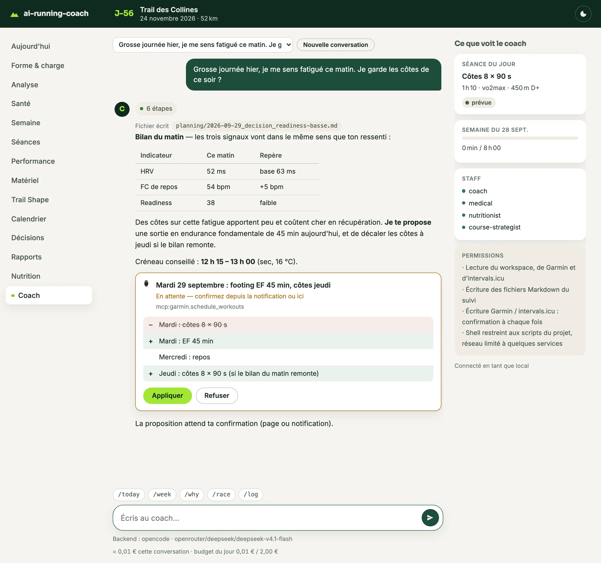
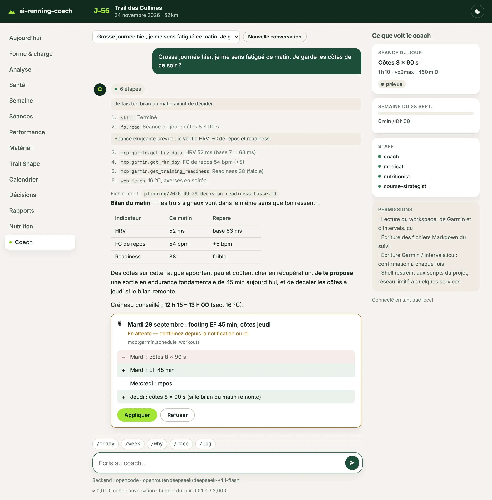
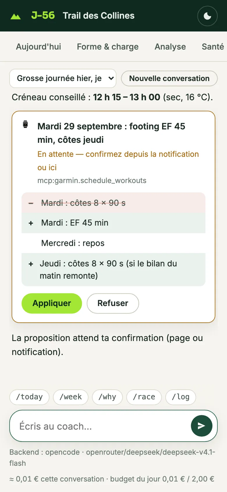
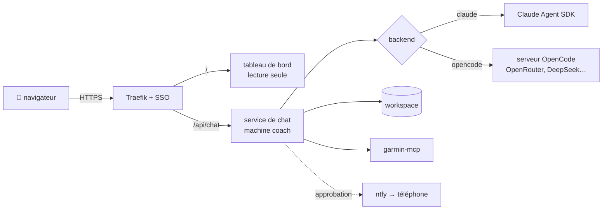

# Le chat avec le coach

La page **Coach** du tableau de bord : vous écrivez au coach depuis le navigateur — ordinateur
ou téléphone —, avec la même connexion que le reste du tableau de bord. Derrière, ce sont les
mêmes agents, les mêmes skills, le même serveur MCP Garmin et les mêmes fichiers Markdown
qu'en session dans votre IDE : le chat n'invente aucune source de vérité.

<!-- arc-video:chat-coach -->
<div class="arc-video-card" markdown>

[](../video/chat-coach/index.html)

<div markdown>

<span class="arc-video__meta">En vidéo · Étape 04 · 1 min 33</span>

**[Parler à son coach](../video/chat-coach/index.html)** — Le chat du tableau de bord : trace des outils, carte d'approbation, politique de permissions, budget et fournisseurs.

[Regarder](../video/chat-coach/index.html) · [English](../video/chat-coach/index.html?lang=en) · [Toutes les vidéos](../videos.md)

</div>

</div>
<!-- /arc-video -->


- chaque étape (fichier lu, outil appelé) apparaît dans une trace repliable, avec ce que le
  coach en dit en travaillant — seule la réponse finale reste affichée ;
- les réponses arrivent au fil de l'eau ; si le fournisseur est saturé, une ligne l'indique
  pendant les nouvelles tentatives au lieu d'une page muette ;
- les blocs de données (` ```arc `, JSON) sont repliés, les tableaux mis en forme ;
- **toute écriture vers Garmin ou Intervals.icu attend votre accord** : une carte montre
  l'avant/après, vous appliquez ou refusez — depuis la page ou depuis la notification ;
- un compteur affiche le coût de la conversation et le budget du jour.



*Workspace de démonstration (générateur des tests, `tests/lib/synthetic.py`) et réponse
scriptée du backend `mock` : aucune donnée personnelle. L'athlète se dit fatigué avant ses
côtes ; le coach fait le bilan du matin, propose de décaler la séance et attend son accord
avant de toucher au calendrier Garmin. À droite, ce que voit le coach : la séance du jour,
la semaine, le staff actif et ses permissions.*

La trace se déplie d'un clic : chaque appel d'outil, numéroté, avec ce que le coach en dit
en travaillant (chez certains modèles, tout leur raisonnement — rangé là plutôt que dans la
réponse).



<div class="grid" markdown>

{ width="260" }

Sur téléphone, la page se réduit à la conversation : la carte d'approbation reste au premier
plan, les boutons à portée de pouce. Le panneau « Ce que voit le coach » disparaît sous
1120 px de large.

</div>

!!! warning "Une clé API, pas votre abonnement"
    Un front maison **ne peut pas** utiliser un abonnement Claude Pro/Max ou ChatGPT
    (voir [Le coach dans la poche](../mobile.md#ce-qui-nest-pas-possible-et-pourquoi)). Le chat
    appelle le modèle avec une **clé API facturée au token** — Anthropic, OpenRouter ou toute
    API compatible OpenAI. Un plafond quotidien l'encadre. Pour parler au coach sans clé API,
    gardez [Remote Control](../mobile.md#5-le-coach-sur-le-telephone-remote-control).



Le tableau de bord reste **en lecture seule** et ne voit jamais la clé API : c'est un service
à part (`scripts/arc_chat.py`), sur la machine coach, qui écrit dans le workspace.

## Choisir un fournisseur

| | Claude (API Anthropic) | OpenRouter (ou API compatible OpenAI) |
|---|---|---|
| Harnais | Claude Agent SDK — le moteur de Claude Code | serveur OpenCode |
| Modèle par défaut | `claude-sonnet-5-5` | `openrouter/deepseek/deepseek-v4.1-flash` |
| Fidélité aux agents/skills | identique à Claude Code | bonne ; dépend beaucoup du modèle |
| Prérequis | `pip install claude-agent-sdk` (Python ≥ 3.10) | binaire `opencode` |
| Coût indicatif (mois type, ci-dessous) | ~30 € (Sonnet, estimation) | **< 1 €** (DeepSeek v4.1 Flash, mesuré) |

Pourquoi Sonnet et pas Haiku côté Claude : c'est dans le chat que se prennent les décisions
délicates (garde-fous médicaux, modification du plan, écriture Garmin). Haiku 4.5 reste le
défaut de la [synchronisation automatique](../mobile.md#modeles-par-defaut), tâche
répétitive et très cadrée.

### Quel modèle sur OpenRouter ?

Huit modèles ont été essayés en conditions réelles (workspace d'un athlète, Garmin en lecture
seule, octobre 2026) sur trois demandes, avec des vérifications automatiques :

- **`/log`** « 2 gels Aptonia + 500 ml au km 15, genou 2/10, RPE 6 » — `arc_log.py` appelé,
  deux fichiers écrits et valides au contrat, 46 g de glucides tirés du catalogue, incohérence
  « km 15 » sur une sortie de 11,3 km relevée ;
- **bilan** « je me sens fatigué, je garde la séance ? » — HRV, FC de repos et readiness
  consultées, verdict ;
- **`/week`** — garde-fous lancés, tableau de la semaine.

Plus un critère commun : réponse propre (pas de raisonnement en anglais mêlé à la réponse) et
tour terminé.

| Modèle | Score | Coût des 3 demandes | Durée moyenne | Verdict |
|---|---|---|---|---|
| `deepseek/deepseek-v4.1-flash` | **14/17** | **0,013 €** | 54 s | **défaut** : le plus fiable et le moins cher ; commente parfois son travail en anglais (rangé dans la trace) |
| `deepseek/deepseek-v4-pro` | 12/17 | 0,10 € | 77 s | solide, plus lent, ~8× plus cher |
| `minimax/minimax-m2.7` | 12/17 | 0,04 € | 69 s | bon bilan matinal, fichiers `/log` hors contrat |
| `qwen/qwen3.8-flash` | 12/17 | 0,05 € | 253 s | `/log` bloqué jusqu'au délai maximal |
| `z-ai/glm-5.3-flash` | 11/17 | 0,04 € | 207 s | idem |
| `anthropic/claude-haiku-4.5` | 10/17 | 0,21 € | 28 s | français impeccable, mais demande la séance à l'athlète au lieu de la lire dans Garmin |
| `google/gemini-3.1-flash-lite` | 9/17 | 0,04 € | 15 s | très rapide, même défaut que Haiku, garde-fous de `/week` sautés |
| `deepseek/deepseek-v4-flash` | 6/17 | — | 364 s | à éviter : délais dépassés, bilan matinal sauté |

Un seul passage par modèle : les écarts de un ou deux points ne sont pas significatifs (le même
modèle a varié de 3/7 à 5/7 sur `/log` d'un essai à l'autre). Coûts tels que rapportés par
OpenCode.

!!! warning "Pas `deepseek/deepseek-chat`"
    C'est l'ancien DeepSeek V3. Essayé avec le chat, il annonçait avoir enregistré un `/log`
    sans rien écrire, s'arrêtait sur « je reviens avec le bilan » et mélangeait les langues.

!!! note "Changer de modèle"
    Un modèle peu fiable en appel d'outils peut casser le contrat ```` ```arc ````, sauter le
    bilan matinal ou adoucir un garde-fou. Essayez-le d'abord dans le
    [bac à sable](#essayer-sans-risque), et gardez un œil sur la trace des étapes.

### Ce que coûte le coach

Un mois type pour un athlète : 60 questions (bilan du jour, « je garde ma séance ? »), 12
`/log`, 4 `/week`, 4 plans de semaine (comptés comme 5 questions chacun) et 60
synchronisations automatiques (2 par jour, comptées comme un `/log` — le mode `watch` en lance
moins).

| Modèle | Mois type | Dont synchronisation |
|---|---|---|
| `deepseek/deepseek-v4.1-flash` | **≈ 0,80 €** | ≈ 0,45 € |
| `deepseek/deepseek-v4-pro` | ≈ 6 € | ≈ 1,60 € |
| `anthropic/claude-haiku-4.5` (via OpenRouter) | ≈ 15 € | ≈ 4,80 € |
| `claude-sonnet-5-5` (API Anthropic) | ≈ 30 € — estimation | sync sur Haiku 4.5 conseillée |

Estimations à partir des coûts mesurés, à ± 50 % selon la longueur des échanges ; Sonnet n'a
pas été mesuré (environ deux fois le prix de Haiku par jeton). Les plafonds par défaut — 2 €/jour
pour le chat, 0,50 €/jour pour la synchronisation, 1 € par tour — laissent une large marge avec
DeepSeek v4.1 Flash. Fixez aussi une limite de crédit chez OpenRouter : quand elle est atteinte,
le chat le dit (« Crédit du fournisseur insuffisant (402) ») et s'arrête proprement.

## Installer

Sur la machine coach :

```bash
./install.sh --llm anthropic --chat
```

ou, pour OpenRouter :

```bash
./install.sh --llm openrouter --chat
```

`--llm` règle **à la fois** le chat (`[chat]`) et la synchronisation automatique (`[sync]`) :
un seul fournisseur pour tout. Si un exécuteur était déjà configuré autrement, il est remplacé
**avec un avertissement** qui indique l'ancienne valeur et comment revenir en arrière. Les deux
sections restent indépendantes : vous pouvez ensuite remettre la synchronisation sur
l'abonnement (`[sync].runner = "claude"`) et garder le chat sur l'API.

Options utiles :

| Option | Effet |
|---|---|
| `--model ID` | autre modèle (ex. `--model anthropic/claude-sonnet-5.5` sur OpenRouter) |
| `--base-url URL` | avec `--llm openai` : Mistral, Ollama, vLLM… |
| `--chat-budget EUR` | plafond quotidien du chat (défaut 2 €) |
| `--sync-budget EUR` | plafond quotidien de la synchronisation (défaut 0,50 €) |

Puis la clé, dans `~/.config/ai-running-coach/llm.env` (créé en mode 600, jamais versionné) :

```bash
ANTHROPIC_API_KEY=sk-ant-...        # ou OPENROUTER_API_KEY=sk-or-...
```

!!! danger "N'exportez pas `ANTHROPIC_API_KEY` dans votre shell"
    Cette variable fait basculer Claude Code sur la clé API et **casse Remote Control**, qui
    exige l'abonnement. Le fichier `llm.env` n'est lu que par le service de chat et la
    synchronisation.

Le service tourne en tâche de fond (systemd `--user` sur Linux, LaunchAgent sur macOS) :

```bash
scripts/coach-chat.sh status
```

Journal : `logs/chat.log` dans le workspace. Diagnostic :

```bash
python3 scripts/coach_doctor.py --check chat_service
```

## Essayer sans risque

### Sans clé : le backend `mock`

```toml
[chat]
enabled = true
backend = "mock"
```

Réponses scriptées, aucun modèle, aucun coût : de quoi voir la page, la trace et la carte
d'approbation. Un message contenant « fatigué » joue la démonstration des captures ci-dessus.

Pour rejouer **votre propre scénario** (démonstration, vidéo, captures reproductibles), ajoutez
`mock_scenario = "chemin/scenario.json"` (absolu, relatif au workspace ou à la racine du dépôt) :
chaque tour est un message reconnu par une expression régulière, suivi d'étapes — texte « tapé »
morceau par morceau (`chunk_delay_s`), appels d'outils avec leur trace, fichiers écrits, pauses, et
une carte d'approbation avec ses issues `allow` / `deny` / `pending`. Le fichier est validé au
démarrage (erreur nommant le fichier et l'étape). `mock_scenario_speed` accélère les délais et
`mock_scenario_hold = "<marqueur>"` fige le tour à un point nommé, pour capturer une réponse à
mi-parcours. Le format complet est décrit en tête de `scripts/arc_chat_mock.py` ; un exemple est
livré dans `docs/video/data/chat-scenario.fr.json`.

### Avec une clé, sur une copie : le bac à sable

Avant de brancher le chat sur votre vrai workspace, essayez-le sur une **copie** : ce que le
coach écrit reste dans la copie, et Garmin peut y être en **lecture seule**. C'est ainsi que
ce chat a été mis au point.

```bash
rsync -a --exclude .git --exclude .arc ~/mon-workspace/ ~/coach-bac-a-sable/
```

Puis, dans la copie :

1. `config/workspace.user.toml` — d'autres ports que le vrai tableau de bord, et pas de
   notification :
   ```toml
   [notifications]
   provider = "none"
   [dashboard]
   port = 8865
   [chat]
   enabled = true
   backend = "opencode"
   model = "openrouter/deepseek/deepseek-v4.1-flash"
   api_key_env = "OPENROUTER_API_KEY"
   port = 8866
   ```
2. `.mcp.json` — Garmin en lecture seule : retirez de `GARMIN_ENABLED_TOOLS` les outils
   d'écriture (`schedule_*`, `unschedule_*`, `upload_*`, `delete_*`, `create_*`, `add_*`).
3. Une clé à part, dans un fichier privé (`chmod 600`), lu grâce à `ARC_LLM_ENV` :
   ```bash
   ARC_LLM_ENV=~/coach-bac-a-sable.env python3 scripts/arc_chat.py --workspace ~/coach-bac-a-sable &
   python3 scripts/arc_serve.py --workspace ~/coach-bac-a-sable
   ```

Ouvrez `http://127.0.0.1:8865/chat.html`. Pour tout effacer : arrêtez les deux processus et
supprimez la copie **et** le fichier de clé (ils contiennent vos données de santé et la clé).

## En local

Sans reverse proxy, ouvrez le tableau de bord (`scripts/dashboard.sh`) : l'entrée **Coach**
apparaît dans la navigation dès que `[chat].enabled = true`. Le tableau de bord, qui écoute sur
`127.0.0.1`, relaie `/api/chat/*` vers le service de chat (port `[chat].port`, 8766). Rien
n'écoute hors de la machine.

## Derrière Traefik et un SSO

La page est servie par le même hôte que le tableau de bord ; Traefik envoie `/api/chat/*` au
service de chat, **avec le même middleware d'authentification**. Exemple complet de
configuration dynamique : `deploy/chat/traefik/dynamic.yml` et son `README.md`.

Côté machine coach, dans `config/workspace.user.toml` :

```toml
[chat]
auth = "proxy"
listen = "192.168.1.20"              # interface joignable par Traefik
trusted_proxies = ["192.168.1.10"]   # l'adresse de Traefik, et elle seule
auth_header = "X-authentik-username" # Authelia : "Remote-User"
public_url = "https://coach.example.org"
allowed_users = ["vous"]             # optionnel
```

Ce que le service vérifie à chaque requête, en plus du SSO :

- l'adresse de l'appelant est celle de Traefik (`trusted_proxies`) ;
- l'en-tête d'identité posé par le SSO est présent (et autorisé, si `allowed_users`) ;
- le nom d'hôte est attendu (`allowed_hosts`, à défaut celui de `public_url`) ;
- toute requête qui modifie quelque chose porte l'en-tête `X-ARC-Chat` et vient de la même
  origine : un autre site ne peut pas agir à votre place avec votre cookie de session ;
- un nombre de tours limité par minute (`rate_limit_per_min`) et le budget du jour.

### En conteneur, à côté du tableau de bord

Si le tableau de bord tourne déjà en conteneur derrière Traefik
([Derrière un reverse proxy](docker.md)), le chat peut l'y rejoindre : même projet compose,
même réseau Traefik, routes déclarées par **labels** — plus de service systemd sur l'hôte ni
de fichier de configuration dynamique. Backend `opencode` uniquement (OpenRouter ou API
compatible OpenAI) ; l'image embarque OpenCode et garmin-mcp.

Dans `deploy/dashboard/.env`, en plus des variables du tableau de bord :

```bash
COMPOSE_FILE=compose.yaml:compose.authentik.yaml:compose.chat.yaml
ARC_ENGINE_HOST=/home/vous/ai-running-coach          # ce dépôt
ARC_HOME=/home/vous                                  # votre dossier personnel
ARC_LLM_ENV_FILE=/home/vous/.config/ai-running-coach/llm.env
```

Le dépôt, le workspace, `~/.garminconnect` et `~/.config/ai-running-coach` sont montés **aux
mêmes chemins que sur l'hôte** : le workspace pointe vers le moteur par liens symboliques
absolus. Contrairement au tableau de bord, le workspace est monté en **écriture**.

Côté `config/workspace.user.toml`, Traefik est désigné par son **nom de conteneur** — son
adresse change à chaque recréation, le nom est résolu par le DNS de Docker :

```toml
[chat]
enabled = true
backend = "opencode"
model = "openrouter/deepseek/deepseek-v4.1-flash"
api_key_env = "OPENROUTER_API_KEY"
auth = "proxy"
trusted_proxies = ["traefik"]        # nom du conteneur Traefik sur le réseau partagé
auth_header = "X-authentik-username"
public_url = "https://coach.example.org"
```

`listen` et `port` sont fixés par le compose (`0.0.0.0:8766`, dans le réseau Docker
seulement : aucun port publié). Puis :

```bash
cd deploy/dashboard && docker compose up -d --build
```

Si le service systemd du chat était installé, retirez-le (`scripts/coach-chat.sh uninstall`)
et supprimez une éventuelle copie de `deploy/chat/traefik/dynamic.yml` : les labels la
remplacent. Journal : `docker logs ai-running-coach-chat`.

## Approuver depuis le téléphone

Quand une carte d'approbation reste sans réponse (`ntfy_delay_s`, 60 s par défaut — ou tout de
suite si aucune page n'est ouverte), une notification part sur votre téléphone via
[ntfy](../mobile.md#3-notifications-push-ntfy). Elle ne contient que le résumé du changement
(« Jeudi : fractionné → EF 45 min »), jamais vos données de santé.

- **Ouvrir** ouvre la carte dans le navigateur, derrière votre connexion habituelle.
- **Appliquer / Refuser** (si `ntfy_quick_approve = true`, défaut) agit directement depuis la
  notification. L'appli ntfy ne porte pas votre cookie de session : ces deux boutons passent
  par une route dédiée, **sans SSO**, protégée autrement — lien à usage unique, valable
  30 minutes (`ntfy_token_ttl_s`), lié à ce changement précis (un lien ne peut rien approuver
  d'autre), débit limité par adresse. Mettez `ntfy_quick_approve = false` pour ne garder que « Ouvrir ».

!!! warning "Les boutons rapides exigent un sujet ntfy protégé"
    Le lien à usage unique est **dans la notification** : quiconque est abonné au sujet peut
    l'utiliser. Le service n'envoie donc « Appliquer / Refuser » que si
    `[notifications].ntfy_token_file` est renseigné (sujet à accès contrôlé, jeton d'accès ntfy).
    Sans ce fichier, seul « Ouvrir » part et un avertissement est journalisé une fois.
    Voir [Notifications](../mobile.md#3-notifications-push-ntfy).

    **Un `ntfy_token_file` renseigné ne suffit pas** : le service ne peut pas vérifier que le
    sujet est réellement protégé en lecture. Le sujet doit avoir des ACL de lecture — côté
    serveur ntfy, `auth-default-access: deny-all` et un utilisateur disposant des droits de
    lecture/écriture sur ce sujet (celui du jeton). Sinon, tout abonné anonyme du sujet reçoit
    les liens : mettez alors `ntfy_quick_approve = false`.

`public_url` doit être renseigné pour que les boutons pointent au bon endroit.

Le coach attend votre réponse une dizaine de minutes (`approval_wait_s`). Passé ce délai, la
proposition reste **en attente** (`approval_ttl_s`, 24 h) : si vous l'appliquez plus tard, la
conversation reprend et le coach exécute exactement ce qui a été approuvé — rien d'autre. Si
la session est occupée à ce moment-là, la reprise attend la fin du tour en cours (et repart au
redémarrage du service si celui-ci s'arrête entre-temps). Si elle est impossible (budget du jour
atteint, erreur du fournisseur, le modèle n'a pas refait l'appel), la carte passe à « Approuvée
mais non exécutée », une erreur est écrite dans la conversation et une notification vous le dit.
Interrompre un tour pendant qu'une carte attend la marque « Annulée (tour interrompu) » — pas
« refusée ».

## Ce que le coach peut faire

La politique est dans `config/chat-policy.toml` (versionné) et s'applique quel que soit le
fournisseur :

| Action | Règle |
|---|---|
| Lire le workspace, lire Garmin / Intervals.icu | autorisé (jamais les fichiers de secrets) |
| Écrire dans `activities/ medical/ nutrition/ planning/ rapports/ gear/` | autorisé |
| Écrire vers Garmin / Intervals.icu (planifier, supprimer, téléverser…) | **votre accord à chaque fois** |
| Scripts du projet (`arc_index.py`, `arc_log.py`…) | autorisé, liste fermée **et options fermées** : chaque script n'accepte que ses options déclarées dans `config/chat-policy.toml`, et tout chemin doit rester dans le workspace (jamais absolu, `~`, `..`, secret ni `.arc/`) ; les sorties ne s'écrivent que sous `activities/ medical/ nutrition/ planning/ rapports/ gear/` |
| Rattrapage du matériel Garmin (`garmin_gear_backfill.py`) | simulation autorisée ; `--apply` (qui écrit dans vos séances et votre profil) passe par la carte d'approbation |
| Shell libre, autre dossier, autre site | refusé |
| Météo (`wttr.in`), points d'eau (OpenStreetMap) | autorisé |

Les conversations sont gardées dans `.arc/chat/` (jetable, hors versionnement). Ce que le coach
décide est écrit comme d'habitude dans les fichiers Markdown, avec leur bloc ```` ```arc ````.

## Budget

`[chat].daily_budget_eur` (2 € par défaut) plafonne la dépense du jour ; une fois atteint, le
chat le dit et n'appelle plus le modèle jusqu'au lendemain. Modifiez-le dans
`config/workspace.user.toml` ou avec `./install.sh --chat-budget 5`. Les fournisseurs facturent
en dollars : `usd_eur_rate` (0,92) sert à la conversion.

Chaque tour **réserve** au plus `turn_budget_max_eur` (1 € par défaut) sur le budget restant du
jour : un échange qui s'emballe s'arrête là, et le reste demeure disponible pour une autre
conversation ou une approbation tardive. Avec `0`, un tour réserve tout le reste du jour et une
seconde conversation simultanée est refusée (« budget réservé par une autre conversation »).

!!! note "Coût inconnu"
    Avec OpenCode, un modèle absent de son catalogue de prix remonte un coût nul : le plafond ne
    peut alors rien compter. Surveillez la dépense côté fournisseur (OpenRouter affiche la
    consommation par clé) et fixez-y aussi une limite.

## Vos données de santé

Le chat envoie au fournisseur de modèle vos données d'entraînement et de santé (HRV, sommeil,
blessures). Choisissez-le en conséquence : chez OpenRouter, limitez le routage aux fournisseurs
qui ne conservent pas les données et ne s'en servent pas pour l'entraînement (réglages de
confidentialité du compte). Voir aussi
[Le coach dans la poche](../mobile.md#vos-donnees-de-sante-et-le-fournisseur).

## Réglages

Toutes les clés : [Configuration — `[chat]`](../configuration.md#le-chat-avec-le-coach-chat).
Variables d'environnement utiles au dépannage : `ARC_LLM_ENV` (autre chemin que `llm.env`),
`ARC_CHAT_PING_S` (intervalle des pings du flux, 15 s), `ARC_OPENCODE_TRACE` (évènements bruts
d'OpenCode recopiés dans un fichier — échanges compris, à supprimer après le diagnostic).

## Dépannage

| Symptôme | Cause probable |
|---|---|
| « Service de chat injoignable » | service arrêté : `scripts/coach-chat.sh start`, puis `logs/chat.log` |
| « Authentification requise » | en-tête d'identité absent : vérifier `auth_header` et le middleware Traefik |
| « Hôte non autorisé » | `allowed_hosts` / `public_url` ne correspondent pas à l'adresse utilisée |
| Pas de notification d'approbation | `[notifications]` non configuré, ou `public_url` vide (pas de boutons) |
| « paquet claude-agent-sdk absent » | `pip install claude-agent-sdk` dans le Python du service |
| Budget atteint dès le matin | augmenter `daily_budget_eur`, ou passer à un modèle moins cher |
