# Les vues

Chaque vue répond à une question précise. Pour chacune : ce qu'elle montre, comment
la lire, **d'où viennent ses données** — et que faire quand elle reste vide.

<!-- arc-video:tableau-de-bord -->
<div class="arc-video-card" markdown>

[](../video/tableau-de-bord/index.html)

<div markdown>

<span class="arc-video__meta">En vidéo · Étape 05 · 1 min 29</span>

**[Tour du propriétaire](../video/tableau-de-bord/index.html)** — Visite guidée du tableau de bord local, en lecture seule : une question par vue.

[Regarder](../video/tableau-de-bord/index.html) · [English](../video/tableau-de-bord/index.html?lang=en) · [Toutes les vidéos](../videos.md)

</div>

</div>
<!-- /arc-video -->


Les captures viennent d'un vrai workspace : deux ans de fichiers (août 2024 →
septembre 2026), la préparation et le déroulé d'un ultra-trail de 110 km le
13 septembre 2026, puis le premier bloc de reprise. Date de référence : mercredi
23 septembre, dix jours après la course.

!!! tip "Partout dans le tableau de bord"
    - **Le bandeau du haut** rappelle l'objectif de `planning/active_objective.md` :
      compte à rebours (J-45), puis « Terminé il y a 10 j » une fois la course passée.
    - **Survolez un graphique** (ou touchez-le, ou utilisez les flèches du clavier) :
      la ligne sous le graphique donne les valeurs exactes du point visé.
    - **Le bouton lune** force le thème clair ou sombre ; sinon, celui du système.
    - **Tout est un lien** : une séance ouvre son détail, un rapport son texte, une
      semaine son plan. L'adresse de chaque page se partage ou se met en favori.

## Aujourd'hui

**Je cours, j'allège ou je me repose ?**


La page du matin, à ouvrir avant de lacer ses chaussures. De haut en bas :

1. **Le verdict du coach** — *Maintenir*, *Alléger* ou *Repos* — et sa raison en une
   phrase, tels qu'écrits dans le fichier santé du jour. Sans verdict ce jour-là, la
   vue rappelle le dernier, daté, plutôt que d'en inventer un.
2. **Le bilan du matin** : chaque mesure est placée sur **votre** référence, pas sur
   une norme générale — la HRV dans sa bande Garmin, la FC de repos face à sa médiane
   des 7 derniers jours (+5 bpm : à surveiller, +7 : nettement élevée, les règles
   mêmes du coach), la readiness, le sommeil et son score.
3. **Au programme** : la séance prévue par le plan de la semaine, ce qui a déjà été
   enregistré aujourd'hui, la météo du lieu d'entraînement et le créneau conseillé —
   puis, quand c'est pertinent, la tuile **Acclimatation chaleur** (#38) : nombre de
   séances outdoor à `temp_max_c` ≥ seuil (défaut 25 °C, `[health].heat_threshold_c`)
   sur les 14 derniers jours et leur durée cumulée. Affichée dès qu'il y a au moins
   une séance chaude sur la fenêtre, OU quand la météo de la course de l'objectif est
   déjà connue et chaude — le seul second critère resterait presque toujours muet en
   dehors de la semaine de course (les prévisions ne portent que sur quelques jours),
   d'où la combinaison des deux plutôt que la seule condition citée par l'issue.
   Une séance sans fichier météo ce jour-là n'est ni chaude ni froide : elle est
   ignorée du compte et signalée à part (« sans météo »). Juste en dessous, la
   tuile **Chaussures à surveiller** (#40) apparaît dès qu'une paire déclarée dans
   « Matériel & lieux » du profil (hors chaussures retirées) atteint son seuil
   d'alerte (700 km par défaut, ou celui précisé sur sa puce) — détail complet
   (toutes les paires, y compris retirées, et tout `gear_id` inconnu du profil)
   dans **[Matériel](#materiel)**, où chaque paire affiche aussi sa **prévision de retraite**
   (« ≈ 6 sem. » à partir du rythme des 28 derniers jours, absente sans usage
   récent), « proche du seuil » dès 90 %, et son éventuel kilométrage de départ.
   Depuis #134, la tuile **Matériel à contrôler** signale de même les objets hors
   chaussures (bâtons, poche, frontale…) sous alerte ; chaque nom renvoie vers sa fiche.
4. **Forme** : condition, fatigue, forme et ratio de charge, avec une phrase qui les
   lit pour vous (« la fatigue est sous la condition physique »), puis une **mini
   tendance de conformité sur 4 semaines** (une barre par semaine, hauteur = % de
   séances faites) — une semaine sans plan reste une barre grise plutôt que de
   disparaître silencieusement de la série. Détail complet dans **Semaine**.
5. **Le dernier rapport du coach**, en lien.

| Alimentée par | Écrit par |
|---|---|
| `medical/<date>_health.md` (mesures, verdict) | la synchronisation du matin ; le verdict, le coach |
| `medical/<date>_meteo.md` (catégorie, créneau) | le coach, skill `weather-forecast` |
| `planning/Semaine_<lundi>.md` (séance du jour) | le coach, quand il planifie |
| `activities/`, `rapports/` | la synchronisation, le coach |

**Si c'est vide** : pas de bilan avant la synchronisation du matin
([mode headless](headless.md)) ou avant d'avoir demandé au coach son bilan matinal.
Pas de verdict tant que le coach n'a pas tranché pour la journée — demandez-lui
« je cours aujourd'hui ? ». Avec `[health].morning_check = "minimal"`, seule la
readiness apparaît ; avec `"off"`, le bloc santé disparaît — c'est voulu.

## Forme & charge

**Où en est ma condition, ma fatigue, ma forme ?**


Trois graphiques, sur 3 mois, 6 mois ou un an :

- **La courbe de forme** met côte à côte votre **condition** (moyenne de charge sur
  42 jours), votre **fatigue** (7 jours) et votre **forme** (leur écart) — le modèle
  impulsion-réponse de Banister, calculé sur le TRIMP (voir
  [Marques et métriques](../marques.md)). Quand la fatigue passe sous la condition,
  la forme devient positive : vous êtes frais. Le jour de course est marqué ; on
  voit ici la fatigue bondir à plus de 200 le 13 septembre, puis la forme redevenir
  positive pendant la reprise.
- **La projection jusqu'à la course** (#172) prolonge ces trois courbes **en
  pointillés** depuis aujourd'hui jusqu'à la date de l'objectif actif, et affiche
  trois repères sous le graphique : la **forme prévue le jour J**, la **semaine du
  pic de fatigue** et l'**ACWR projeté** (maximum sur le bloc). La charge de chaque
  séance planifiée est **estimée** (durée × intensité prescrite, le même estimateur
  que les [garde-fous](../guardrails.md)) : c'est une estimation à partir du
  planifié, **jamais une mesure**. Comme une séance réelle avec fréquence cardiaque
  pèse souvent plus (ou moins) que son estimation, la charge planifiée est **recalée**
  sur le rapport réel / estimé de vos séances planifiées des 56 derniers jours (au
  moins 5 séances appariées) — le recalage, ou son absence, est écrit sous la courbe.
  La forme prévue le jour J est celle **en entrant dans la journée** : la charge de la
  course elle-même n'y compte pas. Un jour sans séance compte pour une charge nulle ;
  les semaines non planifiées sont comptées et signalées, car elles rendent la forme
  prévue optimiste. Rien n'est tracé — la raison est écrite à la place — sans objectif
  actif, sans séance planifiée avant la course, ou avec moins de 84 jours d'historique
  (même plancher que le garde-fou R1). La même projection, hors tableau de bord :
  `python3 scripts/arc_index.py load-forecast [--until AAAA-MM-JJ] [--text]`
  (`/api/load-forecast`) ; `--compare <fichier>` oppose le plan actuel à une variante
  d'affûtage (les semaines de même lundi sont remplacées) et chiffre l'écart de forme
  le jour J.
- **Le ratio charge aiguë / chronique** (ACWR) et sa bande 0,8 – 1,3 — un repère
  indicatif, discuté dans la littérature, pas un seuil de blessure. Il n'est pas
  tracé tant que l'historique est trop mince pour avoir un sens.
- **Le volume hebdomadaire** : heures d'effort et D+ cumulé en trail, kilomètres sur
  route. En profil trail, la ligne affichée au survol ajoute le **km-effort ITRA**
  (km + D+/100 ; voir [Marques et métriques](../marques.md)) — à ne pas confondre
  avec l'« équivalence plat » utilisée ailleurs pour les prédictions VDOT/Riegel
  (D+ × 1,5 à 2 km). Contrairement aux heures, kilomètres et D+ affichés à côté, qui
  cumulent **toutes** les activités de la semaine, le km-effort ne compte que les
  activités de course (running, trail, randonnée, marche) : le vélo et les autres
  sports en sont exclus. Reste exprimé en kilomètres même en unités impériales
  (`[athlete].units = imperial`). En dessous, la monotonie et le *strain* de Foster
  sur 7 jours, et la charge du jour.

**Comment la lire** : une forme très négative plusieurs semaines de suite, c'est de
la fatigue accumulée ; une forme franchement positive avant une course, c'est
l'affûtage réussi. La tendance compte plus que le chiffre du jour. Il faut environ
six semaines d'historique pour que la condition ait un sens.

| Alimentée par | Calcul |
|---|---|
| `activities/*.md` (durée, FC moyenne, effort perçu) | `scripts/arc_metrics.py` : TRIMP, ou effort perçu sans FC |
| `planning/Runner_Profile.md` (FC max, FC de repos) | indispensables au TRIMP |
| `planning/*.md` (séances planifiées), `planning/active_objective.md` (date de course) | projection jusqu'à la course (#172), `scripts/arc_load_forecast.py` |

**Si les courbes sont plates ou bizarres** : renseignez la FC max et la FC de repos
de référence du profil. Sans elles, la charge vient de l'effort perçu seul.

!!! note "#50 — les tendances FIT ont déménagé"
    Jusqu'à la story #50, cette vue affichait aussi la polarisation 80/20, le
    découplage aérobie, la VAM, l'efficacité en descente et la durabilité : elles
    surchargeaient une vue censée rester concentrée sur condition/fatigue/forme et
    volume. Elles vivent désormais dans **[Analyse](#analyse)**, avec la liste des
    montées reconnues d'une séance à l'autre (#49). Un lien de sélecteur de classe
    de descente ouvert depuis avant #50 (`#/forme?jours=…&descente=…`) redirige
    automatiquement vers son équivalent `#/analyse?semaines=…&descente=…` — rien à
    refaire côté favoris ou liens partagés.

## Analyse

**Ma technique et ma durabilité progressent-elles ?**

Les tendances calculées à partir des **échantillons FIT ingérés**
(`activities/fit/*.json`, story #42), sur 3 mois, 6 mois ou un an — jamais
disponibles à partir du seul résumé Markdown d'une séance :

- **La polarisation 80/20** (#43) : une barre empilée par semaine — part du temps en
  zone FC **facile**, **modérée** et **difficile**, modèle à trois zones de Seiler
  (voir [Marques et métriques](../marques.md)). Les seuils bpm qui séparent ces trois
  paliers dépendent de la méthode de zones effective du profil (FC au seuil,
  Karvonen ou %FC max) — pas un simple découpage fixe des 5 zones affichées : pour la
  FC au seuil notamment, une zone FC affichée (« Z4 ») peut rester classée
  « modérée » plutôt que « difficile ». N'apparaît que pour les semaines ayant au
  moins une séance avec échantillons FIT ingérés (`activities/fit/*.json`, story
  #42) et un sport de la famille course à pied (course, trail, randonnée, marche —
  pas le renforcement ni le vélo) ; une semaine sans aucune séance à échantillons
  s'affiche en gris plutôt que d'être masquée — pas de donnée, pas un 0 %.

- **Le découplage aérobie (Pa:HR)** (#45) : un point par sortie longue (plus de
  90 minutes, course à pied) où la mesure est calculable — dérive de la
  fréquence cardiaque à allure ajustée à la pente (GAP, #44) constante entre
  la première et la seconde moitié de la séance, échauffement exclu
  (facteur d'efficacité EF = vitesse GAP / FC, par moitié). Un repère à 5 %
  est tracé : sous ce seuil, bonne durabilité aérobie selon le protocole de
  test de dérive de FC d'Uphill Athlete
  (<https://uphillathlete.com/aerobic-training/heart-rate-drift/>) — un
  protocole CONTRÔLÉ (allure constante, terrain maîtrisé), **pas un seuil
  validé cliniquement pour une sortie de terrain ordinaire**, jamais présenté
  comme une norme (voir [Marques et métriques](../marques.md) pour la
  terminologie Pa:HR/EF, popularisée par la marque TrainingPeaks, calcul
  public repris ici sous des noms génériques). Seule la couleur 0-5 % (bonne
  durabilité) et au-delà de 5 % (dérive marquée) est affichée ; une valeur
  négative reste neutre, jamais présentée comme meilleure qu'une dérive
  proche de zéro. N'apparaît que pour les séances éligibles : famille course
  à pied, au moins 60 minutes de mouvement, couverture FC suffisante sur
  chaque moitié (indépendamment du relief), assez de minutes réellement
  courues hors pente forte/marche, profil de pente comparable entre les deux
  moitiés, effort jugé stable sur des fenêtres glissantes de 30 secondes (voir
  `scripts/arc_decoupling.py::ASSUMPTIONS` pour la règle complète) ; une
  sortie longue non éligible (trop courte, fractionnée, relief trop
  asymétrique entre les deux moitiés, sans FC) n'apparaît simplement pas sur
  ce graphique, sans qu'aucun autre chiffre de la vue n'en soit affecté. **Une
  ascension sèche ou une sortie point-à-point avec la montée d'un côté et la
  descente de l'autre n'affiche généralement AUCUNE valeur** (relief trop
  différent entre les deux moitiés) — ce n'est pas un bug : le GAP ne corrige
  pas parfaitement l'effet du relief sur la FC, et comparer une moitié
  « montée » à une moitié « descente » mesurerait surtout le profil du
  parcours, pas une vraie dérive cardiaque. C'est le cas typique d'un
  aller-retour à un sommet unique (montée concentrée dans la première moitié,
  descente dans la seconde). Une sortie vallonnée, où montées et descentes se
  répartissent de façon comparable dans chacune des deux moitiés (plusieurs
  bosses, pas un seul flanc par moitié), reste éligible.

- **La VAM (vitesse ascensionnelle)** (#46) : un point par séance de la
  famille course à pied où au moins une montée a été détectée — gain
  d'altitude / durée de la meilleure montée de la sortie (VAM temps écoulé, la
  définition la plus simple à interpréter ; voir `scripts/arc_climb.py::ASSUMPTIONS`
  pour la seconde VAM, « temps de mouvement », qui exclut les arrêts).
  L'indicateur lui-même est une simple division (gain / durée), sans modèle
  propriétaire à approximer — voir [Marques et métriques](../marques.md) pour
  son origine historique en cyclisme. Une montée n'est comptée que si son
  gain net atteint 50 m ET sa pente moyenne atteint 5 % (les deux critères,
  **configurables** — `[metrics].climb_min_gain_m`/`climb_min_grade_pct` dans
  `config/workspace.toml`, à adapter au terrain habituel), jamais à travers un
  trou de signal (montre en veille) ; deux montées séparées par un petit
  replat sont fusionnées en une seule (creux de moins de 10 m, ou moins de
  12,5 % du plus petit des deux gains adjacents sur une grosse montée, sur
  moins de 200 m de distance dans tous les cas). Sous les deux repères
  « Meilleure VAM 10/20 min »
  (comme une courbe de puissance en cyclisme) : le plus grand gain net observé
  sur une fenêtre d'au moins 10, puis 20 minutes, glissée à l'intérieur d'une
  seule montée. Une sortie sans montée détectée (parcours plat) n'apparaît
  simplement pas sur ce graphique. La fiche d'une séance individuelle
  (« Séances » → une séance) détaille chaque montée (bornes, D+, pente
  moyenne, classe de pente, durée, VAM) dans son propre tableau.

- **L'efficacité en descente** (#47) : UNE SÉRIE PAR CLASSE de pente descendante
  (sélecteur au-dessus du graphique, comme les périodes de la courbe de forme) —
  jamais une moyenne toutes classes confondues, l'indicateur n'ayant de sens qu'« à
  pente égale » (voir `scripts/arc_descent.py::ASSUMPTIONS["indicator"]`). Chaque
  point est la moyenne, pondérée par le temps, du ratio PAR ÉCHANTILLON vitesse GAP
  / allure GAP de référence de la séance — la référence est l'allure GAP mesurée
  sur les sections RÉELLEMENT PLATES de CETTE sortie (au moins 5 minutes), ou à
  défaut sur tout ce qui n'est PAS une forte descente (repli, la source effective
  est affichée) — **jamais l'allure GAP de toute la séance**, qui se contaminerait
  avec l'effort des descentes elles-mêmes et ferait varier l'efficacité d'une même
  descente selon le reste du parcours. Un repère pointillé à 1,00× marque l'allure
  que prédirait le modèle de Minetti à effort métabolique constant. **Ce modèle est
  connu pour surestimer le bénéfice des fortes descentes en conditions réelles de
  trail, de façon NON MONOTONE** (voir [Marques et métriques](../marques.md)) : une
  efficacité nettement sous 1,00× sur les classes les plus raides est donc
  **normale**, pas la preuve d'une mauvaise descente — seule sa **tendance dans le
  temps, à pente égale**, est exploitable. Classes de pente descendante : les trois
  classes intermédiaires -5/-10 %, -10/-15 %, -15/-20 % sont le miroir direct de la
  VAM (#46) ; au-delà, DEUX classes distinctes -20/-30 % et < -30 % (jamais un
  panier unique, le coût du modèle n'étant pas monotone en descente) ; une classe
  dont le temps de mouvement (2 min) ou la distance (300 m) reste sous le seuil sur
  cette séance n'apparaît simplement pas (critère d'acceptation de #47). La fiche
  d'une séance individuelle détaille chaque classe qualifiante (pente moyenne
  réellement rencontrée, allure, distance, durée, efficacité) dans son propre
  tableau.

- **La durabilité** (#48) : un point par sortie longue (plus de 90 minutes de
  mouvement, la même borne que la tendance de découplage) éligible — fade GAP
  et fade EF entre le dernier et le premier tiers de la sortie (temps de
  mouvement, échauffement de 10 minutes exclu en premier, puis découpage en
  trois tiers égaux), en pourcentage. Une valeur **positive** signale un
  ralentissement en fin de sortie ; négative ou nulle, pas de baisse mesurable,
  voire un négative splitting. Repère à 0 %, jamais un seuil validé
  cliniquement, ni un « prédicteur » démontré de la tenue en ultra (aucune
  source vérifiable n'établit ce lien pour ce calcul précis, seulement le
  raisonnement de bon sens) — même prudence que le découplage aérobie (#45),
  dont la durabilité partage l'esprit et les règles d'éligibilité (couverture
  FC ≥ 80 % et au moins 10 minutes de course réellement exploitable sur le
  premier ET le dernier tiers, pente comparable entre les deux, pentes fortes
  et marche exclues du calcul mais jamais de la sortie entière), à une
  différence près : **aucune** règle d'effort stable n'est appliquée — le fade
  de fin de sortie est précisément ce que ce KPI cherche à détecter. **Fade
  GAP et fade EF se lisent ensemble** : un fade EF nettement supérieur au fade
  GAP signale une dérive cardiaque à allure comparable (fatigue
  cardiovasculaire) ; un fade GAP marqué avec un fade EF proche de 0 signale
  que l'allure et la FC ont baissé ensemble (effort réellement réduit, pas
  seulement l'allure). **Sans règle d'effort stable, une course avec
  accélération finale, un fartlek ou des intervalles en fin de sortie longue
  produisent un fade qui reflète le plan de la séance, pas une baisse de
  performance réelle** — ce KPI n'est interprétable que sur une sortie à
  effort globalement continu. **Limite connue, mesurée** : sur un workspace
  synthétique de 365 jours (profil trail, relief marqué), 0 sortie longue sur
  40 est éligible (31 pour asymétrie de pente entre le premier et le dernier
  tiers, 9 pour manque de course exploitable) — un aller-retour à un sommet ou
  un circuit « montée d'abord » sont STRUCTURELLEMENT souvent inéligibles,
  jamais un bug (le tiers du milieu n'est jamais utilisé dans un ratio ; voir
  `scripts/arc_durability.py::ASSUMPTIONS["mountain_long_runs"]`). **Quand des
  sorties longues existent mais qu'aucune n'est éligible, la section reste
  affichée** avec un message (« N sorties longues, aucune éligible — raison
  dominante ») plutôt que de disparaître silencieusement ; elle ne disparaît
  que s'il n'y a AUCUNE sortie longue du tout dans la fenêtre. La fiche d'une
  séance individuelle affiche le fade GAP (et le fade EF) comme un fait de
  séance, aux côtés du découplage aérobie.

- **La dépense énergétique** : écart modèle vs Garmin (%) par séance éligible
  (famille course à pied, échantillon FIT ingéré **et** poids connu à la date
  de la séance — le modèle exige les deux, contrairement à la VAM ou à
  l'efficacité en descente ci-dessus), sur la fenêtre choisie. **Route** et
  **trail** sont deux séries distinctes (plein pour le trail, creux pour la
  route — même codage visuel que la durabilité, fade GAP plein/fade EF
  creux) : leurs biais mesurés diffèrent (voir `scripts/arc_energy.py::
  ASSUMPTIONS`/[Marques et métriques](../marques.md) : route ±6 %, trail
  +3/+5 % sur 7 séances réelles de validation) — randonnée et marche restent
  hors de ce graphique et du calcul de médiane, sans référence de validation
  connue, mais comptent quand même dans le nombre de séances affiché en
  dessous. Une bande grisée ±15 % (`arc_energy.DELTA_ALERT_PCT`, le même seuil
  que sur la fiche d'une séance) situe l'écart mesuré ; un repère à 0 % marque
  l'égalité parfaite. En dessous, l'écart **médian**, séparément pour la route
  et le trail. Ce graphique sert **uniquement** à suivre la fidélité du modèle
  dans le temps : Garmin reste la référence par défaut partout ailleurs
  (nutrition, rapports), jamais remise en cause ici. Une dernière ligne de
  faits sobre affiche le **statut de la calibration personnelle** par panier
  (« échantillon insuffisant », « non nécessaire » ou « appliquée » + facteur,
  voir [Dépense énergétique — la calibration personnelle](../energie.md#la-calibration-personnelle))
  — sur sa propre fenêtre de 26 semaines, indépendante de celle choisie pour
  ce graphique ; cette calibration ne s'applique qu'aux **prévisions** de
  course du stratège, jamais à ce graphique lui-même ni aux séances déjà
  mesurées.

- **Segments de montée** (#49, #50) : une même montée, reconnue d'une séance à
  l'autre (position GPS quand le FIT en porte, sinon profil distance/D+/pente,
  voir `scripts/arc_climb_match.py`) — un tableau, une ligne par segment avec au
  moins deux occurrences, sans jamais exposer de coordonnée GPS
  (`arc_climb_match.ASSUMPTIONS["privacy"]`). Triée par nombre d'occurrences,
  par pages de 15, avec un filtre par lieu et des colonnes triables. Chaque ligne ouvre l'historique
  complet du segment (`#/montee/<id>`) : toutes ses occurrences, un graphique VAM
  par date, et la progression vs séance précédente/meilleure déjà affichée sur la
  fiche de chaque séance (colonne « vs précédent/meilleur » de la table des
  montées). Cette table existait côté API depuis #49 (`/api/climb-segments`) sans
  être affichée nulle part avant #50.

| Alimentée par | Calcul |
|---|---|
| `activities/fit/*.json` (échantillons ingérés) | temps en zone FC → polarisation 80/20 ; GAP → découplage aérobie/EF ; montées détectées → VAM ; classes de pente descendante → efficacité en descente ; premier/dernier tiers → durabilité (fade GAP/EF) ; segments ~50 m + pente → dépense énergétique modèle ; position GPS des montées (si présente dans le FIT) → identité de montée entre séances (#49) |

**Si la vue est vide** : aucune de ces six sections n'apparaît tant qu'aucune
activité n'a d'échantillons FIT ingérés — la vue l'explique alors en une seule
fois (plutôt que six sections vides côte à côte) et renvoie au skill
`fit-download` (`skills/fit-download/SKILL.md`) pour synchroniser les fichiers
FIT depuis Garmin. Une section peut aussi rester absente individuellement (pas
de séance à échantillons cette fenêtre, aucune sortie longue, aucun segment
reconnu deux fois, aucun poids connu aux dates des séances à échantillons pour
la dépense énergétique) sans que les autres en soient affectées.

## Santé

**Comment mon corps encaisse-t-il ?**

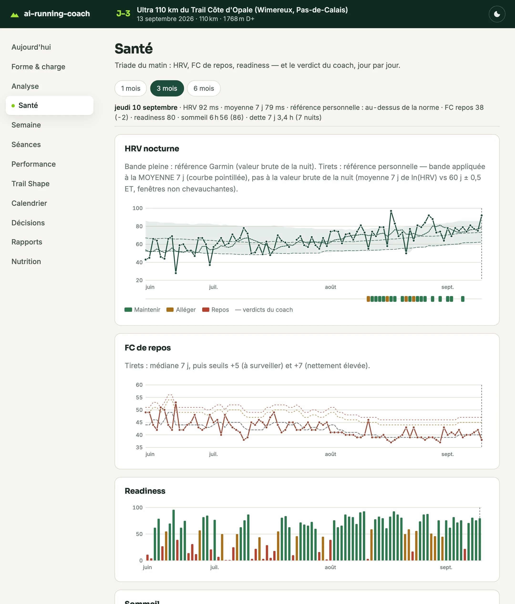

Les tendances du bilan matinal, sur 1, 3 ou 6 mois :

- **HRV nocturne** dans sa bande de référence Garmin (zone pleine), avec sa courbe
  lissée en tirets — moyenne glissante 7 jours de ln(HRV) comparée à une **référence
  personnelle** 60 jours ± 0,5 écart-type calculée localement (largeur de bande :
  Plews, Laursen & Buchheit 2013 ; passage au log et CV du lnRMSSD hebdomadaire :
  Plews et al. 2012 — Kiviniemi et al. 2007 n'est qu'un précédent de l'entraînement
  guidé par une bande individuelle, pas la source de cette largeur ni de ce CV ;
  détail complet dans `ASSUMPTIONS["hrv_baseline"]` de `scripts/arc_metrics.py`).
  Quand Garmin ne fournit pas de bande, cette référence personnelle prend sa place —
  y compris hors tableau de bord, via `python3 scripts/arc_index.py hrv-baseline`.
  Sous 30 jours d'historique de référence, le statut reste « en construction » plutôt
  que d'afficher une estimation bruitée. Uniquement calculé et affiché en
  `[health].morning_check = "full"` : en `minimal`, seule la readiness est exposée.
  Juste dessous, **la frise des verdicts du coach**, jour par
  jour (vert *Maintenir*, orange *Alléger*, rouge *Repos*). On y lit ici le repos
  imposé au lendemain de l'ultra, puis le feu vert de la reprise.
- **FC de repos**, avec sa médiane 7 jours et les seuils +5 / +7 qui la suivent : le
  pic post-course à 55 bpm les franchit nettement, puis la FC redescend.
- **Readiness**, colorée par niveau, et **sommeil** face au besoin configuré (profil
  → « Besoin de sommeil », sinon 7 h 30 par défaut).
- **Dette de sommeil sur 7 jours** (#37, `[health].morning_check = "full"` uniquement) :
  somme, sur les nuits mesurées des 7 derniers jours, du manque par rapport à ce même
  besoin — une nuit sans mesure n'est jamais comptée comme un manque de 0 h, et la
  valeur n'est rendue qu'à partir de 4 nuits mesurées sur les 7 (sinon aucune barre ce
  jour-là). Les nuits excédentaires ne compensent pas un déficit d'une autre nuit
  (détail et justification dans `ASSUMPTIONS["sleep_debt"]` de `scripts/arc_metrics.py`).
  Seuils d'affichage indicatifs (pas médicaux, même statut que la zone ACWR) :
  **5 h cumulées → à surveiller**, **10 h → nettement** (`SLEEP_DEBT_WARN_S`/
  `SLEEP_DEBT_ALERT_S`, servis par `/api/health` → `thresholds.sleep_debt_warn_h`/
  `sleep_debt_alert_h`, jamais recalculés côté JS). Même calcul repris dans la
  tuile « Aujourd'hui » et disponible hors tableau de bord via
  `python3 scripts/arc_index.py sleep-debt`.

**Comment la lire** : un point isolé ne dit rien ; deux ou trois jours d'affilée
hors de la bande, ou au-dessus du seuil +5, oui. C'est exactement ce que le coach
regarde avant de poser son verdict.

| Alimentée par | Écrit par |
|---|---|
| `medical/<date>_health.md` | la synchronisation (bilan matinal) ; le verdict, le coach |

**Si c'est vide** : `[health].morning_check = "off"` désactive le bilan — la vue le
dit au lieu d'afficher des trous. Un jour sans verdict dans la frise est un jour où
le coach n'a pas tranché : rien n'est inventé.

### Foulée

**Comment évolue ma foulée ?**

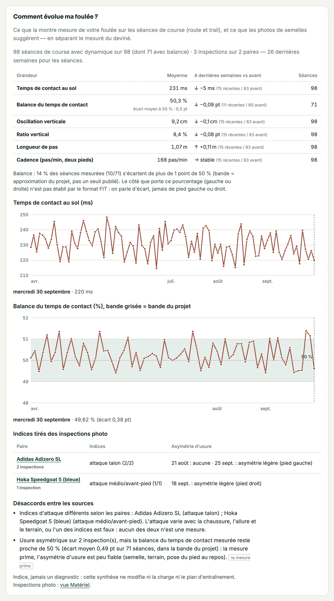

*La carte Foulée (workspace de démonstration) : 98 séances de course avec dynamique, dont 71 avec
balance ; chaque grandeur avec sa moyenne et son sens de variation sur les 4 dernières semaines ;
la balance reste dans la bande grisée de ±1 point autour de 50 % ; en bas, les indices tirés des
inspections photo et les deux désaccords relevés — indices d'attaque différents selon la paire, et
usure asymétrique alors que la balance mesurée est symétrique (« la mesure prime »).*

Une carte en bas de la vue Santé (#151), montrée **même quand le bilan matinal est désactivé**
(elle ne dépend pas de `[health].morning_check` : aucune donnée de santé du matin). Elle sépare
ce qui est **mesuré** de ce qui est **deviné** :

- **Mesuré par la montre** — sur les séances de **course** (route et trail ; marche, randonnée et
  vélo exclus), les 26 dernières semaines : temps de contact au sol, **balance du temps de
  contact**, oscillation verticale, ratio vertical, longueur de pas et cadence (en pas/min, deux
  pieds — le champ FIT est par pied, doublé à l'extraction). Pour chacun : la moyenne, la
  variation des 4 dernières semaines face à la période antérieure (seulement avec au moins deux
  séances de chaque côté), donnée par une **flèche neutre** (↑ hausse, ↓ baisse, → stable : ni bon ni
  mauvais) et sa valeur signée, et le nombre de séances. Deux petits graphiques : temps de contact et
  balance, cette dernière avec sa bande grisée.
- **Deviné d'après les photos** — depuis les inspections de chaussures : les indices de foulée
  (attaque talon ou médio/avant-pied, pronation/supination) comptés par paire, l'asymétrie d'usure de chaque inspection, et si elle
  se répète **du même côté**.
- **Confiance** — le nombre de séances avec dynamique (dont avec balance) et d'inspections, avec
  la mention « confiance faible » sous 5 séances mesurées ou 3 inspections.
- **Désaccords entre les sources** — jamais arbitrés en silence : des indices d'attaque
  différents selon les paires, une usure asymétrique alors que la balance mesurée reste dans la
  bande (ou l'inverse), un côté d'asymétrie qui change d'une inspection à l'autre. Quand une
  mesure existe, **la mesure prime** et l'usure est dite peu fiable.

**Comment la lire** : c'est un **indice, jamais un diagnostic**, et elle ne modifie ni la charge ni
le plan. Deux réserves à garder en tête. (1) La balance est lue comme un **écart à 50 %** :
le côté que porte le pourcentage (gauche ou droite) n'est pas établi par le format FIT, donc la
carte ne dit jamais « pied gauche » ou « pied droit » pour la mesure — et ne compare jamais le côté de
l'usure au côté de la balance. (2) La bande « hors bande » (plus de 1 point d'écart à 50 %) est
une **approximation du projet**, pas un seuil publié. Un écart de quelques dixièmes de point est
banal ; le bruit d'un capteur de poignet, la pente, l'allure et la fatigue font varier ces
grandeurs.

| Alimentée par | Écrit par |
|---|---|
| `activities/fit/<id>.json` (échantillons FIT : `ground_contact_s`, `stance_balance_pct`, `vertical_oscillation_m`, `vertical_ratio_pct`, `step_length_m`, `cadence_spm`) ; à défaut, les clés `avg_*` du bloc `arc` de la séance ; `gear/*_inspection.md` | skill `fit-download` (extraction), synchronisation, coach (inspections) |

La même synthèse, hors tableau de bord : `python3 scripts/arc_index.py gait-summary [--weeks N]`
(`/api/gait`). **Si c'est vide** : sans dynamique de course, la carte le dit et donne la commande de
rattrapage — sur un FIT déjà téléchargé avant #151, relancer
`python3 skills/fit-download/scripts/download_fit.py --refresh-dynamics` (voir
[Téléchargement FIT](../skills/fit-download.md#rattraper-la-dynamique-de-course)). Certains capteurs ne fournissent pas la
balance : elle reste alors absente, jamais remplacée par 50 %. Sans inspection, la carte invite à
en demander une au coach.

### Exposition à l'altitude

**Combien de temps ai-je passé en altitude ?**

Une carte sous « Foulée » dans la vue Santé (#185), elle aussi indépendante du bilan matinal. Pour
les fenêtres de **14 et 28 jours**, le nombre de séances et le temps passés **au-dessus de
1 500 m et de 2 000 m**, et l'altitude maximale atteinte, d'après les échantillons FIT. Une séance
compte à un seuil à partir de 5 minutes au-dessus (un col franchi 30 s ne compte pas). Seules les séances de terrain
sont prises en compte (salle, piscine et repos exclus).

**Comment la lire** : c'est un **indicateur d'exposition**, pas un modèle d'acclimatation. L'altitude
barométrique ou GPS est approximative près d'un seuil. Une séance **sans altitude** (échantillons FIT
absents, capteur muet) est comptée à part (« sans altitude, non comptée »), jamais comme une
exposition nulle. Cette exposition réduit légèrement la pénalité d'altitude du plan de course
quand la course a lieu dans les 14 jours (approximation du projet, voir [l'agent Course Strategist](../agents/course-strategist.md#penalite-daltitude-185)).

**Si c'est vide** : sans séance sur la fenêtre, ou sans aucune altitude dans les séances, la carte
l'écrit et pointe vers `skills/fit-download` ; rien n'est inventé. Hors tableau de bord :
`python3 scripts/arc_index.py altitude-exposure [--days N]` (`/api/altitude-exposure`).

## Semaine

**Qu'est-ce qui était prévu, qu'est-ce qui a été fait ?**


Le plan de la semaine face au réalisé. Pour chaque jour :

- **les séances prévues** et leur statut — *Prévue*, *Faite*, *Déplacée*, *Manquée*,
  *Annulée* ; ici, le footing du mardi a été couru le mercredi ;
- **la catégorie météo** du jour (*Optimal*, *Vigilance*…) quand une prévision existe ;
- **les séances réellement enregistrées**, sous le plan : un clic ouvre leur détail.

En tête de la vue (et de **Calendrier**), la **frise du bloc** (#193) : une colonne par
semaine planifiée, du début du bloc courant à la course (et la semaine de récupération qui
la suit). La teinte donne la **phase** (*Base*, *Développement*, *Spécifique*, *Affûtage*,
*Récupération*), la hauteur le **volume prévu**, le trait noir le **réalisé** (partiel pour la
semaine en cours), une pastille marque une **semaine allégée**, un drapeau la **semaine de
course**, et un cadre vert la **semaine en cours**. Chaque colonne est un lien vers la vue
Semaine de ce lundi (clavier : Tab puis Entrée) ; survol ou focus affichent le détail
sous la frise. Sur téléphone, la frise défile horizontalement dans sa carte.

La frise ne devine rien : la phase vient du champ `phase` de la semaine, reconnu seulement
s'il correspond à un libellé du gabarit (c'est ce qu'écrit `plan-skeleton`, #190). Une semaine
sans phase (fichier antérieur) est tracée en pointillé « Phase inconnue » ; un autre libellé
libre est affiché tel quel, sans teinte de phase. Le bloc est la suite de semaines planifiées
aux lundis consécutifs qui contient la semaine courante (sinon la prochaine, sinon la plus
récente). Une **seule** semaine sans fichier entre deux semaines écrites par `plan-skeleton`
(semaine de vacances, fichier supprimé) ne coupe pas le bloc : elle apparaît en contour
pointillé « Semaine sans plan », jamais remplie. Deux semaines manquantes d'affilée, ou une
voisine écrite à la main, coupent le bloc. Les données viennent de `/api/block`.

En dessous, **le réalisé face à la cible** de la semaine (18,2 km sur 40 visés), puis
**la conformité** — le KPI de l'épopée #20 (story #33) : % de séances faites, ratio
durée réalisée/planifiée, ratio D+ réalisé/planifié (route : ratio absent, pas de D+
significatif), le tout aussi par intensité (*Facile* : récupération, endurance ;
*Qualité* : tempo, seuil, VO2max, course ; *Autre* : renforcement et toute intensité
non classée, pour que Facile + Qualité + Autre reconstitue toujours le total). Les
séances de **repos**, **annulées** et **déplacées** sont retirées du calcul (elles ne
comptent ni en séance faite ni en manquée), les séances des jours pas encore passés
de la semaine en cours ne sont jamais comptées manquées, et une séance du jour même
sans activité encore enregistrée est **en attente**, pas manquée — le décompte ne se
fige qu'à la fin de la journée. Une semaine sans aucune séance planifiée (hors repos)
n'affiche aucun pourcentage plutôt qu'un 0 % trompeur. Puis **le texte du plan** tel
que le coach l'a écrit. *Précédente* / *Suivante* naviguent d'une semaine à l'autre ;
la liste **Plans** saute directement aux semaines qui ont un plan.

!!! note "Comment une séance prévue est rapprochée du réalisé"
    Une séance de repos (`sport` ou `intensity` valant `rest`) est hors sujet pour ce
    KPI et n'entre dans aucun calcul : sans cette exclusion, une semaine des plans
    hérités (qui classent chaque « Repos » du tableau en `sport = rest` sans statut)
    tombait à 50 % de conformité alors que tout avait été fait.

    Le statut écrit dans le plan (`done`, `missed`, `moved`, `cancelled`) prime
    toujours — et les séances `done` explicites réservent leur activité avant que les
    séances sans statut ne piochent dans ce qui reste, pour qu'une séance non
    résolue ne puisse jamais « voler » l'activité d'une séance déjà validée du même
    jour. Sans statut, ou avec `planned` sur une date déjà passée, la séance est
    comparée aux activités restantes du même jour de sport compatible (course sur
    route, trail, randonnée et marche interchangeables, de même pour les variantes de
    vélo) : une activité correspondante fait compter la séance comme faite, son
    absence comme manquée — sauf le jour même, où l'absence d'activité est encore
    « en attente », pas manquée.

    Une séance `cancelled` est exclue du calcul quel que soit le motif — le contrat
    de données n'a pas de champ pour distinguer une annulation médicale d'une autre
    (voir la docstring de `scripts/arc_metrics.py::week_compliance`). Une séance
    `moved` est également exclue : rien dans le contrat n'indique sa nouvelle date ;
    si le coach a écrit une séance distincte au jour réel, celle-ci compte pour
    elle-même. Une séance `done` explicite sans activité chiffrée en face (fichier
    pas encore synchronisé) compte comme faite, mais reste hors des ratios durée/D+
    des deux côtés — un ratio à 0 % serait aussi trompeur qu'optimiste.

La même vue montre les semaines à venir — ici une semaine d'un plan de transition sur
dix semaines, écrit en un seul fichier multi-semaines (#69) : fiches de renforcement,
côtes et home trainer, déjà poussés sur le calendrier Garmin, et l'extrait du plan
du coach pour cette semaine-là :

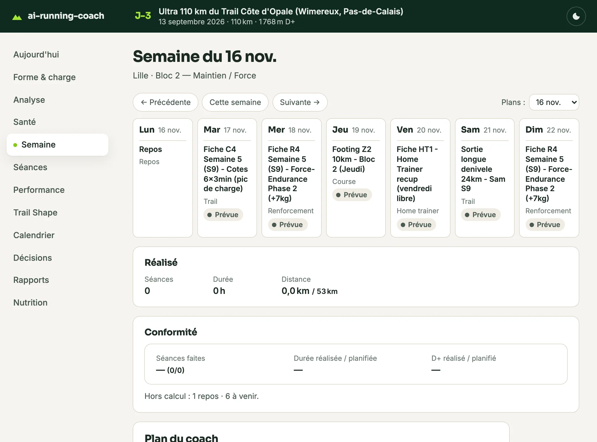

| Alimentée par | Écrit par |
|---|---|
| `planning/Semaine_<lundi>.md` : un fichier par semaine, OU un seul fichier multi-semaines (`weeks[]`, #69) nommé d'après le lundi de sa première semaine | le coach, quand il planifie ou pousse le plan sur Garmin |
| `activities/*.md` (le réalisé) | la synchronisation |
| `medical/<date>_meteo.md` | le coach, skill `weather-forecast` |

Un plan de plusieurs semaines (« plan de transition sur 10 semaines ») n'a plus
besoin d'un fichier par semaine (#69) : le coach peut écrire un seul fichier
`planning/Semaine_<premier-lundi>.md` avec un bloc `weeks` — une entrée par
semaine, chacune avec ses séances datées et son `garmin_workout_id` quand
elles sont sur le calendrier Garmin. La vue Semaine retrouve chaque semaine du
fichier par sa propre date, exactement comme pour un fichier par semaine — les
deux formes restent possibles, au choix du coach (voir `skills/
workspace-data-contract/SKILL.md`, section `week`).

!!! warning "Collision entre deux fichiers pour la même semaine"
    Si un fichier dédié `planning/Semaine_<lundi>.md` ET un plan multi-semaines
    décrivent tous les deux la même semaine, le fichier DÉDIÉ fait foi — l'autre
    entrée est ignorée de cette vue (elle reste visible dans les fichiers hors
    contrat/à vérifier, avec un message expliquant lequel des deux l'emporte).
    Évitez la situation plutôt que d'en dépendre : réécrivez ou supprimez le
    fichier de trop.

## Séances

**Qu'est-ce que j'ai fait, et comment ça s'est passé ?**

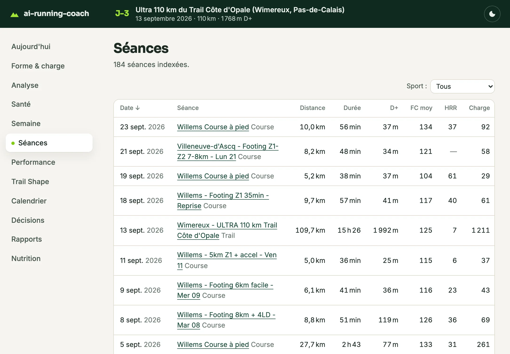

Tout l'historique : date, distance, durée, D+ (ou allure sur route), FC moyenne, HRR
et charge, par pages de 50. Une recherche (nom ou lieu, sans tenir compte des accents)
et deux filtres (sport, année) réduisent la liste ; une ligne de totaux (séances,
distance, durée, D+) suit le filtre. Triée par date, la liste se découpe par mois, chaque
mois avec ses propres totaux. Les colonnes se trient d'un clic ; recherche, filtres, tri et
page restent dans l'adresse (un lien partagé rouvre la même liste). Sur téléphone, seules
la date, la séance, la distance et le D+ (ou l'allure) restent affichés. Une séance lue
dans un fichier antérieur au contrat porte la mention **approx.** ; une charge estimée
faute de fréquence cardiaque et d'effort perçu, un astérisque.

### Détail d'une séance


- **La carte** : la trace GPS des échantillons FIT sur un fond topographique
  (OpenTopoMap par défaut, `[dashboard].map_tiles`), colorée au choix par **allure**
  (quintiles de la séance), **FC** (les mêmes zones que la barre « Zones FC »),
  **pente** ou d'une seule couleur. Les montées détectées sont surlignées et
  numérotées comme dans leur tableau ; « Sur la carte », dans ce tableau, cadre la
  montée. Sans GPS (tapis, intérieur) ou sans FIT, une note le dit et la page reste
  complète. Le serveur de tuiles ne voit que la zone affichée, jamais la trace ; un
  `map_tiles = ""` coupe tout fond de carte (trace seule, hors ligne).
- **Le profil** : altitude (montées détectées ombrées), FC, allure et cadence le
  long de la distance, sur un axe commun. Un seul curseur relie les quatre graphiques
  **et la carte** : survoler le profil déplace un point sur la trace, survoler la
  trace place le curseur du profil, avec la lecture complète (distance, altitude,
  pente, FC, allure, cadence, temps écoulé). Les arrêts (ravitaillement, pause) ne
  sont pas des allures : au-delà de 20 min/km, la courbe s'interrompt.
- **Les chiffres clés**, en trois groupes (effort, cœur, contexte) à côté de la
  carte : distance, durée (en mouvement, et totale quand les pauses dépassent une
  minute), allure, D+ / D-, FC moyenne et max, **HRR**
  (récupération cardiaque — « non mesuré » avec sa raison quand Garmin ne l'a pas),
  effet d'entraînement, charge, VO2max estimée quand la séance s'y prête, et le
  **découplage aérobie (Pa:HR)** (#45, facteur d'efficacité EF en complément) quand la
  séance est éligible (sortie course à pied d'au moins 60 minutes de mouvement, à
  effort stable — voir la section « Découplage aérobie » de [Analyse](#analyse)
  pour la méthode complète) ; absent sinon, jamais une valeur à zéro. La
  **durabilité (fade GAP dernier tiers)** (#48, fade EF en complément) apparaît de la
  même façon, quand la sortie est éligible (plus de 90 minutes de mouvement, voir la
  section « Durabilité » de [Analyse](#analyse)) ; absente sinon.
- **La météo du jour**, si une prévision a été enregistrée, et le matériel porté.
- **Ressenti & ravitaillement** : ce que vous avez déclaré, souvent avec `/log` —
  effort perçu, glucides et boisson (et leur débit horaire), pesées avant/après,
  taux de sudation, douleurs du jour (fichier santé). Absent si rien n'est déclaré.
- **La foulée de la séance** (#151) : moyennes de la dynamique de course mesurée par
  la montre (temps de contact, balance, oscillation, ratio vertical, longueur de
  pas, cadence). Les tendances restent dans la carte « Foulée » de [Santé](#sante).
- **Les zones FC** (#43) : une barre empilée du temps passé dans chacune des 5 zones,
  avec les bornes intérieures (bpm, ex. « Z1 < 146 · Z2 146-155 · … · Z5 ≥ 172 ») et
  la méthode effective (FC au seuil, Karvonen ou %FC max — voir
  [Marques et métriques](../marques.md)), plus la polarisation 80/20 de la séance,
  restreinte aux sports de la famille course à pied. Réservé aux sports course à
  pied (course, trail, randonnée, marche). Si le profil ne permet de calculer aucune
  zone (FC max/repos/seuil manquantes, ou méthode forcée par
  `[athlete].hr_zones` mais incomplète), la raison est affichée explicitement au lieu
  de masquer la section ; sans échantillons FIT ingérés pour cette séance, les bornes
  s'affichent quand même, sans barre — **sauf** pour une séance de la famille course
  à pied sans AUCUN échantillon FIT (voir plus bas, « Détail avancé »).
- **Les splits** : un graphique allure + FC, puis le tableau complet — temps, D+ / D-,
  FC, cadence et la lecture du coach pour chaque kilomètre quand il en a écrit une.
  Quand la séance a des échantillons FIT ingérés, une seconde courbe **GAP**
  (allure ajustée à la pente, #44 — voir [Marques et métriques](../marques.md))
  s'ajoute au graphique et au tableau, à côté de l'allure brute : elle « aplatit »
  mentalement les côtes pour comparer une allure de montée à une allure de plat.
  Réservée aux sports de la famille course à pied avec échantillons FIT ; absente
  sinon (jamais une valeur à zéro).
- **Les montées** (#46, VAM) : un tableau, une ligne par montée détectée (bornes en
  kilomètres, distance, D+, pente moyenne et sa classe, durée, VAM temps
  écoulé/temps de mouvement), plus la VAM moyenne par classe de pente en pied de
  tableau. Réservé aux sports de la famille course à pied avec échantillons FIT ;
  une séance sans montée détectée (parcours plat, D+ ou pente sous le seuil de
  détection) affiche la section avec un message plutôt que la masquer — pour
  distinguer « pas de montée sur cette sortie » d'un bug d'affichage. Une colonne
  **« vs précédent/meilleur »** (#49, identité de montée entre séances) complète
  chaque ligne quand cette montée a été reconnue comme LA MÊME qu'une occurrence
  antérieure (géométrie GPS quand disponible, sinon repli par lieu + profil — voir
  `scripts/arc_climb_match.py`) : progression de temps face à l'occurrence
  précédente et face à la meilleure occurrence connue, un tiret pour la toute
  première occurrence (rien à comparer), et un lien **« historique »** vers une
  page dédiée (`#/montee/<id>`) qui trace la VAM de chaque occurrence dans le temps
  et détaille FC (premier/dernier tiers de la montée) et dérive FC par 100 m de D+ —
  la même page que la liste des « Segments de montée » de [Analyse](#analyse).
  Les pages de montée n'exposent aucune coordonnée GPS : seule la carte de la page
  séance (`/api/activity/<id>/track`) en renvoie.
- **L'efficacité en descente** (#47) : un tableau, une ligne par classe de pente
  descendante qualifiante (pente moyenne réellement rencontrée, allure, distance,
  durée de mouvement, indicateur d'efficacité — voir la section « Efficacité en
  descente » de [Analyse](#analyse) et `scripts/arc_descent.py::ASSUMPTIONS` pour la
  méthode complète), plus l'allure GAP de référence utilisée en pied de tableau —
  sections réellement plates de CETTE séance, ou à défaut tout ce qui n'est pas une
  forte descente (repli, la source est indiquée). Réservé aux sports de la famille
  course à pied avec échantillons FIT ; une séance sans classe qualifiante affiche
  la section avec un message explicite plutôt que la masquer (contrairement aux
  montées, l'absence est ici TOUJOURS documentée — critère d'acceptation de #47).
- **« Détail avancé »** (#50) : sur une séance de la famille course à pied sans
  **AUCUN** échantillon FIT ingéré, zones FC, montées, descente et dépense
  énergétique modèle disparaissent au profit d'une **note unique** — jamais
  quatre sections vides côte à côte disant chacune, à sa façon, « pas
  d'échantillons FIT » — qui garde les bornes de zones effectives (utiles même
  sans FIT) et renvoie vers le skill `fit-download`.
- **La dépense énergétique** : **Garmin** (`calories_kcal`, la référence —
  utilisée partout ailleurs, nutrition comprise) et le **modèle indépendant**
  (équation RE3 de course + marche de Minetti, résultat brut, métabolisme de
  base inclus) côte à côte, avec leur écart — mis en évidence (« Écart
  notable ») au-delà de ±15 % (`arc_energy.DELTA_ALERT_PCT`, seuil unique
  repris partout, y compris par la tendance de [Analyse](#analyse)). En
  dessous, la part net (hors métabolisme de base) des deux côtés quand
  `calories_bmr_kcal` (`bmr_calories` du MCP Garmin) est connue — sinon une
  note discrète explique l'absence de BMR Garmin, jamais un chiffre
  silencieusement faux. La décomposition par nature de terrain (plat, montée,
  descente, marche, arrêt), en temps et en kcal, complète le modèle —
  catégories à zéro masquées, jamais une ligne à « 0 min · 0 kcal » qui
  laisserait croire à une mesure. Réservée aux sports de la famille course à
  pied ; dans tous les autres cas sans modèle calculable (pas de poids connu à
  la date de la séance, séance synchronisée depuis Intervals.icu sans
  identifiant Garmin, #68), Garmin reste affiché seul quand connu, avec la
  raison exacte en clair, en français — jamais un « NaN » ni une section vide
  muette. Sur une séance SANS AUCUN échantillon FIT, cette section se réduit au
  seul fait Garmin : la raison n'est dite qu'une fois, par la note « Détail
  avancé » qui la mentionne déjà (jamais un texte répété deux fois sur la même
  page). Le modèle est un **contrôle indépendant**, jamais un remplacement de
  Garmin ; voir aussi la stratégie de course, qui l'utilise en **prévision**
  (kcal/h par section, dans le plan de ravitaillement).
- **L'analyse complète du coach**, rendue telle qu'il l'a écrite, tableaux compris ;
  le chemin du fichier source est rappelé en bas.

Les splits sont les **tours Garmin**. En course libre, un tour = un kilomètre. Sur une
séance structurée, un tour suit les étapes de la séance : 500 m, 676 m… Le graphique
trace alors l'**allure** de chaque tour (le temps ramené au kilomètre), et le tableau
ajoute distance et allure. Le reliquat de quelques mètres à la fin d'une sortie n'est
pas tracé ; il reste dans le tableau.

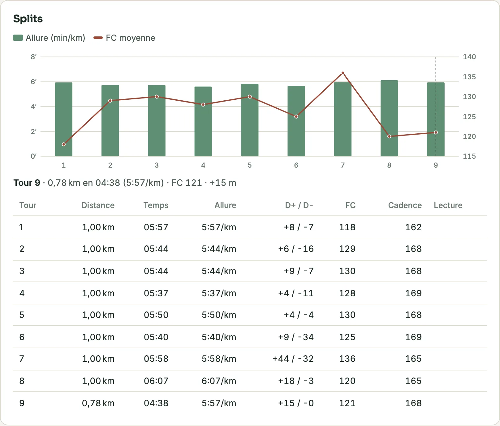

Sur une longue sortie, le graphique devient le profil de la course : ici les 110 km
de l'ultra, les ravitaillements lisibles en creux de FC et en pics d'allure.

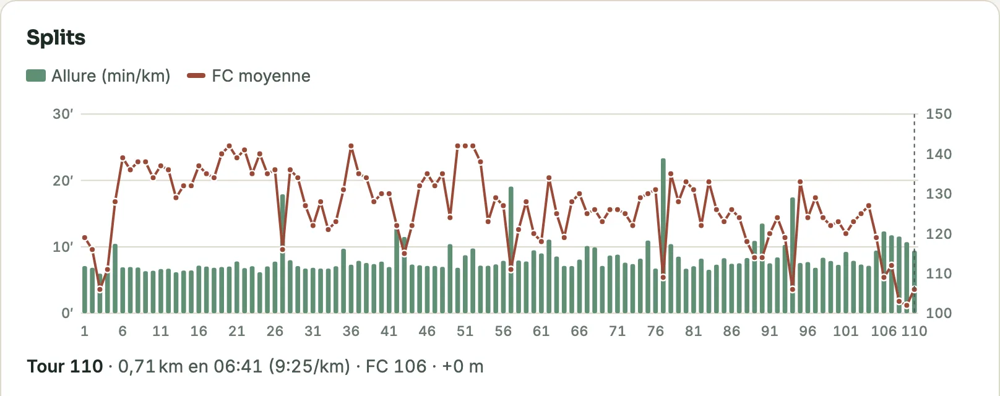

| Alimentée par | Écrit par |
|---|---|
| `activities/<date>_<sport>.md` : bloc de données (`splits`, `garmin_activity_id`) et analyse | la synchronisation |

**Pas de graphique ?** Le bloc de la séance n'a pas de splits : fichier ancien,
migré sans eux. Voir [Compléter les splits depuis Garmin](migration.md#completer-les-splits-depuis-garmin).
Le renforcement, le vélo d'intérieur ou l'elliptique n'ont pas de tours au
kilomètre : pas de graphique, c'est normal.

## Performance

**Quel est mon niveau, et que puis-je viser ?**

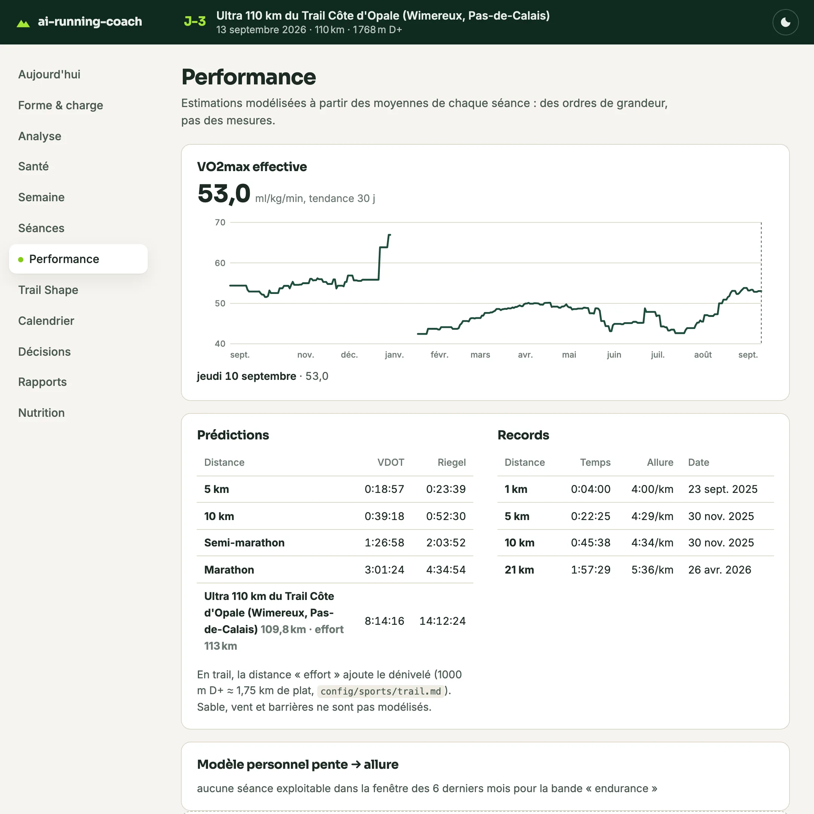

- **VO2max effective**, tendance sur 30 jours, estimée sur les séances de course
  qualifiantes (20 min à 3 h, au-dessus de 70 % de la FC max, sans marche).
- **Prédictions** du 5 km au marathon, et pour votre objectif : par le VDOT de
  Daniels et par la formule de Riegel. En trail, la distance « effort » ajoute le
  dénivelé (1 000 m D+ ≈ 1,75 km de plat).
- **Records** sur des fenêtres de kilomètres consécutifs (1, 5, 10, 21 km) : seuls
  les tours d'environ 1 km comptent.
- **Indices de performance ITRA / UTMB** (#62, facultatif) : la valeur la plus
  récente de chaque indice déclaré (ITRA global et par catégorie, UTMB général
  et par distance 20K/50K/100K/100M), avec sa date, plus un graphique de
  l'historique des indices généraux quand au moins deux relevés existent.
  Ces valeurs viennent **uniquement** de ce que vous avez écrit vous-même dans
  « Indices de performance (ITRA / UTMB) » du profil — aucun script, ni aucun
  agent de sa propre initiative, ne va les chercher sur `itra.run`/`utmb.world` ;
  un agent ne le fait qu'à votre demande explicite, et vous montre la valeur
  trouvée avant de l'écrire. Rien n'apparaît tant qu'aucun indice n'est déclaré.
- **Modèle personnel pente → allure** (#58) : votre allure typique par classe de
  pente fine, apprise sur les six derniers mois (par défaut) de vos propres
  séances — pas le modèle générique de laboratoire (Minetti) appliqué à tout le
  monde. La bande grisée est un repère de dispersion (quartiles), pas un
  intervalle de confiance statistique ; la courbe pointillée est le repli
  générique, affiché pour comparaison sur les classes de pente encore sans
  assez de données, PLAFONNÉ en descente (jamais une allure implausible : le
  modèle de Minetti, inversé pour prédire une vitesse plutôt que l'appliquer à
  une vitesse déjà mesurée, amplifierait sinon son biais connu en forte
  descente). Bande « endurance » par défaut : une SÉANCE ENTIÈRE est retenue si
  au moins 80 % de son temps reste sous le seuil facile/modéré (FC), jamais un
  filtre instant par instant — qui biaiserait les montées, où la FC monte avec
  un retard sur l'effort. Un lien bascule vers « tous efforts ». Marche/
  power-hiking sur les fortes pentes n'est jamais retirée (c'est comment vous
  bougez réellement sur cette pente), seulement signalée au survol quand elle
  domine le panier.
- **Vitesse critique et courbe allure-durée** (#169) : la **meilleure allure GAP** (ajustée
  à la pente) que vous avez tenue sur chaque durée de 30 s à 2 h, sur 42, 90 et
  365 jours, et, quand les données le permettent, votre **vitesse critique** et votre
  **réserve anaérobie D′** (ajustement sur les meilleurs efforts de 3 à 20 min, avec
  sa qualité : nombre de points, incertitude sur chaque paramètre, R²) et leur **tendance** (un point
  tous les 28 jours). Ce ne sont pas des mesures de laboratoire : un effort jamais
  couru à fond sous-estime la vitesse critique. Quand l'ajustement est impossible
  (moins de 3 efforts, une seule séance, courbe plate…), la carte affiche
  « Données insuffisantes » et le motif — jamais une valeur. Le détail, les
  motifs de refus et l'usage par le coach : [Vitesse critique](../vitesse-critique.md).
  Hors tableau de bord : `python3 scripts/arc_index.py pace-curve [--days N] [--lt-speed-ms V]`
  (API : `/api/pace-curve`).
- **Hypothèses** : un lien vers la vue [Hypothèses](#hypotheses), qui réunit toutes les
  formules et leurs limites.

Le kilométrage des chaussures, l'équipement et les inspections photo ont leur propre vue :
[Matériel](#materiel).

**Comment la lire** : ce sont des ordres de grandeur, calculés sur l'allure et la FC
*moyennes* de chaque séance — pas une mesure de laboratoire. Deux estimations qui
divergent disent que le terrain ou la forme du jour pèsent.

| Alimentée par | Calcul |
|---|---|
| `activities/*.md` (course et trail : allure, FC, splits) | `scripts/arc_metrics.py` |
| `planning/Runner_Profile.md`, `planning/active_objective.md` | FC max ; distance et D+ de l'objectif |
| `activities/fit/*.json` (échantillons seconde par seconde) | `scripts/arc_slope_model.py` (#58) |
| `planning/Runner_Profile.md` → « Indices de performance » | `arc_legacy.parse_performance_index`, `arc_index.performance_index` (#62) |

## Matériel

**Mon matériel est-il en état ? Que dois-je remplacer ?**

Vue dédiée (#147), toujours présente dans le menu pour être trouvée même avant la première
déclaration. Un lien « Hypothèses des modèles » en tête renvoie vers celles du
matériel, dans la vue [Hypothèses](#hypotheses). Elle réunit, dans cet ordre : une synthèse **À traiter**, les
**chaussures**, l'**équipement** (kits compris) et les **inspections photo**. Les trois cartes
vivaient jusque-là dans Performance.

!!! note "Captures de cette section"
    Elles viennent d'un **workspace de démonstration** (générateur des tests,
    `tests/lib/synthetic.py`), pas du workspace réel des autres captures : un inventaire
    varié (paire proche du seuil, paire retirée, frontale à contrôler, poche à eau
    bientôt à nettoyer), sans exposer de données personnelles.

Sans matériel déclaré, la vue montre un état vide utile : la syntaxe à écrire dans « Matériel &
lieux » du profil, la commande de simulation `python3 scripts/garmin_gear_backfill.py` pour
rattraper l'historique Garmin (rien n'est écrit sans `--apply`) et des liens vers la documentation.

**À traiter** — toute paire ou tout objet au-delà de son seuil, toute inspection conseillée :
une ligne par élément, avec ses raisons, chacune renvoyant vers sa fiche. Sans rien à signaler,
la carte le dit. Les paires marquées « ignorées » dans le profil sont listées à part, en bas de
la vue.

**Chaussures** (#40) — kilométrage cumulé de chaque paire déclarée dans « Matériel & lieux » du
profil (course et randonnée seulement), une ligne « à surveiller » au-delà du seuil d'alerte,
les paires retirées affichées en grisé sans jamais alerter, et une ligne « inconnue » par
`gear_id` vu sur une séance mais absent du profil — jamais masqué silencieusement. Depuis #132 :
le kilométrage inclut le « départ » déclaré sur la puce (rappelé sous le total : « dont N km de
départ »), un badge **« ≈ N sem. »** donne la prévision de retraite au rythme des 28 derniers
jours (rien sans usage récent, « seuil dépassé » au-delà du seuil), « proche du seuil » apparaît
dès 90 %, et le rôle `usage:` déclaré s'affiche à côté du nom.


*La vue Matériel : en tête « À traiter » — la frontale a dépassé ses 40 h, deux paires sont
à inspecter —, puis les chaussures : l'Adizero SL (« dont 120 km de départ », usure visible
à la dernière inspection) et la Speedgoat, paire par défaut, affichent leur prévision de
retraite (≈ 5 et ≈ 4 semaines) ; la Pegasus retirée reste visible en grisé.*

**Équipement** (#134) — un tableau pour tout ce qui n'est pas chaussure (`### Matériel` du
profil) : par objet, son **usage** (distance, heures, séances, jours depuis la date de
référence — `depuis` ou dernier `entretien`), ses **déclencheurs** avec la valeur atteinte face
au seuil dans l'unité de chacun (km, h, séances, jours), ses kits, et un statut « À surveiller »
(un déclencheur atteint — le premier suffit) ou « Proche du seuil » (≥ 90 %). Un objet sans
déclencheur déclaré affiche « aucun seuil déclaré » et n'alerte jamais ; un déclencheur en jours
sans `depuis` ni `entretien` est dit inopérant plutôt que compté à zéro. Un identifiant cité
dans `gear_ids` d'une séance mais absent du profil apparaît en « inconnu ». Le tableau ne
s'affiche que si le profil déclare du matériel ; le détail des règles est dans les Hypothèses
(`equipment_usage`).

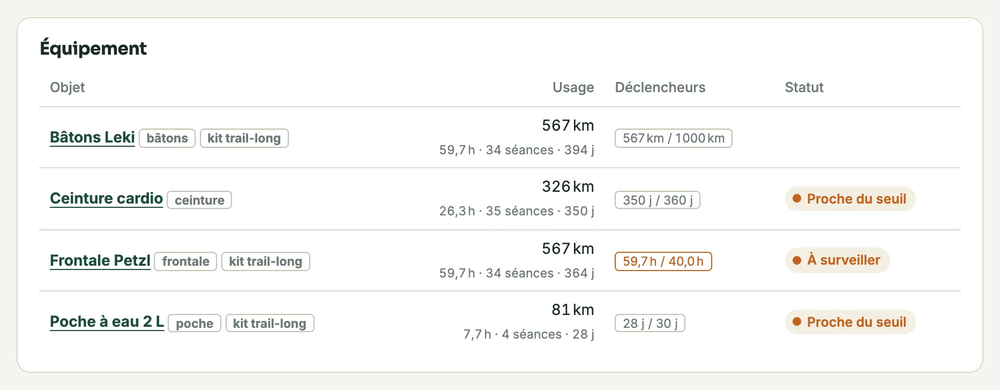

*Le tableau Équipement : la frontale a atteint son seuil en heures (59,7 h / 40 h), la
ceinture cardio approche de son année (« 12 mois » compté 360 j) et la poche à eau de son
rappel d'hygiène (28 j / 30 j depuis le dernier entretien) ; les objets du kit
« trail-long » portent leur étiquette.*

**Inspections photo** (#135) — pour chaque paire, l'historique des inspections du dossier
`gear/` (plus récente d'abord) : état 🟢🟡🟠🔴 écrit aussi en toutes lettres, kilométrage à
l'inspection, zones d'usure en **petit tableau zone × pied gauche / pied droit** (sévérité en
toutes lettres), **badge d'asymétrie** (neutre quand « aucune asymétrie », mis en avant avec le
côté le plus usé sinon), **badge d'indice de foulée** et vignettes des photos — chaque inspection
en lignes distinctes, lisibles sur téléphone. Le rappel « indice, pas un diagnostic » figure
**une fois par carte**, avec le lien vers la carte [Foulée](#foulee) de la vue Santé. La ligne de la paire dans « Chaussures » porte la dernière inspection ;
« Inspection conseillée » apparaît après ~200 km sans inspection, ou une fois le seuil d'alerte
franchi (rappel, jamais une obligation) : pour agir, tapez `/inspection <paire>` (ou `/inspection`
pour laisser le coach proposer la plus urgente), voir [Faire inspecter une paire](../skills/inspection.md). Une inspection plus dégradée que la précédente est
signalée. Les vignettes sont servies par une route dédiée en lecture seule, limitée aux images
(`.jpg`, `.png`, `.webp`) de `gear/photos/` **citées par une inspection** ; rien d'autre du
workspace n'est exposé. Rien n'apparaît tant qu'aucune inspection n'existe et qu'aucune paire
n'est à inspecter.

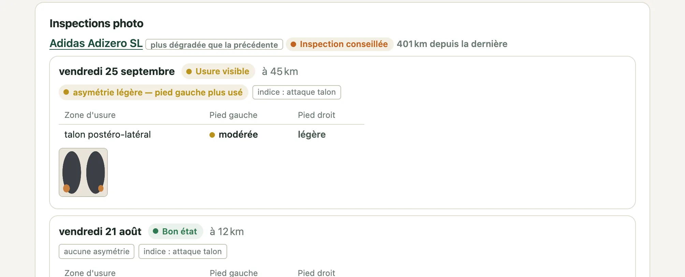

*Les inspections photo : l'Adizero SL compte deux inspections chaînées — la seconde, plus
dégradée que la précédente, relève une asymétrie légère (pied gauche plus usé) ; la Speedgoat
n'a jamais été inspectée (« Inspection conseillée »). Photo schématique : jamais de vraies
photos dans le dépôt.*

### Fiche d'une paire ou d'un objet

Chaque nom de paire ou d'objet (tableaux, synthèse, tuiles d'Aujourd'hui, page d'une séance)
ouvre sa fiche, à l'adresse partageable `#/materiel/<gear_id>` :

- **Une paire** : bilan de carrière (kilométrage départ compris, séances et période, courses,
  sortie la plus longue, meilleurs efforts 1/5/10/21 km sur les séances qui ont des splits,
  seuil et prévision de retraite, paire rattachée ou non à Garmin Connect), **kilomètres par
  mois**, **liste des séances** (chacune renvoie vers son détail) et **historique des
  inspections** de la paire. Une paire retirée reste consultable ; une paire marquée
  « ignorée » le dit, garde ses inspections et n'affiche aucun kilométrage.
- **Un objet d'équipement** : usage (depuis le dernier entretien, avec le total à vie à côté),
  **déclencheurs** (valeur atteinte face au seuil), **kits** et leurs autres membres, séances où
  il a servi — celles d'avant le dernier entretien sont grisées : elles ne comptent plus dans
  les déclencheurs.
- **Identifiant inconnu** : un état « introuvable » clair, jamais une page vide.

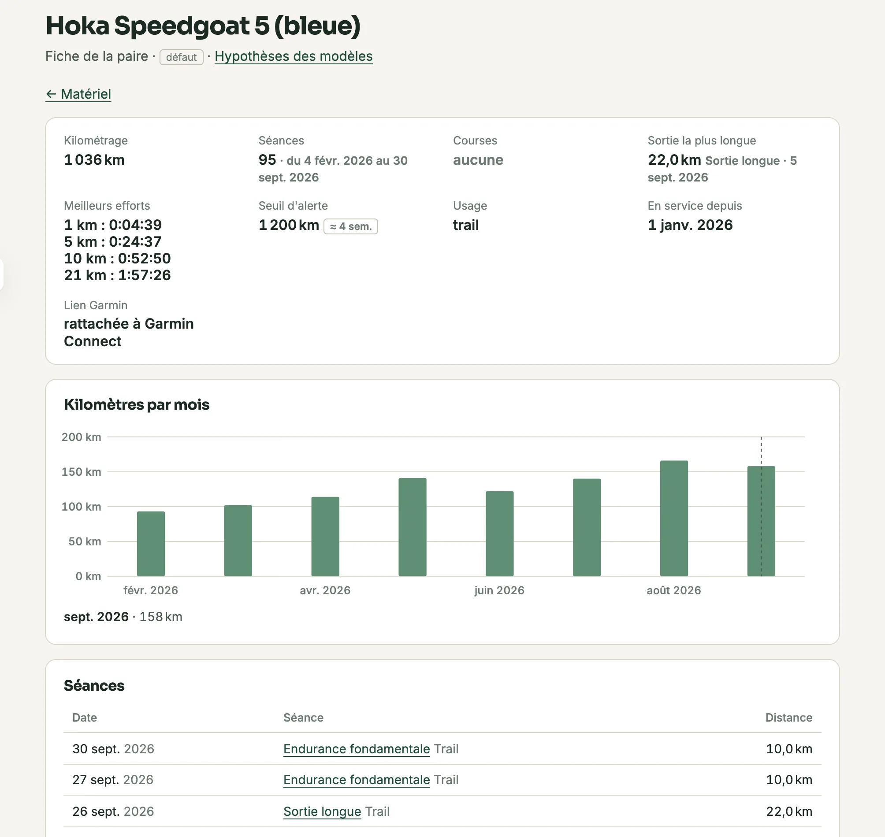

*La fiche d'une paire : bilan de carrière — kilométrage, séances et période, courses, sortie la
plus longue, meilleurs efforts, seuil et prévision, lien Garmin —, kilomètres par mois, puis
la liste des séances (chacune renvoie vers son détail) et les inspections de la paire.*

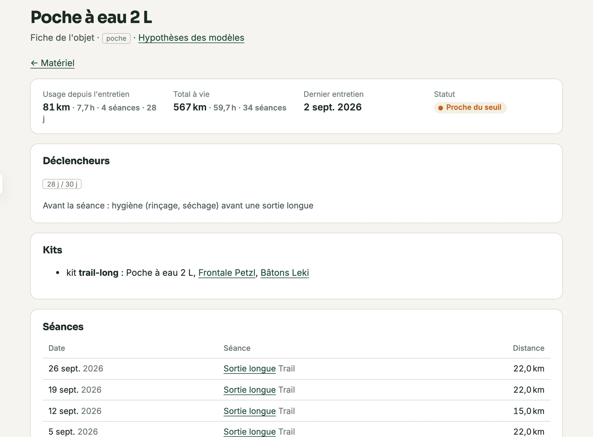

*La fiche d'un objet : la poche à eau compte 4 séances depuis son dernier entretien
(2 septembre) pour 34 à vie ; son déclencheur en jours (28 j / 30 j) la met « proche du
seuil », avec le rappel avant séance ; le kit « trail-long » renvoie vers ses autres objets.
Plus bas, les séances d'avant l'entretien sont grisées.*

La page d'une séance affiche de son côté « Chaussure » (paire attribuée, mention « paire par
défaut » quand elle n'est pas déclarée sur la séance) et « Équipement porté » (`gear_ids`,
hors chaussures), lorsqu'ils existent, chacun renvoyant vers sa fiche.

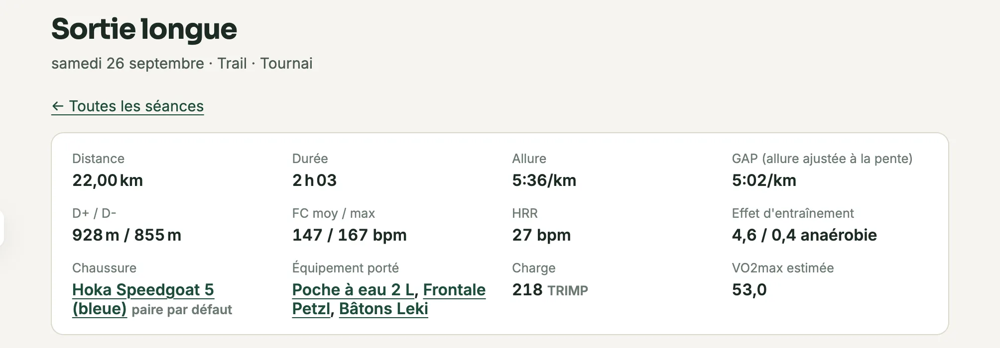

*Une sortie longue : la Speedgoat, « paire par défaut » (aucune paire déclarée sur la séance),
et l'équipement porté du kit « trail-long ».*

Sur **Aujourd'hui**, une tuile « Matériel à contrôler » (ou « Chaussures à surveiller »)
apparaît dans « Au programme » dès qu'un élément atteint son seuil, avec un lien vers la vue :

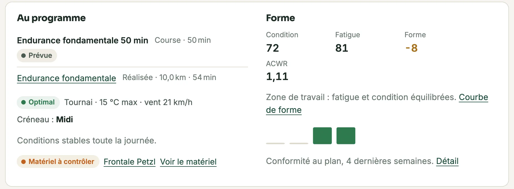

**Comment la lire** : les kilométrages viennent tous de la même règle d'attribution des
séances aux paires (`gear_id` explicite, sinon paire par défaut — voir les
[Hypothèses](#hypotheses)) ; la fiche, le tableau et la commande `arc_index.py gear-career`
ne peuvent donc pas diverger.

| Alimentée par | Calcul |
|---|---|
| `planning/Runner_Profile.md` → « Matériel & lieux » (`### Chaussures`, `### Matériel`) | `arc_legacy.parse_gear`, `arc_legacy.parse_equipment` |
| `activities/*.md` (`gear_id`, `gear_ids`, distance, durée) | `arc_metrics.attribute_gear`, `arc_index.gear_mileage`, `arc_index.equipment_usage`, `/api/gear/<id>` (#147) |
| `gear/*.md` (inspections photo) | `arc_index.gear_inspections` (#135) |

## Trail Shape

**Ma préparation récente couvre-t-elle ce que la course va exiger ?**


Un score 0-100 (#63) qui compare les 8 dernières semaines glissantes
d'entraînement aux exigences de l'objectif actif (`planning/active_objective.md`) —
sans jamais utiliser de donnée de santé (aucune HRV, FC de repos ou readiness
n'entre dans ce calcul, quel que soit `[health].morning_check`) :

- **Volume hebdomadaire** (km-effort ITRA, distance + D+/100, #35) : moyenne
  sur la fenêtre — **course/trail uniquement**, la randonnée et la marche ne
  comptent pas — comparée à une cible sous-linéaire de l'effort de course
  (une simple proportion serait triviale pour un 10 km et irréaliste pour un
  ultra, voir `arc_trail_shape.weekly_volume_target_km`).
- **Plus longue sortie** : distance de la plus longue sortie de la fenêtre
  (**course/trail uniquement**), comparée à une cible continue en fonction de
  la distance de course (`arc_trail_shape.longest_run_target_m`).
- **D+ max d'une séance** : dénivelé positif de la sortie la plus « montante »
  de la fenêtre, comparée à 50 % du D+ de la course (plafonnée à 2 500 m) —
  absente si la course n'a pas de D+ renseigné ou un D+ nul (route). **Seule
  composante qui compte aussi la randonnée/power-hiking** : grimper à pied
  sans courir reste une préparation légitime à la tolérance du dénivelé,
  contrairement aux deux composantes ci-dessus.
- **Durabilité** (#48) : fade GAP moyen sur les sorties longues éligibles de
  la fenêtre, affiché comme un fade sous un plafond (« moins on fade, mieux
  c'est » — jamais une cible à atteindre par le haut) — absente si aucune
  sortie longue n'est éligible.

Chaque composante affiche sa cible, sa valeur observée et son ratio (plafonné
à 100 %) — unités distinctes selon la composante (un dénivelé ne s'affiche
jamais comme une distance, un km-effort n'est pas une distance brute). Le
score global pondère ces ratios ; une composante absente ne pénalise jamais
le score, son poids est redistribué sur les autres (annoncé dans le texte,
piloté par un code stable — `far_horizon`, `low_confidence`,
`durability_omitted` — jamais un mot cherché dans le texte français). Un
bandeau signale une confiance réduite quand moins de 4 des 8 semaines de la
fenêtre ont au moins une séance de course à pied/trail.

**Aucune des cibles ci-dessus n'est une norme publiée** — ce sont des
approximations du projet, réglables en tête de `scripts/arc_trail_shape.py`,
documentées comme telles (jamais présentées comme un chiffre validé par la
littérature). Un indicateur parmi d'autres pour le coach, jamais un verdict —
et **aucun affûtage n'est détecté** : une baisse de volume dans les dernières
semaines avant la course, signe d'un bon affûtage, peut faire baisser le
score sans que ce soit un problème.

| Alimentée par | Calcul |
|---|---|
| `planning/active_objective.md` (distance, D+, date de course) | `scripts/arc_trail_shape.py` |
| `activities/*.md` (course/trail des 8 dernières semaines) | `scripts/arc_metrics.py` (km-effort ITRA #35, durabilité #48), `scripts/arc_trail_shape.py` |

## Roadbook

**Qu'ai-je dans la poche le jour J ?**

<!-- arc-video:ultra -->
<div class="arc-video-card" markdown>

[](../video/ultra/index.html)

<div markdown>

<span class="arc-video__meta">En vidéo · Étape 14 · 1 min 49</span>

**[La nuit, la roche et le roadbook](../video/ultra/index.html)** — Préparer un ultra : la nuit calculée sur place (crépuscule, frontale, heure d'hiver), le dénivelé corrigé par un modèle de terrain, la technicité du sentier, puis le roadbook imprimable avec passages, barrières et matériel obligatoire.

[Regarder](../video/ultra/index.html) · [English](../video/ultra/index.html?lang=en) · [Toutes les vidéos](../videos.md)

</div>

</div>
<!-- /arc-video -->

Une feuille imprimable par scénario (#187, épopée #170), accessible par le lien
« Roadbook imprimable du plan de course » en bas de [Trail Shape](#trail-shape)
(adresse `#/roadbook`, `?plan=<fichier>` pour choisir un plan, `?scenario=safe|realistic|ambitious`).
Elle lit le plan de course persisté dans `planning/` (bloc ```` ```arc ````
`kind: race_plan`, écrit par `course-strategist`) et ne calcule rien de plus :
heures de passage et marges de barrière viennent de `scripts/arc_race_pacing.py`,
le contrôle du matériel de `arc_index.py equipment --race-plan` (#134).
Les heures de passage sont en **heure locale réelle** du fuseau `timezone` du plan :
une course qui traverse le changement d'heure reste juste (même règle que la nuit, #184),
marges de barrière comprises : `arc_race_pacing.py` les calcule en temps absolu dans le même
fuseau (#205) ; un avertissement signale simplement le changement d'heure.

Une feuille contient :

- l'en-tête (course, date, heure de départ, distance, D+/D−, temps du scénario,
  heure d'arrivée, objectif du plan) ;
- le **profil d'élévation**, avec les ravitos numérotés (R1, R2…) et la nuit
  hachurée — **relatif au départ** : le plan ne contient pas l'altitude absolue ;
- les **sections** (de ravito à ravito) : km, distance, D+/D−, temps, heure de
  passage et durée écoulée, barrière horaire avec sa marge (texte « TENDU » /
  « HORS DÉLAI », jamais la seule couleur), ravito avec **ce qu'on y prend**
  (`take` du plan nutrition) et ce qu'il sert, drapeau **nuit / frontale** ;
- le **matériel obligatoire** en liste à cocher, avec son statut contre l'inventaire
  (prêt, à vérifier, jamais utilisé à l'entraînement, non retrouvé) ;
- l'**urgence et les consignes** du plan (`emergency`, `notes`), et un encart
  « À compléter / à savoir » qui liste **tout ce qui manque** au plan (pas de
  départ renseigné, pas de barrière, `take` absent…) : une donnée absente est
  dite absente, jamais inventée.

Le sélecteur de scénario bascule sans nouvel appel. **Imprimer / PDF** ouvre la
boîte d'impression du navigateur (`window.print()`, aucun service ni
dépendance : choisissez « Enregistrer au format PDF ») ; **Imprimer les 3
scénarios** met un scénario par page. La feuille d'impression est en A4
portrait, noir et blanc lisible quel que soit le thème de l'écran, sans
navigation, tableau à 9 pt. Sur téléphone, le tableau devient une carte par
section.

| Alimentée par | Calcul |
|---|---|
| `planning/*.md` (`race_plan` : `segments`, `aid_stations` dont `take`/`cutoff`, `start_time`, `gear`, `notes`, `emergency`) | `scripts/arc_roadbook.py` (`/api/roadbook`), `scripts/arc_race_pacing.py` (`compute_passages`, `check_cutoffs`) |
| `planning/Runner_Profile.md`, `activities/*.md` (matériel) | `arc_index.equipment_race_check` (#134) |

## Calendrier

**Suis-je régulier ?**

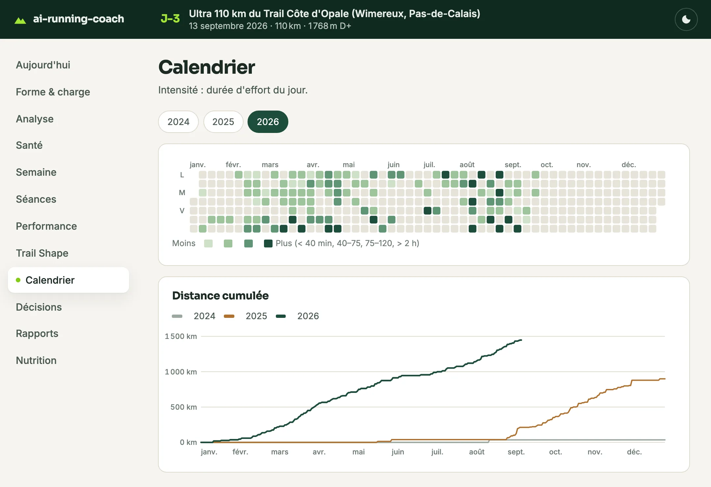

L'année en carte de chaleur — plus la case est foncée, plus la durée d'effort du jour
est longue — et la **distance cumulée**, comparée d'une année à l'autre. Les boutons
d'année remontent l'historique. Au-dessus, la **frise du bloc** planifié (voir
[Semaine](#semaine)) quand un plan existe.

## Décisions

**Pourquoi cette séance a-t-elle changé ?**

Le principal reproche fait aux coachs IA commerciaux : on ne sait jamais vraiment
*pourquoi* le plan a bougé. Le coach écrit ici une trace à chaque ajustement — bilan
matinal qui allège une séance, garde-fou qui la bloque, blessure, changement de météo
ou de plan de course, demande de l'athlète — jamais pour une séance qui se déroule
comme prévu (voir [le contrat de données](../skills/workspace-data-contract.md#les-types-de-fichiers)
et [les garde-fous](../guardrails.md)).

Une liste chronologique (la plus récente d'abord), filtrable par **déclencheur** et par
**résultat**, et par période (1 mois / 3 mois / 1 an / tout) ; les trois filtres se
combinent et se retrouvent dans l'adresse de la page
(`#/decisions?declencheur=guardrail&resultat=proposed`), donc se partagent ou se mettent
en favori. Chaque ligne ouvre le détail de la décision :

- l'état **avant / après** de ce qui a changé (durée, intensité, statut… seuls les
  champs qui bougent, jamais la séance entière) ;
- les **données** qui l'ont justifiée (`inputs`, ex. `hrv_personal_status`, `acwr_projected`) ;
- la ou les **règles de garde-fou** concernées, avec un lien vers leur description ;
- les **sources** citées — un lien direct vers la vue du tableau de bord concernée
  (Santé, Semaine, une séance, un rapport…) quand c'est possible, un simple texte sinon
  (jamais un fichier arbitraire n'est servi) ;
- pour une décision remplacée par une réévaluation plus récente (`supersedes`) : un lien
  vers l'ancienne décision, et réciproquement vers la nouvelle.

**Ce qui s'est passé ensuite (#175).** Une carte de synthèse en tête de liste (par déclencheur,
nature de l'action et issue : « Allègement après bilan matinal — décisions appliquées : 7
évaluée(s) (5 améliorée(s), …) » ; la nature — allègement, annulation, report, renforcement,
remplacement — est déduite des champs `before`/`after` de la décision, jamais du texte ; deux
décisions dont les fenêtres se chevauchent sont signalées, leurs effets étant confondus),
une pastille d'évolution sur chaque ligne et, dans le détail, les signaux utilisés (HRV, FC de
repos, readiness, douleur, ACWR, RPE, découplage, conformité) avec leurs fenêtres avant / après
et les chiffres. Les décisions refusées par l'athlète sont évaluées aussi (que se passe-t-il quand
le conseil n'est pas suivi). Garde-fous de lecture : **corrélation, pas causalité** ; sous 5 cas
évaluables, comptes bruts et avertissement de petit effectif, jamais de « tendance » ; jamais
utilisé pour assouplir un garde-fou `block`, une décision médicale ni un verdict rouge. Les effets
sont **dérivés** (recalculés à chaque lecture depuis l'index, rien n'est écrit dans les fichiers de
décision) ; sans donnée suffisante, l'état vide le dit (« Données insuffisantes », fenêtre pas
encore écoulée). API : `/api/decision-effects` ; CLI :
`python3 scripts/arc_index.py decision-effects [--trigger T] [--days N] [--text]` (JSON par défaut).

Une décision **proposée** (`outcome: "proposed"`) porte la mention « en attente de ta
confirmation » : rien n'a encore été réécrit dans le plan ni poussé au calendrier Garmin.

| Alimentée par | Écrit par |
|---|---|
| `planning/<date>_decision_<slug>.md` | le coach (garde-fous, bilan matinal, météo, plan de course), le médical (blessure, disponibilité) |

**Si c'est vide** — « Aucune décision sur cette période » : le coach n'a rien eu à
ajuster sur la fenêtre choisie, élargissez-la ou retirez les filtres.

L'encart **« Pourquoi aujourd'hui ? »** de la vue [Aujourd'hui](#aujourdhui) reprend la
dernière décision ACTIVE datée d'aujourd'hui (à défaut, la plus récente des deux derniers
jours, étiquetée avec sa propre date) : résumé en une phrase, déclencheur, données clés,
règle(s), sources, résultat — et un lien vers ce journal complet.

## Rapports

**Qu'est-ce que le coach en a conclu ?**

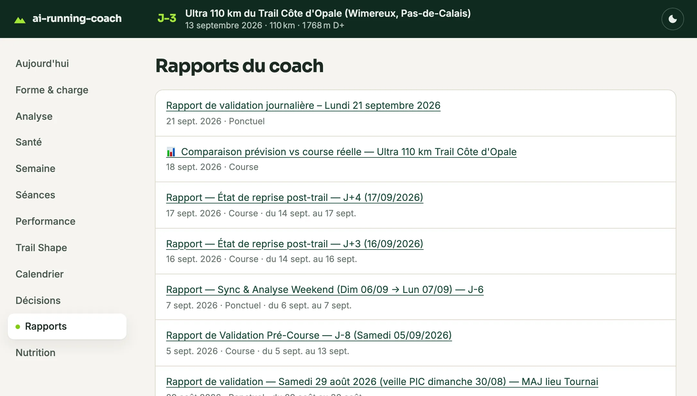

Les rapports du coach — bilans hebdomadaires, validations du jour, comparaisons de
parcours, analyses de course —, du plus récent au plus ancien, avec leur type et leur
période. Un clic les rend lisibles, tableaux compris ; ici, la comparaison entre la
prévision et le déroulé réel de l'ultra :

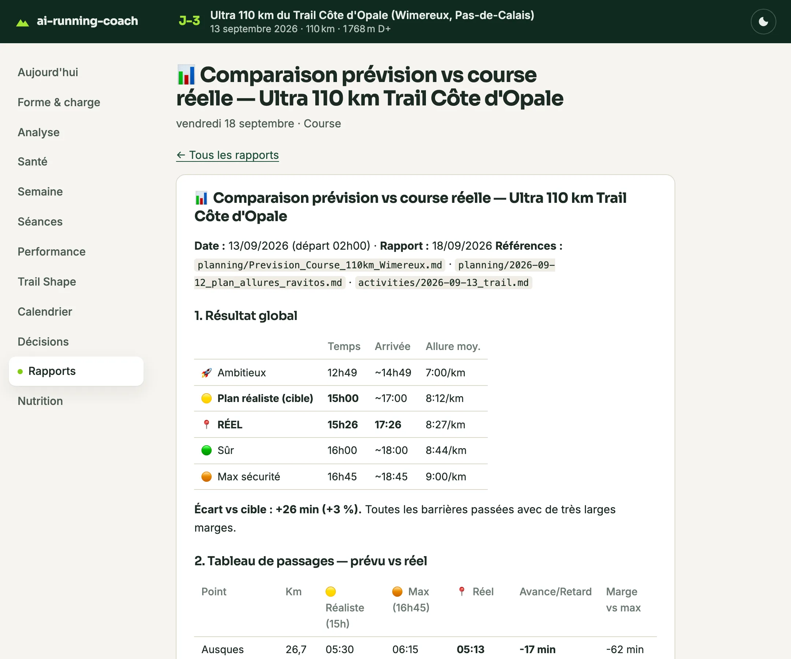

| Alimentée par | Écrit par |
|---|---|
| `rapports/*.md` | le coach |

## Nutrition

**Mon poids et mes apports suivent-ils ?**

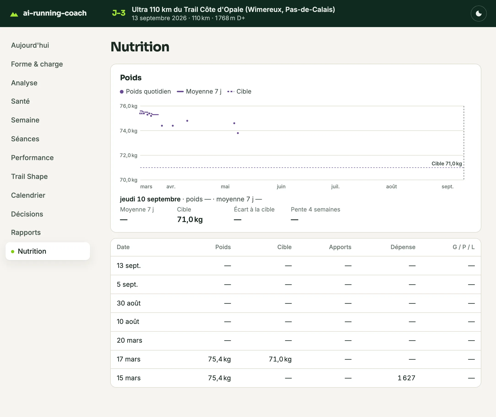

Un graphique de poids (#36) — points quotidiens, moyenne mobile 7 jours et cible — puis
un tableau jour par jour : poids et poids cible, apports déclarés, dépense Garmin,
glucides / protéines / lipides. Il n'y a pas de connexion MyFitnessPal : les apports
viennent de ce que vous dites au nutritionniste, qui les consigne.

Le poids affiché fusionne deux sources qui peuvent toutes deux exister le même jour :
`medical/<date>_health.md` (pesée du bilan matinal) et `nutrition/<date>_nutrition.md`
(sans garantie d'horaire). La mesure du matin gagne toujours ; jamais de moyenne entre
les deux. Deux fichiers de la MÊME source pour la même date (doublon santé, ou doublon
nutrition) : le `source_path` le plus grand par ordre alphabétique gagne — une règle
arbitraire mais déterministe et documentée (`ASSUMPTIONS["weight_merge"]`), faute d'heure
de mesure dans le contrat pour départager autrement. Sous trois jours pesés sur les sept
derniers, la moyenne 7 j n'est pas affichée plutôt que de montrer une valeur bruitée ; la
moyenne et l'écart à la cible affichés sont toujours ceux du jour même — jamais la dernière
valeur non nulle trouvée plus tôt dans l'historique — et portent leur propre date (« au
25 sept. ») pour qu'une valeur ancienne ne se fasse jamais passer pour la valeur du jour.
La pente sur 4 semaines (kg/semaine) demande au moins cinq jours pesés ET un écart d'au
moins 14 jours entre la première et la dernière pesée de la fenêtre — quelques pesées
groupées sur deux ou trois jours ne donnent pas une tendance fiable sur 4 semaines. Ce sont
des chiffres, jamais un avis sur ce qu'il faudrait en faire. En unités impériales
(`[athlete].units = "imperial"`), le poids s'affiche en livres.

| Alimentée par | Écrit par |
|---|---|
| `nutrition/<date>_nutrition.md` (valeurs chiffrées) | le nutritionniste |
| `medical/<date>_health.md` (poids du bilan matinal) | le coach / la synchronisation santé |

**Glucides & sudation, sorties longues (#41).** Un point par sortie longue
(`duration_s` > 90 min) des 12 dernières semaines glissantes : glucides ingérés par
heure d'effort (`carbs_g` / durée), et taux de sudation quand la séance a été pesée
avant/après (`sweat_rate_l_h`, dérivé à l'indexation — voir plus haut). Une bande
60-90 g/h rappelle le repère généraliste des plans de course, à titre documentaire
seulement, pas une cible normative. Le débit maximal observé sur la fenêtre — le seul
repère de tolérance dont dispose le workspace, faute d'un champ de trouble digestif
au contrat — est affiché en chiffre et sert de plafond (+ marge de progression
documentée) à `course-strategist` lors d'un plan de course : jamais un pari sur
60-90 g/h par défaut si l'athlète n'a encore rien démontré à l'entraînement. Sans
aucune sortie longue chiffrée, la section ne s'affiche pas — ce n'est pas une
absence de données à signaler comme une erreur, juste un entraînement digestif qui
n'a pas encore commencé.

| Alimentée par | Écrit par |
|---|---|
| `activities/<date>_*.md` (`carbs_g`, `weight_pre_kg`/`weight_post_kg`) | le nutritionniste / le coach, déclaration de l'athlète pendant la séance |

**Si c'est vide** — « Pas encore de suivi chiffré » : les fichiers `nutrition/` ne
contiennent pas encore de valeurs (une liste de courses ou un plan de ravitaillement
n'en contiennent pas). Sans `nutritionist` dans `[agents].enabled`, la vue
n'apparaît pas du tout.

## Hypothèses

**Que suppose ce calcul, et où s'arrête-t-il ?**

Toutes les hypothèses des modèles du tableau de bord (charge, VO2max, HRV, zones FC,
allure ajustée, découplage, VAM, descente, durabilité, dépense énergétique, matériel…),
regroupées par modèle. Un sommaire à gauche (une rangée défilante sur téléphone) affiche
un modèle à la fois ; chaque hypothèse montre son libellé et sa première phrase, le
détail se déplie à la demande. La recherche parcourt tous les modèles, ouvre les détails
qui contiennent le terme et le surligne.

Les liens « Hypothèses des modèles » des autres vues ouvrent directement le modèle
concerné (`#/hypotheses?modele=vam`, `?modele=decouplage`…). Les textes viennent tels
quels des modules de calcul (`ASSUMPTIONS` de `scripts/arc_*.py`, servis par
`/api/assumptions`) ; une hypothèse ajoutée côté Python apparaît sans changement du
tableau de bord, dans « Autres » tant qu'elle n'est rattachée à aucun modèle.

## Fichiers hors contrat

**Qu'est-ce que le tableau de bord lit mal ?**

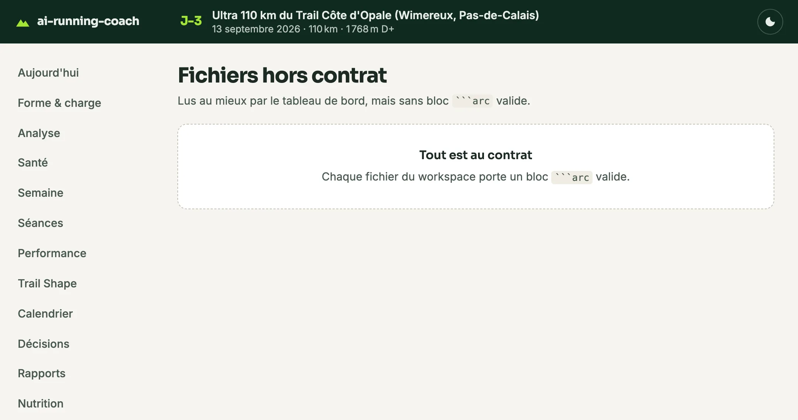

Les fichiers sans bloc de données, avec un bloc invalide, ou illisibles — chacun avec
ce qui lui manque. Le lien n'apparaît dans le menu que s'il en reste. Pour les
reprendre : [Migrer vos fichiers](migration.md). Les fichiers écartés à dessein (une
séance prescrite jamais courue, un doublon) peuvent y rester : c'est une liste de
contrôle, pas une erreur.

Une seconde section, **« Collisions de semaine »** (#69), liste séparément les
fichiers plan (`planning/Semaine_*.md`) déjà **valides** au contrat dont une semaine
est éclipsée par un autre fichier décrivant la même semaine (un fichier dédié et un
plan multi-semaines qui la recouvre, le plus souvent) — ce n'est jamais une dette de
contrat, donc jamais mélangé à la liste ci-dessus ni compté dans son lien de menu :
son propre lien (« N collision(s) de semaine ») les compte à part. L'action attendue
n'est pas de réécrire un bloc — il est déjà correct — mais de retirer ou supprimer
l'entrée `weeks[]` en trop.

## En sombre, et sur le téléphone

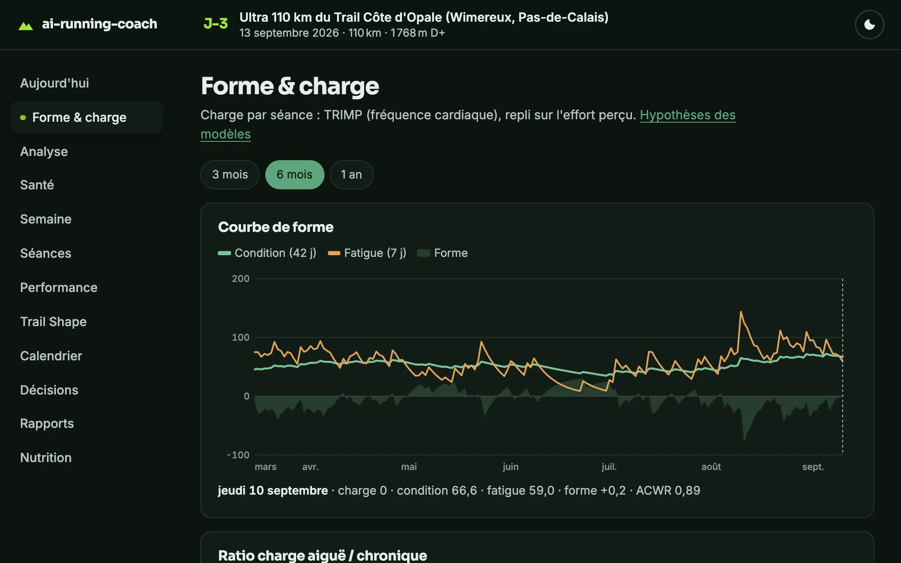

Le tableau suit le thème clair ou sombre du système ; le bouton lune force l'un ou
l'autre, un lien avec `?theme=dark` ou `?theme=light` aussi. Sur un téléphone, le
menu se replie et les graphiques s'adaptent : c'est la vue à ouvrir le matin, depuis
la [machine coach](headless.md) ou [derrière votre reverse proxy](docker.md).

<div class="grid" markdown>

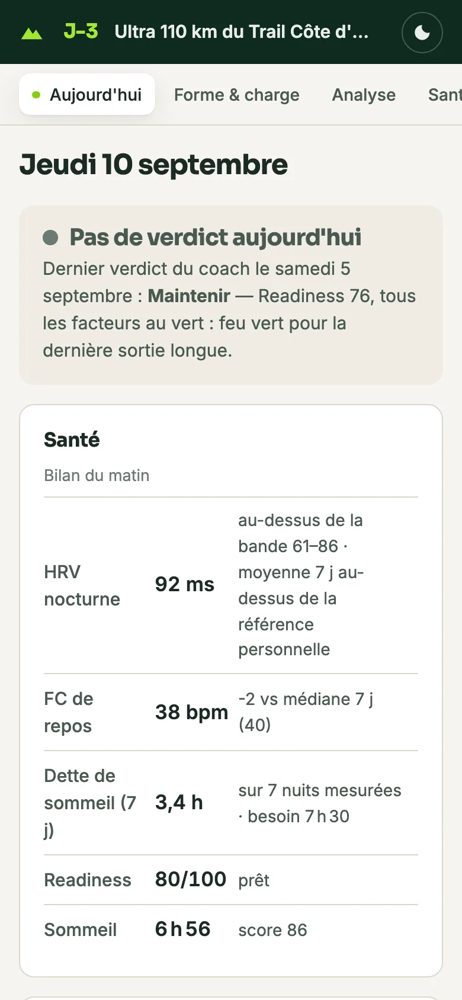{ width="260" }
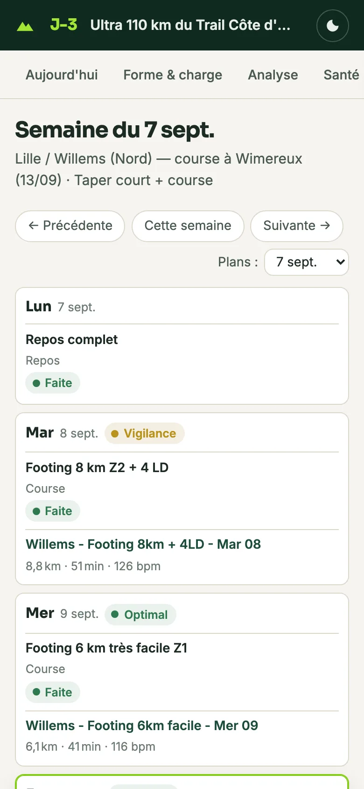{ width="260" }
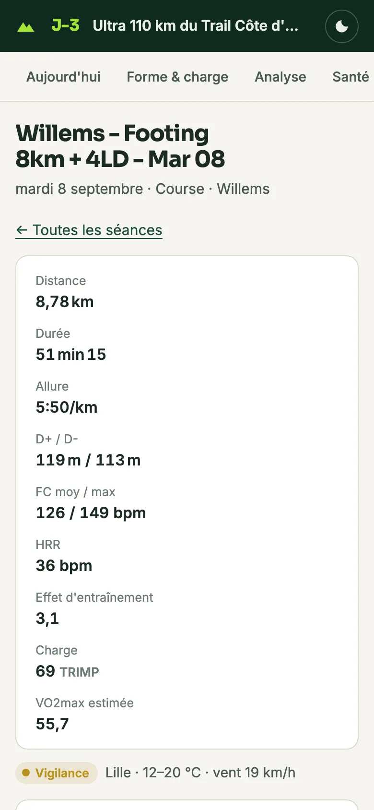{ width="260" }
{ width="260" }
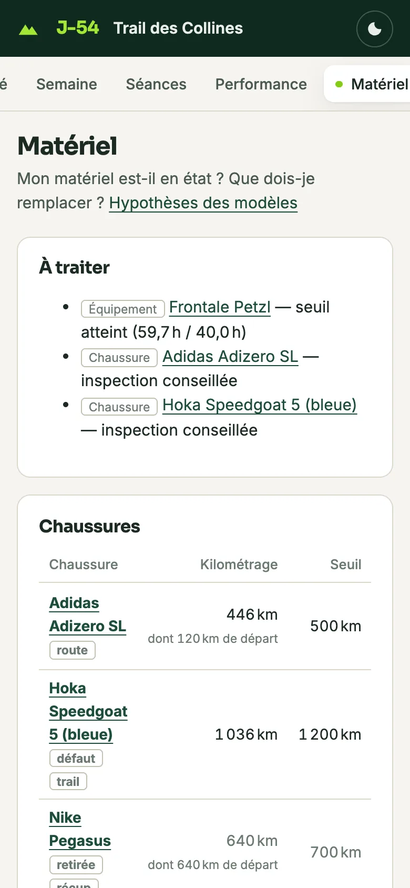{ width="260" }
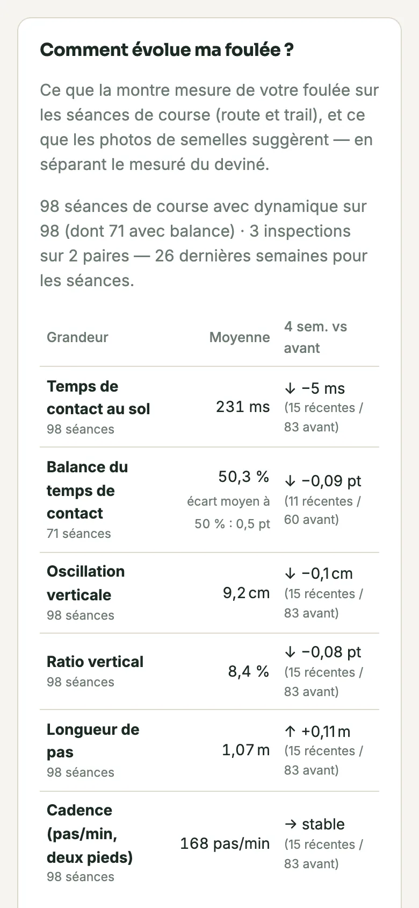{ width="260" }

</div>

## D'où vient chaque vue

Une vue vide ou incomplète se diagnostique presque toujours par le fichier qui la
nourrit :

| Vue | Fichiers lus | Écrits par |
|---|---|---|
| Aujourd'hui | `medical/<date>_health.md`, `medical/<date>_meteo.md`, `planning/Semaine_<lundi>.md` | synchronisation, coach |
| Forme & charge | `activities/*.md`, `planning/Runner_Profile.md` | synchronisation, vous |
| Analyse | `activities/fit/*.json`, `planning/Runner_Profile.md` | skill `fit-download`, synchronisation |
| Santé | `medical/<date>_health.md` ; cartes Foulée et Exposition à l'altitude : `activities/fit/*.json`, `gear/*_inspection.md` (Foulée) | synchronisation, coach, skill `fit-download` |
| Semaine | `planning/Semaine_<lundi>.md`, `activities/*.md` | coach, synchronisation |
| Séances | `activities/<date>_<sport>.md` | synchronisation |
| Performance | `activities/*.md`, `planning/Runner_Profile.md`, `planning/active_objective.md` | synchronisation, vous |
| Matériel | `planning/Runner_Profile.md`, `activities/*.md`, `gear/*.md` | vous, coach, synchronisation |
| Trail Shape | `activities/*.md` (8 dernières semaines), `planning/active_objective.md` | synchronisation, vous |
| Roadbook | `planning/*.md` (plan de course : segments, ravitos, matériel), `planning/Runner_Profile.md` | `course-strategist`, vous |
| Calendrier | `activities/*.md`, `planning/Semaine_<lundi>.md` (frise du bloc) | synchronisation, coach |
| Rapports | `rapports/*.md` | coach |
| Nutrition | `nutrition/<date>_nutrition.md` | nutritionniste |
| Hypothèses | aucun fichier du workspace : les modules de calcul (`scripts/arc_*.py`) | — |

Chacun de ces fichiers s'ouvre par un bloc de données décrit par le
[contrat de données](../skills/workspace-data-contract.md) : c'est ce bloc que le
tableau de bord lit, jamais la prose.
