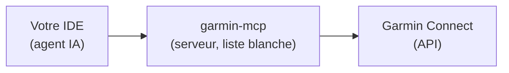
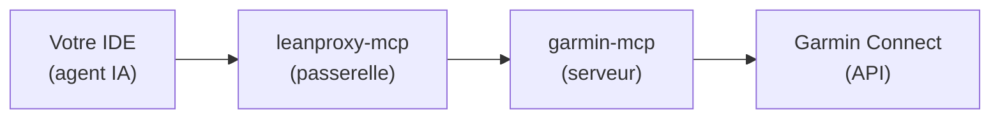

# Configuration Garmin

Cette page détaille l'accès à **Garmin Connect** utilisé par `ai-running-coach`.

## Architecture

### Mode direct (défaut)



### Mode passerelle (optionnel — power user)



- **`garmin-mcp`** — serveur MCP qui expose les données Garmin Connect (activités, santé, sommeil, calendrier, planification d'entraînements). **Mode direct par défaut** : il est enregistré directement dans votre IDE avec une **liste blanche d'outils** (`GARMIN_ENABLED_TOOLS`) pour réduire la taxe de contexte (~151 outils → ~25).
- **`leanproxy-mcp`** — passerelle MCP optionnelle (mode *power user*) qui agrège les serveurs, charge les schémas à la demande et économise ~98 % de tokens. Installée avec `--use-leanproxy`.
- **`garmin-mcp-auth`** — outil d'authentification OAuth (tokens stockés dans `~/.garminconnect/`)

## Composants installés

| Composant | Rôle | Installation |
|---|---|---|
| `uv` | Gestionnaire Python | `curl -LsSf https://astral.sh/uv/install.sh \| sh` |
| `garmin-mcp` | Serveur MCP Garmin | `uv tool install --python 3.12 git+https://github.com/Taxuspt/garmin_mcp@cfc5d799ab0f165e837f1188a1d093c65838aaf7` |
| `garmin-mcp-auth` | Authentification OAuth | via `uv run garmin-mcp-auth` |
| `leanproxy-mcp` | Passerelle MCP (optionnel) | `brew tap mmornati/leanproxy-mcp && brew install leanproxy-mcp` |

## Mode direct (défaut)

Le script d'installation enregistre le serveur MCP `garmin` dans votre IDE avec la liste blanche d'outils :

```json
{
  "mcpServers": {
    "garmin": {
      "command": "garmin-mcp",
      "args": ["stdio"],
      "env": {
        "GARMIN_ENABLED_TOOLS": "get_activities,get_activities_by_date,get_activity,get_activity_fit_data,get_activity_splits,get_activity_typed_splits,get_activity_split_summaries,get_sleep_data,get_hrv_data,get_rhr_day,get_training_readiness,get_calendar_events,get_courses,get_workouts,get_workout_by_id,get_scheduled_workouts,schedule_workouts,schedule_week,upload_workout,upload_course,create_strength_workout,delete_workout,unschedule_workout,unschedule_workouts,download_activity_file,get_stats,get_lactate_threshold,get_training_status,get_gear,get_activity_gear,add_gear_to_activity"
      }
    }
  }
}
```

!!! tip "Pourquoi une liste blanche ?"
    `garmin-mcp` expose ~151 outils. Les agents de ce projet n'en utilisent qu'une vingtaine. La liste blanche (`GARMIN_ENABLED_TOOLS`) réduit fortement la taxe de contexte de chaque requête. Vous pouvez l'ajuster dans `install.sh` (variable `GARMIN_TOOL_WHITELIST`).

## Mode passerelle (optionnel — power user)

Installez avec `--use-leanproxy` :

```bash
./install.sh --use-leanproxy
```

Le script configure deux fichiers dans `~/.config/leanproxy/` :

### `config.yaml`

```yaml
server:
  host: "127.0.0.1"
  port: 8080
  timeout: 300s
  max_batch_size: 100
optimization:
  lazy_loading:
    enabled: true
    stub_tokens: 54
    cache_ttl: 24h
namespaces:
  sport:
    description: "Sport tools"
    servers:
      - garmin
    allowed_clients:
      - "*"
logging:
  level: "info"
  file: ""
```

### `leanproxy_servers.yaml`

```yaml
version: "1.0"
servers:
    - name: garmin
      enabled: true
      transport: stdio
      stdio:
        command: garmin-mcp
        args:
            - stdio
        env:
            - GARMIN_ENABLED_TOOLS: "get_activities,get_activities_by_date,get_activity,get_activity_fit_data,get_activity_splits,get_activity_typed_splits,get_activity_split_summaries,get_sleep_data,get_hrv_data,get_rhr_day,get_training_readiness,get_calendar_events,get_courses,get_workouts,get_workout_by_id,get_scheduled_workouts,schedule_workouts,schedule_week,upload_workout,upload_course,create_strength_workout,delete_workout,unschedule_workout,unschedule_workouts,download_activity_file,get_stats,get_lactate_threshold,get_training_status,get_gear,get_activity_gear,add_gear_to_activity"
        cwd: .
      timeout: 300s
      connect_timeout: 10s
      idle_timeout: ""
```

!!! note "Config existante"
    Le script **ne remplace pas** une configuration existante. Si `config.yaml` ou `leanproxy_servers.yaml` existent déjà, ils sont conservés.

!!! warning "Liste blanche déjà installée avant un ajout d'outil"
    Conséquence directe de la note ci-dessus : une installation leanproxy déjà
    en place ne reçoit **pas automatiquement** un outil ajouté plus tard à
    `GARMIN_TOOL_WHITELIST` (ex. `get_stats`/`get_lactate_threshold`/
    `get_training_status`, story #65) — `~/.config/leanproxy_servers.yaml`
    n'est réécrit que s'il est absent. Éditez sa ligne `GARMIN_ENABLED_TOOLS`
    à la main pour y ajouter le nouvel outil, plutôt que de réinstaller :

    ```bash
    grep -n GARMIN_ENABLED_TOOLS ~/.config/leanproxy_servers.yaml
    # ajoutez le(s) nouveau(x) outil(s) à la fin de la liste, séparés par une virgule
    ```

    Appelez ensuite les nouveaux outils via
    `leanproxy_invoke_tool(server="garmin", tool="get_stats", arguments={...})`
    (voir `skills/garmin-sync-efficiency/SKILL.md`), pas directement.

## Suivi du cycle menstruel (opt-in, #166)

Les outils `get_menstrual_data_for_date` et `get_menstrual_calendar_data` ne figurent **pas** dans
la liste blanche ci-dessus. `install.sh` les y ajoute uniquement avec
`[health].cycle_tracking = "garmin"` (ou `./install.sh --cycle-tracking garmin`, qui écrit la
clé) ; repasser à `off` et relancer l'installation les retire. En mode passerelle,
`leanproxy_servers.yaml` n'étant réécrit que s'il est absent, ajoutez-les à la main à sa ligne
`GARMIN_ENABLED_TOOLS`. Détail : [Cycle menstruel](cycle-menstruel.md).

## Apports vers Garmin Connect (opt-in, #167)

Les outils `get_custom_foods`, `get_custom_food_serving_units`, `get_nutrition_daily_food_log`,
`get_nutrition_daily_meals`, `get_hydration_data` (lecture) et `create_custom_food`,
`log_custom_food`, `log_food`, `add_hydration_data` (écriture, « oui » explicite, jamais en
headless) ne figurent **pas** dans la liste blanche ci-dessus. `install.sh` les y ajoute uniquement
avec `[nutrition].garmin_sync = "ask"` (ou `./install.sh --nutrition-sync ask`, qui écrit la clé) ;
repasser à `off` et relancer l'installation les retire. Mode direct uniquement : refusé avec
`--use-leanproxy` (écritures non filtrables en headless) — ne les ajoutez pas à la main à
`leanproxy_servers.yaml`. Détail : [Apports vers Garmin](nutrition-garmin.md).

## Synchronisation du matériel Garmin

Garmin Connect gère son propre matériel (attribution automatique par sport, seuils de retraite).
Trois outils sont dans la liste blanche : `get_gear` et `get_activity_gear` (lecture) et
`add_gear_to_activity` (**écriture** côté Garmin — le coach ne l'appelle qu'après votre
confirmation explicite dans la conversation, jamais en synchronisation automatique).

- **Association, une seule fois.** Au premier `get_gear` qui montre un matériel Garmin sans puce
  correspondante, le coach vous propose, pour chacun, de l'associer à une puce existante de
  `### Chaussures` (ajout du segment `garmin: <uuid>`) ou d'en créer une (`alerte` ← seuil Garmin,
  `depuis` ← date de début, `(retirée)` ← statut retiré). Jamais d'association devinée ; sans
  réponse, le matériel n'est simplement pas attribué. Le total Garmin d'une paire qui précède
  votre suivi peut alimenter son `départ` (départ = total Garmin − kilomètres déjà comptés par vos
  séances, jamais négatif : aucun double comptage). Pour l'historique déjà dans le workspace, voir
  [Rattraper le matériel de l'historique](#rattraper-le-materiel-de-lhistorique).
- **Priorité d'attribution.** Votre déclaration en chat > matériel attaché par la montre
  à la séance (un seul `get_activity_gear` par séance **nouvelle**) > `(par défaut)`. Si Garmin
  dit A et que vous dites B, vous gagnez et le coach le signale une fois. Un matériel Garmin sans
  puce n'est jamais attribué en silence ni crédité à la paire par défaut (`gear_source:
  garmin_unmapped`) ; une puce `- <nom Garmin> — garmin: <uuid> (ignorée)` fait taire propositions
  et alertes. La provenance est tracée dans `gear_source` (`garmin`/`chat`/`garmin_unmapped`) ; règle exécutée par `python3 scripts/arc_index.py gear-attribution`.
- **Synchronisation automatique.** `scripts/daily-sync.sh` passe `--disallowedTools` pour
  `add_gear_to_activity` et `remove_gear_from_activity`, ainsi que pour les outils d'écriture de
  séances et de parcours (`schedule_workouts`, `upload_workout`, `delete_workout`…) : le run non
  surveillé ne peut pas écrire chez Garmin. **Limite** : en mode passerelle l'appel passe par l'outil unique
  `mcp__leanproxy__invoke_tool`, qui ne peut pas être filtré par sous-outil — seule la consigne du skill
  protège alors ; préférez le mode direct pour un run non surveillé.
- **Retour vers Garmin (facultatif).** Une attribution faite en chat peut être poussée vers Garmin
  si vous le confirmez ; sans confirmation, rien n'est écrit.
- **Installations existantes.** Relancez `./install.sh` : la liste blanche de `.mcp.json` est
  mise à jour. En mode passerelle, éditez à la main `GARMIN_ENABLED_TOOLS` de
  `~/.config/leanproxy_servers.yaml` (voir l'avertissement plus haut) pour y ajouter
  `get_gear,get_activity_gear,add_gear_to_activity`. `/coach-doctor` (`gear_sync`) signale une liste
  blanche trop ancienne et les paires du profil sans `garmin:` — sans jamais contacter Garmin.
- **Source intervals.icu.** Voir [Configuration Intervals.icu](intervals-setup.md#materiel-et-attribution-par-seance).

## Rattraper le matériel de l'historique

Le matériel attaché par la montre n'est attribué qu'aux séances **nouvelles** (`get_activity_gear` à la
synchronisation). Un historique déjà dans `activities/` reste sans `gear_id` : la vue « Matériel » du tableau de bord est vide
alors que Garmin Connect connaît la paire de chaque séance. Le script `scripts/garmin_gear_backfill.py` (#145)
les rattrape avec **un appel Garmin par paire** de chaussures (`get_gear_activities`), jamais un par séance.

```bash
# 1. Simulation (par défaut) : rien n'est écrit
python3 scripts/garmin_gear_backfill.py
# 2. Après relecture du rapport : écriture
python3 scripts/garmin_gear_backfill.py --apply
```

Extrait d'un rapport de simulation (noms et identifiants fictifs, format réel) :

```text
RATTRAPAGE DU MATÉRIEL GARMIN — simulation (rien n'est écrit)
Workspace : 190 fichier(s) d'activité, 187 avec garmin_activity_id, période 2024-08-15 → 2026-09-29

PAIRES (4 retenue(s), 12 hors période masquée(s) — --all-shoes pour les proposer)
- Hoka Speedgoat 5 [puce à ajouter]
    puce proposée : - Hoka Speedgoat 5 — depuis 2025-08-11 — alerte 800 km — id: hoka-speedgoat-5 — garmin: 3f9c2a7e…
    séances rattachées : 49 (à écrire 49, déjà attribuées 0, conflits 0, ambiguës 0)
    km : 919.8 dans le workspace · 948.2 au total chez Garmin (51 séance(s))
    départ : aucun kilométrage antérieur au premier fichier du workspace ; non comptée(s) : 2 dans la période
             du workspace (trous, à importer par la synchronisation)
- Nike Pegasus 40 [puce à ajouter] (retirée)
    puce proposée : - Nike Pegasus 40 — depuis 2024-04-25 — alerte 644 km — départ 239 km — id: nike-pegasus-40 — garmin: 7a1e4c9b… (retirée)
    séances rattachées : 10 (à écrire 10, déjà attribuées 0, conflits 0, ambiguës 0)
    départ : 239 km = 20 séance(s) Garmin de la paire antérieures au premier fichier du workspace (2024-08-15)
…
PAIRES PAR DÉFAUT CHEZ GARMIN (non reprises : `(par défaut)` n'est jamais posé automatiquement) : Hoka Speedgoat 5
AMBIGUËS — revendiquées par deux paires chez Garmin, jamais attribuées (4)
SÉANCES GARMIN ABSENTES DU WORKSPACE (185, 2314 km)
  - 58 (685 km) antérieures au premier fichier du workspace — comptées dans « départ » des puces nouvelles
  - 127 (1629 km) dans la période du workspace (trous) — non comptées, jamais réimportées ici
FICHIERS SANS garmin_activity_id : 3 — non rattachables automatiquement (déclarer la paire dans le chat)

BILAN : 4 puce(s) à ajouter, 0 segment(s) garmin: à ajouter à une puce existante, 108 séance(s) à renseigner, 0 conflit(s), 4 ambiguë(s).
Simulation seulement. Pour écrire : relancer avec --apply.
```

Après `--apply`, la dernière ligne résume ce qui a été écrit (`Appliqué : profil mis à jour, N séance(s)
écrite(s), 0 échec(s)…`) et l'index est reconstruit : la vue [Matériel](dashboard/views.md#materiel)
affiche aussitôt le kilométrage de chaque paire. Sur un serveur avec le tableau de bord en conteneur,
reconstruisez l'image après la mise à jour du moteur (`docker compose up -d --build`, voir
[Docker](dashboard/docker.md#mettre-a-jour)).

Options : `--since AAAA-MM-JJ` (séances du workspace à partir de cette date), `--gear <uuid>` (une seule paire),
`--all-shoes` (propose aussi les paires sans séance dans la période du workspace — les anciennes paires
retirées, en `(retirée)`), `--json`, `--workspace`, `--tokens-dir`. Le script est idempotent : une seconde
exécution ne change rien.

- **Dépendance.** Comme `download_fit.py`, il utilise `garminconnect` et les jetons locaux (`~/.garminconnect`,
  ou `GARMINTOKENS` de `.mcp.json`) : c'est la seule exception à « bibliothèque standard seule » ; il se relance
  seul avec le Python de `garmin-mcp` (`GARMIN_PYTHON` pour en imposer un autre). La connexion Garmin peut prendre
  une à deux minutes.
- **Rapport de simulation.** Par paire : la puce `### Chaussures` proposée, le nombre de séances rattachées, les
  km du workspace comparés au total Garmin ; puis les **conflits**, les séances **ambiguës**, les séances Garmin
  **absentes** du workspace et le nombre de fichiers **sans `garmin_activity_id`** (non rattachables : déclarez la
  paire dans le chat).
- **Priorité athlète.** Une séance qui porte déjà un `gear_id` (déclaré en chat, ou attribué par une
  synchronisation antérieure) n'est **jamais** écrasée : la divergence est seulement listée. Seul un
  `gear_source: "garmin_unmapped"` sans `gear_id` est remplacé (uniquement la valeur de `gear_source`, le reste
  du bloc `arc` est conservé octet pour octet). Une paire `(ignorée)` n'est jamais attribuée ; une séance
  revendiquée par **deux** paires chez Garmin est ambiguë et n'est attribuée à aucune. **Toutes** les paires
  sont lues même avec `--gear` (qui ne restreint que ce qui est proposé et écrit), pour que l'ambiguïté soit
  toujours détectée. Si une paire est en erreur ou tronquée, elle peut cacher une ambiguïté : `--apply` est
  **refusé** (code 1, rien n'est écrit) ; la simulation la liste (section INCOMPLET).
- **Fichiers particuliers.** Plusieurs fichiers portant le même `garmin_activity_id` (ex. `_running.md` et
  `_running_2.md`) sont signalés comme **doublons** et jamais écrits (à trier à la main). Un fichier avec
  `gear_source` mais sans `gear_id` (invalide) est laissé tel quel et signalé. Un fichier **déjà hors contrat**
  (avant le passage du script) n'est pas réécrit et est rapporté à part (« voir /arc-backfill ») sans compter
  comme un échec. Les écritures se font en octets : fins de ligne (CRLF) et permissions conservées, et un
  fichier refusé après écriture est restauré à l'identique.
- **Puces proposées.** `- <nom> — depuis <date> — alerte N km — départ N km — id: <slug> — garmin: <uuid>
  (retirée)` : `alerte` vient de `maximumMeters` (si > 0), `(retirée)` du statut Garmin, le nom de
  `displayName`, à défaut `customMakeModel`, à défaut « Chaussure Garmin <uuid[:8]> ». Une puce existante avec le
  même `garmin:` est réutilisée (son `gear_id` sert) et **jamais modifiée**. Une puce existante **sans** `garmin:`
  dont le nom (ou l'`id`) correspond à la paire n'est pas dupliquée : le rapport propose d'y ajouter le segment
  `garmin: <uuid>` et `--apply` l'ajoute — c'est la **seule** modification jamais faite à une puce existante (nom
  ambigu : rien n'est attribué). L'`id` d'une puce nouvelle n'est jamais celui d'un `gear_id` déjà présent dans
  vos séances (déclaré en chat, sans puce) : il reçoit un suffixe et le rapport signale la correspondance de nom
  pour que vous décidiez. `(par défaut)` n'est jamais posé : le rapport liste seulement les paires par défaut de
  Garmin.
- **`départ` sans double comptage.** Seule une puce **nouvelle** en reçoit un : la somme des km Garmin des séances
  de la paire datées **strictement avant le premier fichier du workspace** (identifiées par `activityId`). Les
  séances déjà dans le workspace sont comptées par leurs fichiers ; celles **postérieures** au dernier fichier
  seront importées par la synchronisation ; celles qui tombent **dans la période** sans fichier (trous) ne sont
  pas comptées non plus (choix prudent : un fichier sans identifiant peut les représenter). Ces trois catégories
  sont listées séparément au rapport. Le départ n'est pas proposé (raison donnée) avec `--since`, ni si la liste
  Garmin est tronquée ou en erreur. Sans trou, km du workspace + départ = total Garmin.
- **`--apply`.** Ajoute les puces manquantes sous `### Chaussures` (sous-section créée dans `## Matériel & lieux`
  si absente), écrit `gear_id` + `gear_source: "garmin"` dans le bloc `arc` des séances (le reste du fichier est
  conservé tel quel), valide chaque fichier avec le contrat (un fichier refusé est restauré) puis réindexe.
- **Codes de sortie.** 0 = succès ; 1 = succès partiel (paire injoignable, fichier refusé) ; 2 = usage,
  `garminconnect` absent ou authentification impossible ; 3 = `--apply` sans profil athlète.

Le coach vous propose ce rattrapage **une fois**, en conversation seulement, toujours en simulation d'abord, et
n'écrit qu'après votre « oui » sur le rapport (la simulation dure 1 à 2 minutes de connexion plus un appel par paire :
lancez-la avec un long délai ou en arrière-plan). La synchronisation automatique (`garmin-daily-sync`, sans
surveillance) ne le lance jamais et n'en parle pas : c'est `/coach-doctor` (`gear_history`) qui le signale, sans
contacter Garmin, quand plus de la moitié des séances (au moins 5) portant un `garmin_activity_id` n'ont pas de
`gear_id`.

## Authentification

Les tokens Garmin sont stockés dans `~/.garminconnect/` et sont valides environ **6 mois**.

### Vérifier les tokens

```bash
uv run garmin-mcp-auth --verify
```

### Renouveler l'authentification

```bash
uv run garmin-mcp-auth
```

## Données accessibles

Les agents accèdent aux outils Garmin directement (mode direct) ou via `leanproxy_invoke_tool(server="garmin", tool="...")` (mode passerelle) :

- **Activités** : liste, détails, fichiers FIT
- **Santé** : HRV, sommeil, stress, fréquence cardiaque au repos
- **Calendrier** : séances planifiées, push d'entraînements
- **Planification** : création de séances (course, fractionné, renforcement)

## Dépannage

| Problème | Solution |
|---|---|
| `garmin-mcp` introuvable | `uv tool install --python 3.12 git+https://github.com/Taxuspt/garmin_mcp@cfc5d799ab0f165e837f1188a1d093c65838aaf7` |
| Tokens expirés | `uv run garmin-mcp-auth` |
| `leanproxy-mcp` introuvable (mode passerelle) | `brew tap mmornati/leanproxy-mcp && brew install leanproxy-mcp` |
| Erreur de connexion | Vérifiez que `garmin-mcp` fonctionne : `garmin-mcp stdio` |

Voir aussi la page [Dépannage](troubleshooting.md).

!!! info "Pas de montre Garmin ?"
    `./install.sh --source intervals` remplace tout ce qui précède par
    Intervals.icu (COROS, Suunto, Polar, Apple...) — voir
    [Configuration Intervals.icu](intervals-setup.md).
