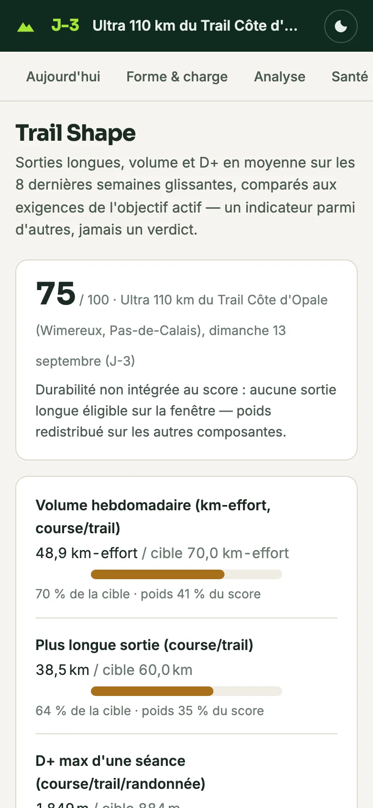
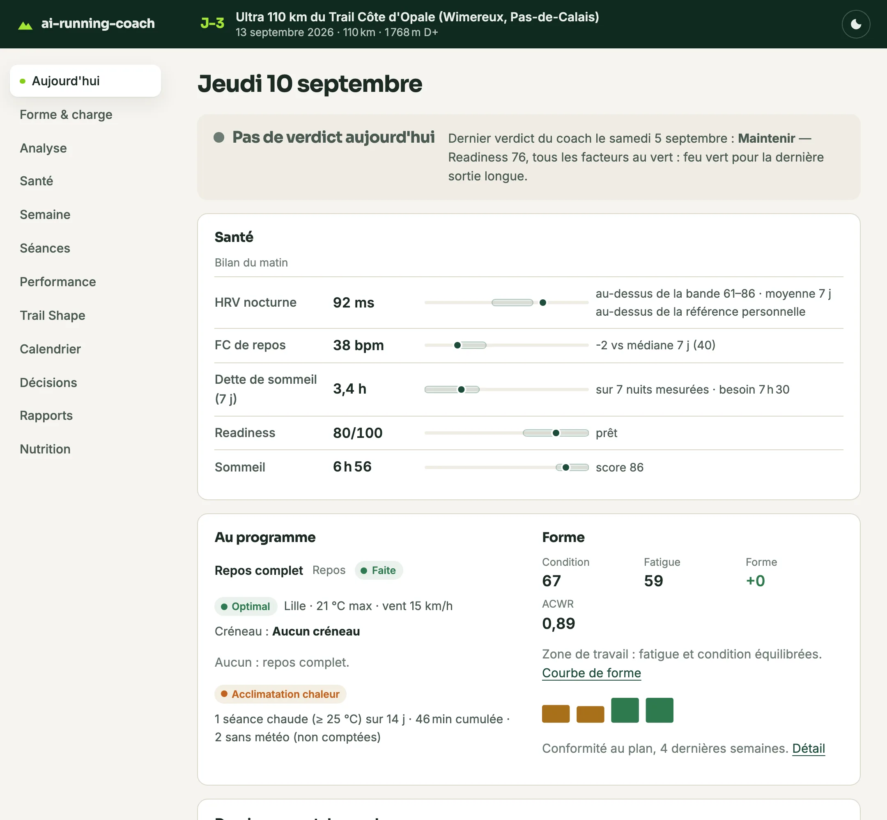
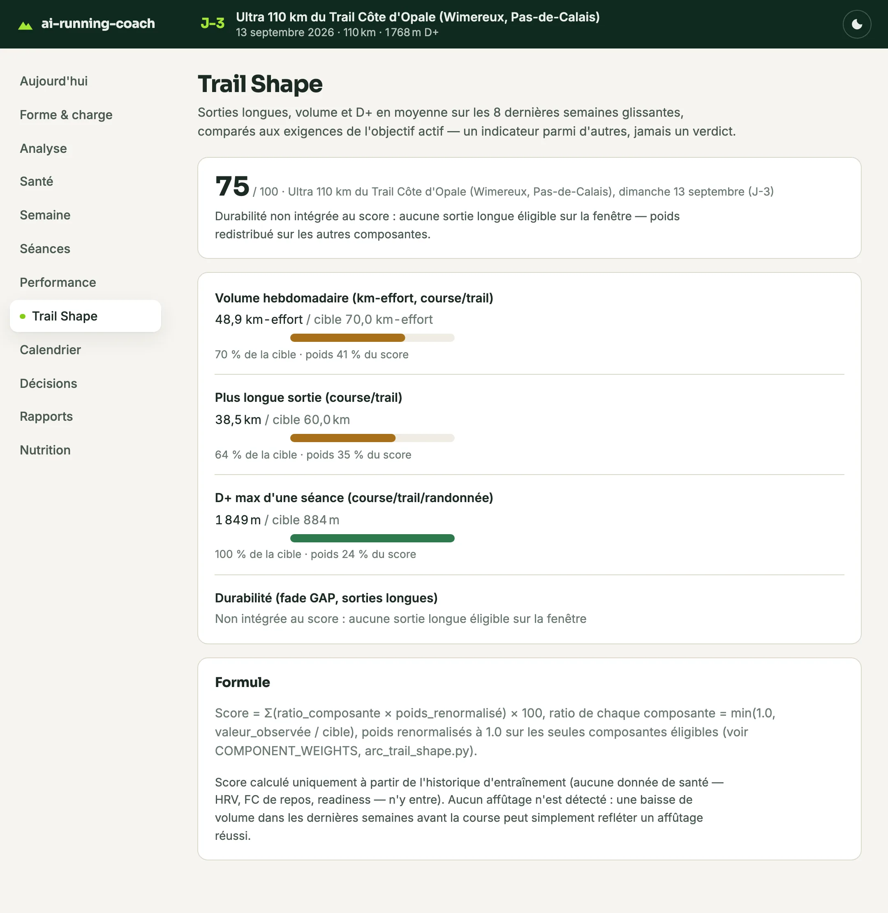
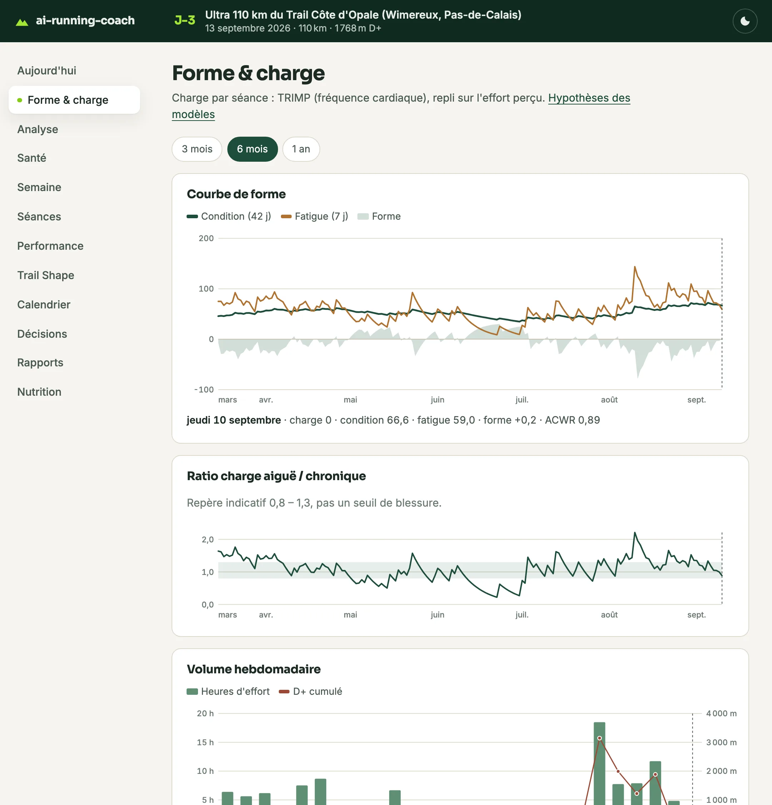
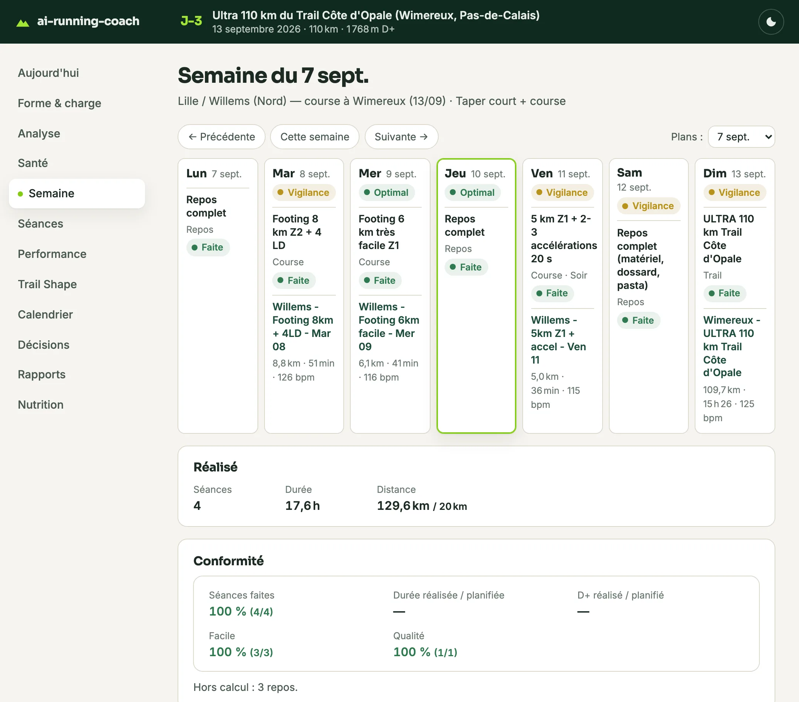
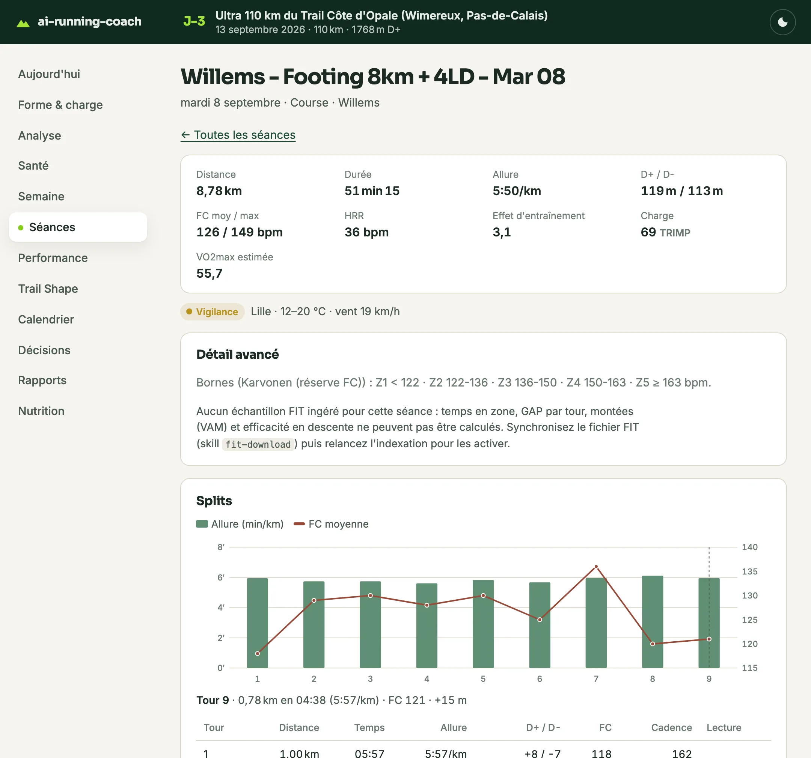
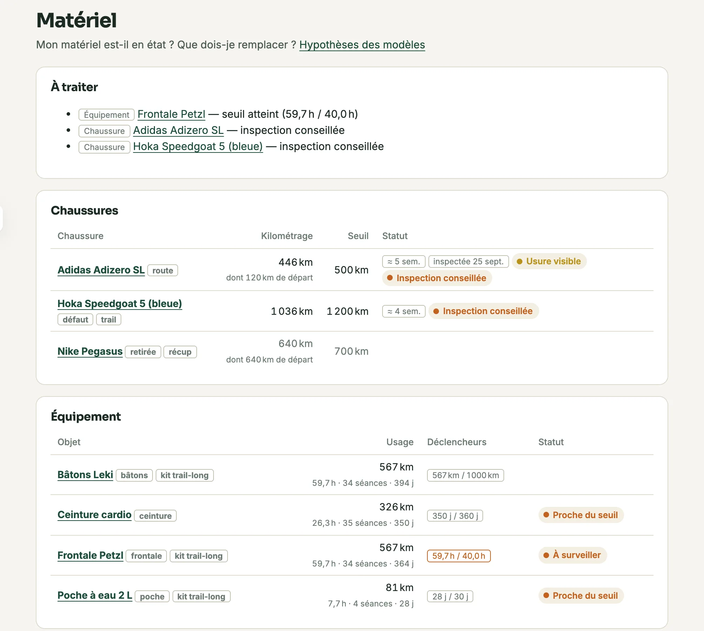

---
hide:
  - navigation
  - toc
---

  

## Quatre spécialistes, un seul objectif : le vôtre

`ai-running-coach` transforme votre IDE en staff d'entraînement complet. Quatre agents IA open source, en français par défaut, coordonnés par un coach — chacun avec ses skills, ses données et ses protocoles. Vous décrivez votre objectif, ils construisent le plan. <!-- count:agents -->
{ .arc-section__intro }

:material-whistle:

### Coach

Le chef d'orchestre. Il construit le plan, semaine après semaine ou en bloc de plusieurs semaines, analyse chaque séance Garmin, fixe vos cibles d'allure et de FC à partir de vos propres zones et pousse les séances dans votre calendrier Garmin Connect.

> « Je veux préparer un trail de 50 km avec 2500 m de D+ dans 6 mois. »

:material-map-marker-path:

### Stratège de course

Il lit le GPX de la course, découpe le parcours en segments et prédit chacun avec votre propre modèle pente → allure. Trois scénarios, ravitos, météo, équipement — puis le parcours envoyé sur la montre.

> « Analyse ce parcours et donne-moi un plan d'allures. »

:material-heart-pulse:

### Médecin du sport

Il lit HRV, FC de repos, readiness et dette de sommeil avant chaque séance, lève un signal de vigilance blessure quand plusieurs indicateurs dérivent ensemble, et suit vos douleurs jusqu'à la consultation.

> « Suis-je prêt pour la séance de demain ? »

:material-food-apple:

### Nutritionniste

Il gère macros, poids de course et plans de ravitaillement, mesure vos glucides par heure et votre sudation sur les sorties longues, en croisant vos apports avec les calories brûlées Garmin.

> « Que dois-je manger pendant la course ? »

  

  

## Du premier réglage à la ligne d'arrivée

Le staff vous suit sur tout le parcours d'une préparation — et chaque étape laisse une trace lisible dans votre workspace.
{ .arc-section__intro }

  <svg class="arc-profile" viewBox="0 20 1000 180" preserveAspectRatio="none" aria-hidden="true" focusable="false">
    <path class="arc-profile__area" d="M0,152.8 L4,156.0 L8,156.6 L12,154.5 L16,151.4 L20,149.7 L24,150.1 L28,151.9 L32,152.9 L36,152.3 L40,150.8 L44,150.3 L48,152.0 L52,154.9 L56,157.1 L60,156.5 L64,153.2 L68,148.8 L72,145.6 L76,144.1 L80,143.4 L84,141.7 L88,138.4 L92,134.8 L96,133.0 L100,134.1 L104,137.1 L108,139.8 L112,140.4 L116,138.8 L120,136.7 L124,135.8 L128,136.4 L132,137.1 L136,136.1 L140,133.1 L144,129.7 L148,128.1 L152,129.3 L156,132.3 L160,135.0 L164,135.7 L168,134.4 L172,132.9 L176,132.6 L180,133.2 L184,133.1 L188,130.5 L192,125.2 L196,119.1 L200,114.4 L204,112.3 L208,111.9 L212,111.1 L216,108.6 L220,105.1 L224,102.3 L228,101.4 L232,101.9 L236,101.8 L240,99.2 L244,94.0 L248,88.2 L252,83.9 L256,82.1 L260,81.6 L264,80.8 L268,78.6 L272,76.1 L276,75.1 L280,76.7 L284,80.0 L288,82.8 L292,83.1 L296,80.9 L300,77.8 L304,75.8 L308,75.5 L312,75.6 L316,74.4 L320,71.5 L324,68.1 L328,66.4 L332,67.4 L336,70.2 L340,72.6 L344,72.7 L348,70.7 L352,68.2 L356,66.9 L360,66.9 L364,66.8 L368,65.0 L372,61.2 L376,57.1 L380,55.1 L384,56.1 L388,59.4 L392,62.7 L396,64.5 L400,65.0 L404,66.0 L408,68.7 L412,72.8 L416,76.6 L420,78.1 L424,77.3 L428,75.9 L432,76.1 L436,79.1 L440,83.7 L444,88.0 L448,90.7 L452,92.5 L456,95.1 L460,99.6 L464,105.3 L468,110.1 L472,112.2 L476,111.3 L480,109.4 L484,108.6 L488,109.8 L492,111.8 L496,113.0 L500,112.5 L504,111.5 L508,112.0 L512,115.0 L516,119.7 L520,123.8 L524,125.6 L528,124.9 L532,123.5 L536,123.3 L540,124.8 L544,126.7 L548,127.3 L552,126.2 L556,124.8 L560,125.2 L564,128.6 L568,134.0 L572,139.0 L576,141.8 L580,142.6 L584,142.9 L588,144.3 L592,146.7 L596,148.6 L600,148.2 L604,145.2 L608,141.5 L612,139.3 L616,139.6 L620,141.6 L624,143.0 L628,142.5 L632,140.4 L636,138.4 L640,137.8 L644,138.3 L648,138.0 L652,135.1 L656,129.5 L660,123.1 L664,118.3 L668,116.0 L672,115.2 L676,114.2 L680,111.8 L684,108.9 L688,107.2 L692,107.9 L696,110.3 L700,112.2 L704,111.6 L708,108.5 L712,104.8 L716,102.4 L720,102.1 L724,102.8 L728,102.6 L732,100.9 L736,98.9 L740,98.5 L744,100.9 L748,105.0 L752,108.6 L756,109.7 L760,108.5 L764,106.5 L768,105.7 L772,106.2 L776,106.8 L780,105.9 L784,103.1 L788,99.9 L792,98.7 L796,100.5 L800,104.3 L804,108.0 L808,109.9 L812,110.2 L816,110.5 L820,112.4 L824,115.7 L828,118.7 L832,119.7 L836,118.5 L840,117.0 L844,117.4 L848,120.7 L852,126.0 L856,131.0 L860,134.6 L864,137.0 L868,139.9 L872,144.7 L876,150.5 L880,155.5 L884,157.8 L888,157.2 L892,155.6 L896,155.3 L900,157.0 L904,159.8 L908,161.8 L912,162.1 L916,161.5 L920,162.0 L924,164.6 L928,168.6 L932,171.8 L936,172.2 L940,170.0 L944,166.8 L948,164.8 L952,164.6 L956,165.0 L960,164.4 L964,162.3 L968,159.9 L972,159.4 L976,161.9 L980,166.3 L984,170.4 L988,172.3 L992,172.2 L996,171.5 L1000,172.2 L1000,200 L0,200 Z" />
    <path class="arc-profile__line" d="M0,152.8 L4,156.0 L8,156.6 L12,154.5 L16,151.4 L20,149.7 L24,150.1 L28,151.9 L32,152.9 L36,152.3 L40,150.8 L44,150.3 L48,152.0 L52,154.9 L56,157.1 L60,156.5 L64,153.2 L68,148.8 L72,145.6 L76,144.1 L80,143.4 L84,141.7 L88,138.4 L92,134.8 L96,133.0 L100,134.1 L104,137.1 L108,139.8 L112,140.4 L116,138.8 L120,136.7 L124,135.8 L128,136.4 L132,137.1 L136,136.1 L140,133.1 L144,129.7 L148,128.1 L152,129.3 L156,132.3 L160,135.0 L164,135.7 L168,134.4 L172,132.9 L176,132.6 L180,133.2 L184,133.1 L188,130.5 L192,125.2 L196,119.1 L200,114.4 L204,112.3 L208,111.9 L212,111.1 L216,108.6 L220,105.1 L224,102.3 L228,101.4 L232,101.9 L236,101.8 L240,99.2 L244,94.0 L248,88.2 L252,83.9 L256,82.1 L260,81.6 L264,80.8 L268,78.6 L272,76.1 L276,75.1 L280,76.7 L284,80.0 L288,82.8 L292,83.1 L296,80.9 L300,77.8 L304,75.8 L308,75.5 L312,75.6 L316,74.4 L320,71.5 L324,68.1 L328,66.4 L332,67.4 L336,70.2 L340,72.6 L344,72.7 L348,70.7 L352,68.2 L356,66.9 L360,66.9 L364,66.8 L368,65.0 L372,61.2 L376,57.1 L380,55.1 L384,56.1 L388,59.4 L392,62.7 L396,64.5 L400,65.0 L404,66.0 L408,68.7 L412,72.8 L416,76.6 L420,78.1 L424,77.3 L428,75.9 L432,76.1 L436,79.1 L440,83.7 L444,88.0 L448,90.7 L452,92.5 L456,95.1 L460,99.6 L464,105.3 L468,110.1 L472,112.2 L476,111.3 L480,109.4 L484,108.6 L488,109.8 L492,111.8 L496,113.0 L500,112.5 L504,111.5 L508,112.0 L512,115.0 L516,119.7 L520,123.8 L524,125.6 L528,124.9 L532,123.5 L536,123.3 L540,124.8 L544,126.7 L548,127.3 L552,126.2 L556,124.8 L560,125.2 L564,128.6 L568,134.0 L572,139.0 L576,141.8 L580,142.6 L584,142.9 L588,144.3 L592,146.7 L596,148.6 L600,148.2 L604,145.2 L608,141.5 L612,139.3 L616,139.6 L620,141.6 L624,143.0 L628,142.5 L632,140.4 L636,138.4 L640,137.8 L644,138.3 L648,138.0 L652,135.1 L656,129.5 L660,123.1 L664,118.3 L668,116.0 L672,115.2 L676,114.2 L680,111.8 L684,108.9 L688,107.2 L692,107.9 L696,110.3 L700,112.2 L704,111.6 L708,108.5 L712,104.8 L716,102.4 L720,102.1 L724,102.8 L728,102.6 L732,100.9 L736,98.9 L740,98.5 L744,100.9 L748,105.0 L752,108.6 L756,109.7 L760,108.5 L764,106.5 L768,105.7 L772,106.2 L776,106.8 L780,105.9 L784,103.1 L788,99.9 L792,98.7 L796,100.5 L800,104.3 L804,108.0 L808,109.9 L812,110.2 L816,110.5 L820,112.4 L824,115.7 L828,118.7 L832,119.7 L836,118.5 L840,117.0 L844,117.4 L848,120.7 L852,126.0 L856,131.0 L860,134.6 L864,137.0 L868,139.9 L872,144.7 L876,150.5 L880,155.5 L884,157.8 L888,157.2 L892,155.6 L896,155.3 L900,157.0 L904,159.8 L908,161.8 L912,162.1 L916,161.5 L920,162.0 L924,164.6 L928,168.6 L932,171.8 L936,172.2 L940,170.0 L944,166.8 L948,164.8 L952,164.6 L956,165.0 L960,164.4 L964,162.3 L968,159.9 L972,159.4 L976,161.9 L980,166.3 L984,170.4 L988,172.3 L992,172.2 L996,171.5 L1000,172.2" vector-effect="non-scaling-stroke" />
    <g class="arc-profile__wp" transform="translate(100,134.1)"><line y1="0" y2="65.9" /><circle r="7" /></g>
    <g class="arc-profile__wp" transform="translate(300,77.8)"><line y1="0" y2="122.2" /><circle r="7" /></g>
    <g class="arc-profile__wp" transform="translate(500,112.5)"><line y1="0" y2="87.5" /><circle r="7" /></g>
    <g class="arc-profile__wp" transform="translate(700,112.2)"><line y1="0" y2="87.8" /><circle r="7" /></g>
    <g class="arc-profile__wp" transform="translate(900,157.0)"><line y1="0" y2="43.0" /><circle r="7" /></g>
  </svg>

<ol class="arc-stages">
<li class="arc-stage">
Départ
<h3>Installer et se présenter</h3>

Un script, trois préréglages (<code>laptop</code>, <code>coach-server</code>, <code>docker</code>). Puis <a href="skills/coach-setup/"><code>/coach-setup</code></a> vous interroge et pré-remplit FC max, FC de repos, seuil et VO2max depuis Garmin — avec leur source, à confirmer.

</li>
<li class="arc-stage">
Préparation
<h3>Un plan qui sait dire non</h3>

Des plans sur plusieurs semaines, poussés au calendrier Garmin. Avant chaque push, sept <a href="guardrails/">garde-fous</a> calculés vérifient charge, volume, D+ et enchaînements : un second avis déterministe, pas une intuition de LLM. Vos chaussures aussi sont suivies : kilométrage par paire depuis Garmin, prévision de retraite, <a href="skills/inspection/">inspection photo</a> proposée environ tous les 200 km, bilan de carrière à la retraite d'une paire.

</li>
<li class="arc-stage">
Chaque matin
<h3>Le verdict, et sa raison</h3>

HRV, FC de repos et readiness avant toute séance, la météo et le meilleur créneau. Si le coach allège, la décision est tracée : <a href="skills/why/"><code>/why</code></a> vous dit pourquoi, jamais une raison inventée.

</li>
<li class="arc-stage">
Jour J
<h3>Prêt, et le plan en poche</h3>

Le score <a href="dashboard/views/#trail-shape">Trail Shape</a> mesure si vos huit dernières semaines couvrent ce que la course exige. Le plan de course donne une allure par segment, tirée de votre propre modèle pente → allure.

</li>
<li class="arc-stage">
Arrivée
<h3>Le débrief, segment par segment</h3>

Prévu contre réalisé : écart d'allure et dérive cumulée, fade, glucides par heure, météo. Vos indices ITRA et UTMB rejoignent l'historique — et la préparation suivante part de là.

</li>
</ol>

  

  

## Vingt skills, prêts à l'emploi

Des protocoles précis que l'IA suit à la lettre. Six d'entre eux sont des commandes courtes, pensées pour le téléphone : cinq pour une question, une réponse, et `/inspection` pour une inspection guidée.
{ .arc-section__intro }

<a class="arc-command" href="skills/today/"><code>/today</code>Séance du jour, bilan du matin, créneau météo.</a>
<a class="arc-command" href="skills/why/"><code>/why</code>La raison de la dernière décision du coach, citée depuis le journal.</a>
<a class="arc-command" href="skills/week/"><code>/week</code>La semaine en cours : réalisé face au prévu, garde-fous.</a>
<a class="arc-command" href="skills/race/"><code>/race</code>Compte à rebours, score Trail Shape, plan de course.</a>
<a class="arc-command" href="skills/log/"><code>/log</code>« 2 gels + 500 ml au km 15, genou gauche 3/10, RPE 7 » — noté.</a>
<a class="arc-command" href="skills/inspection/"><code>/inspection</code>Inspecter une paire : photos, usure, état.</a>

<figure class="arc-phone">
  
</figure>

<h3>Terrain et séances</h3>
<ul>
<li><a href="skills/gpx-analysis/">Analyse GPX</a>profil, D+, compatibilité avec une séance cible</li>
<li><a href="skills/course-comparison/">Comparaison de parcours</a>progression sur un même lieu</li>
<li><a href="skills/session-parts-analyzer/">Analyse de séances</a>strides, montées, intervalles au segment près</li>
<li><a href="skills/fit-download/">Téléchargement FIT</a>données brutes, précision sub-kilomètre</li>
<li><a href="skills/weather-forecast/">Météo</a>prévisions et créneau optimal</li>
<li><a href="skills/gear-inspection/">Inspection des chaussures</a>usure lue sur photos, comparée à la précédente (<code>/inspection</code>)</li>
</ul>

<h3>Garmin et synchronisation</h3>
<ul>
<li><a href="skills/garmin-workout-scheduling/">Planification Garmin</a>séances poussées au calendrier</li>
<li><a href="skills/garmin-sync-efficiency/">Synchronisation Garmin</a>récupérer sans saturer le contexte</li>
<li><a href="skills/garmin-daily-sync/">Sync quotidienne</a>headless, résumé poussé sur le téléphone</li>
<li><a href="skills/intervals-icu-best-practices/">Intervals.icu</a>source primaire avec <code>--source intervals</code>, secondaire sinon</li>
</ul>

<h3>Installation et données</h3>
<ul>
<li><a href="skills/coach-setup/">Premier démarrage</a>staff, discipline, style, profil</li>
<li><a href="skills/coach-doctor/">Diagnostic d'installation</a>tokens, MCP, config, daily-sync</li>
<li><a href="skills/workspace-data-contract/">Contrat de données</a>le schéma lu par l'index et le tableau de bord</li>
<li><a href="skills/arc-backfill/">Backfill du contrat</a>mettre à niveau vos anciens fichiers</li>
</ul>

  

  

## Tout ce que le coach sait, sous vos yeux

Un tableau de bord local, en lecture seule, alimenté par les fichiers de votre workspace — même quand le coach travaille seul sur votre machine coach. Captures réelles, trois jours avant un ultra de 110 km.
{ .arc-section__intro }

=== "Aujourd'hui"

    { .arc-shot }

=== "Trail Shape"

    { .arc-shot loading=lazy }

=== "Forme & charge"

    { .arc-shot loading=lazy }

=== "Semaine"

    { .arc-shot loading=lazy }

=== "Séance"

    { .arc-shot loading=lazy }

=== "Matériel"

    { .arc-shot loading=lazy }

<a href="dashboard/" class="md-button arc-button--ghost">Découvrir toutes les vues</a>

  

  

## Prêt à courir plus malin ?

Installez `ai-running-coach` et laissez votre staff d'entraînement prendre le relais.

<code>git clone https://github.com/mmornati/ai-running-coach.git && cd ai-running-coach && ./install.sh</code>

<a href="quickstart/" class="md-button md-button--primary">Commencer en 5 minutes</a>

Projet open source (MIT), en français par défaut (langue des documents configurable via <code>config/workspace.toml</code>), compatible Claude Code, GitHub Copilot, OpenCode, Gemini CLI, Cursor et Windsurf. Ce projet fournit des outils d'aide à la préparation sportive : il ne remplace pas un avis médical professionnel.

  

