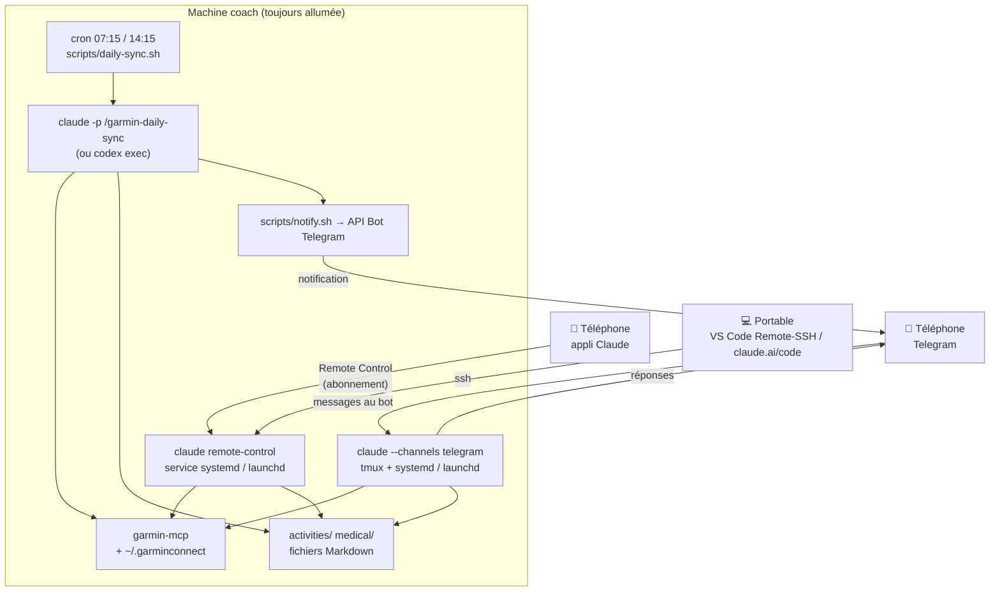

# 📱 Le coach dans la poche

Le projet fonctionne dans un IDE, sur un ordinateur. Cette page explique comment garder
le coach **toujours avec vous** — synchronisation Garmin automatique avec notification, et
dialogue avec le coach depuis le téléphone — **sans renoncer à votre abonnement**
Claude (Pro/Max) ou ChatGPT (Codex).

## Ce qui n'est pas possible (et pourquoi)

!!! warning "Pas de « front » mobile maison"
    Une appli ou un bot **maison** (PWA, Agent SDK, bot Telegram codé à la main…) qui
    appellerait le modèle **ne peut pas** utiliser votre abonnement. Depuis avril 2026, Anthropic bloque l'authentification
    par abonnement pour tout outil tiers (OpenCode a dû retirer cette possibilité), et la
    connexion « Sign in with ChatGPT » d'OpenAI est réservée à Codex CLI/App. Un front
    maison implique donc une clé API facturée au token. Le chat Telegram décrit plus bas
    n'est pas un front maison : c'est **Claude Code lui-même** (fonction *Channels*,
    plugin officiel), qui tourne avec votre abonnement sur la machine coach.

La seule voie qui préserve l'abonnement : utiliser les **surfaces distantes officielles**
des éditeurs, en gardant une **machine « coach »** où vivent le workspace (`activities/`,
`medical/`, `planning/`…), les tokens Garmin et le serveur MCP.

| Besoin | Solution officielle | Abonnement | Limites |
|---|---|---|---|
| Discuter avec le coach + recevoir les notifications | **Telegram via Claude Code Channels** — une session `claude --channels plugin:telegram@claude-plugins-official` tourne sur la machine coach ; les notifications de la sync arrivent dans la même conversation | ✅ Pro/Max (clé API refusée) | *Research preview* ; pas de confirmation d'outil à distance (envois Garmin confirmés dans le chat) |
| Sessions longues depuis le téléphone | **Claude Code Remote Control** — `claude remote-control` tourne sur la machine coach, l'appli Claude (iOS/Android) ou claude.ai/code s'y connecte | ✅ Pro/Max/Team/Enterprise (clé API refusée) | Le processus doit rester lancé (service systemd/launchd fourni) |
| Idem avec Codex | **Codex Remote** — appli Codex sur macOS + appli ChatGPT | ✅ ChatGPT Plus/Pro | macOS uniquement (le mode CLI est expérimental) |
| Synchronisation automatique | **cron/launchd → `claude -p` ou `codex exec`** (CLI officiels, headless) | ✅ | — |
| Machine éteinte | *Routines cloud* Claude (voir [plan B](#plan-b-cloud-anthropic-sans-machine-a-la-maison)) | ✅ Pro (5 exécutions/jour) / Max (15) | Workspace dans un dépôt GitHub, tokens Garmin en secrets |

!!! note "Pourquoi pas les « routines » ou les tâches planifiées de l'appli Claude ?"
    Les routines cloud s'exécutent dans une VM Anthropic (sans votre `garmin-mcp` ni vos
    fichiers), les tâches planifiées de l'appli de bureau ne tournent que si l'appli est
    ouverte, et les environnements auto-hébergés sont réservés aux plans Team/Enterprise.
    Sur une machine sans écran, le déclencheur fiable reste le **cron du système**.

## Architecture recommandée : la machine « coach »

Un ordinateur toujours allumé à la maison (Mac mini, mini-PC Linux, NAS, Raspberry Pi,
vieux portable) — 1 Go de RAM libre suffit.



- **Le workspace vit sur la machine coach** (source de vérité unique), idéalement dans
  votre dépôt privé séparé du moteur (`--workspace`, voir [Votre workspace privé](workspace.md)).
  Depuis le portable, vous continuez à travailler dans l'IDE via *VS Code Remote-SSH* ou
  claude.ai/code.
- **Chat** : une session Claude Code permanente reliée à votre bot Telegram. Vous
  écrivez « séance du jour ? », « analyse ma sortie », « je ne suis pas dispo jeudi » :
  le message arrive dans la session (agents, skills, Garmin, fichiers MD), la réponse
  revient dans Telegram.
- **Sessions longues** : `claude remote-control` (mode serveur) tourne en service. Depuis
  l'appli Claude, vous ouvrez une session qui s'exécute *sur la machine coach* : agent
  `coach`, skills, serveur MCP `garmin`, fichiers du workspace. Les confirmations d'outils
  (push d'une séance dans le calendrier Garmin…) s'affichent sur le téléphone.
- **Automatique** : deux fois par jour (après la nuit, après la sortie du midi), le cron
  lance `claude -p "/garmin-daily-sync"` : le skill délègue à l'agent `coach` +
  `garmin-sync-efficiency`, ne récupère que les dates manquantes, persiste les fichiers MD
  et termine par un résumé de 5 lignes envoyé dans la conversation Telegram.

## Installation pas à pas

### 1. Préparer la machine coach

```bash
# Claude Code (obligatoire pour Remote Control et le runner "claude")
curl -fsSL https://claude.ai/install.sh | bash
claude          # puis /login → connexion avec votre compte claude.ai (PAS de clé API)
```

Sur une machine sans navigateur, `/login` affiche une URL à ouvrir depuis un autre appareil
et un code à coller. Vérifiez avec `claude auth status` (`"loggedIn": true`).

```bash
# Optionnel : Codex CLI comme exécuteur de la synchronisation
npm i -g @openai/codex
codex login --device-auth
```

### 2. Installer le projet et l'accès Garmin

```bash
git clone https://github.com/mmornati/ai-running-coach.git
cd ai-running-coach
./install.sh --ide claude                      # données dans ce dossier (exclues du dépôt)
# ou, données dans votre dépôt privé :
./install.sh --ide claude --workspace ~/mon-workspace
```

L'authentification Garmin (`garmin-mcp-auth`, MFA compris) fonctionne en SSH. Si vos tokens
existent déjà sur le portable, copiez simplement le dossier (permissions 600) :

```bash
rsync -az ~/.garminconnect/ machine-coach:~/.garminconnect/
```

Si vous migrez un workspace existant, copiez aussi les dossiers personnels — ils restent
exclus du dépôt (`.gitignore`) :

```bash
rsync -az --exclude .DS_Store activities medical nutrition planning rapports resources machine-coach:~/ai-running-coach/
```

`install.sh` **pré-approuve** le serveur MCP `garmin` du projet dans `~/.claude.json` :
sans cela, Claude Code le laisse « Pending approval » jusqu'à une session interactive, ce qui
bloque une machine sans écran. Vérifiez avec `claude mcp list` (→ `garmin … ✔ Connected`).

### 3. Le coach sur Telegram (chat + notifications)

Un seul bot sert aux deux usages : la conversation avec le coach, et les notifications de
la synchronisation (envoyées directement par l'API Bot, même si la session de chat est
arrêtée).

1. **Créer le bot** : dans Telegram, [@BotFather](https://t.me/BotFather) → `/newbot` →
   nom et identifiant (finissant par `bot`) → copiez le token. Ne le committez jamais.
2. **Installer Bun** (le plugin tourne dessus) et vérifier la connexion abonnement :

    ```bash
    curl -fsSL https://bun.sh/install | bash
    claude auth status          # "loggedIn": true, pas de clé API
    ```

3. **Installer et configurer le plugin**, dans une session `claude` lancée dans le workspace :

    ```
    /plugin install telegram@claude-plugins-official      # portée « user »
    /telegram:configure <token>
    ```

4. **Appairer votre compte**, au premier plan :

    ```bash
    scripts/coach-telegram.sh run --pairing
    ```

    Écrivez n'importe quoi au bot : il répond par un code. Dans la session :
    `/telegram:access pair <code>`, puis **`/telegram:access policy allowlist`** (sinon
    n'importe qui trouvant le bot pourrait lire vos données de santé). Quittez (`Ctrl+C`).

5. **Installer le service et les notifications** :

    ```bash
    ./install.sh --telegram           # ou : scripts/coach-telegram.sh install
    scripts/setup-telegram.sh         # notifications de la sync dans la même conversation
    ```

`coach-telegram.sh install` :

- fusionne les permissions de `templates/settings.telegram.json` dans
  `.claude/settings.local.json` du workspace — personne ne regarde le terminal, donc
  toute demande de permission bloquerait la conversation ;
- lance la session dans **tmux** (Claude Code a besoin d'un terminal), sous
  `systemd --user` + `loginctl enable-linger` (Linux) ou LaunchAgent (macOS), relancée si
  elle s'arrête ;
- la redémarre chaque nuit (`[telegram].daily_restart`, défaut `03:30`) pour repartir d'un
  contexte neuf.

```bash
scripts/coach-telegram.sh status      # session active ? politique d'accès du bot ?
tmux attach -t coach-telegram         # voir la session (détacher : Ctrl-b d)
scripts/coach-telegram.sh restart
scripts/coach-telegram.sh uninstall
```

!!! warning "Envois au calendrier Garmin : confirmés dans le chat"
    Le plugin Telegram ne relaie pas les demandes de permission. Les outils d'envoi
    (`schedule_workouts`, `upload_workout`…) sont donc pré-autorisés, et le skill
    [`telegram-chat`](skills/telegram-chat.md) impose au coach de présenter la séance puis
    d'attendre votre **« OK » dans un message suivant** avant tout envoi. Les suppressions
    (`delete_workout`, `unschedule_workout(s)`) sont interdites depuis Telegram : passez par
    Garmin Connect, Remote Control ou le terminal.

Exemples : *« séance du jour ? »*, *« analyse ma sortie de ce midi »*, *« genou qui tire,
adapte la semaine »*, *« contrainte : pas dispo jeudi »*, ou une photo de votre assiette.

### 4. Synchronisation automatique

```bash
./install.sh --daily-sync
```

Installe deux entrées cron (Linux) ou un LaunchAgent (macOS) aux heures de
`[sync].times` dans `config/workspace.toml` (défaut `07:15` et `14:15`, à surcharger dans
`workspace.user.toml`). Testez sans attendre :

```bash
scripts/daily-sync.sh --dry-run   # affiche la commande
scripts/daily-sync.sh             # exécution réelle, journal dans logs/sync-YYYY-MM-DD.log
```

Exemple de notification reçue sur Telegram :

```
🏃 Sync Garmin
Séances : 1 nouvelle — trail 12,3 km / 480 m D+ / FC moy 148 / HRR 28 bpm (2026-09-20)
Sommeil : 7 h 42, score 81
HRV : 62 ms — équilibré (baseline 58-66)
Readiness : 74
Alerte : aucune
```

Pour utiliser Codex à la place de Claude Code : `runner = "codex"` dans
`config/workspace.user.toml` (section `[sync]`).

### 5. Sessions longues depuis le téléphone (Remote Control)

Telegram suffit pour l'échange courant. Remote Control reste utile pour une session
longue (plan de course, refonte du plan) ou pour confirmer un outil à distance. Les deux
peuvent tourner en même temps : évitez simplement de modifier les mêmes fichiers depuis
les deux à la fois.

```bash
./install.sh --remote-control     # ou : scripts/coach-remote.sh install
```

1. **Première fois** : Remote Control demande une confirmation unique (`Enable Remote
   Control? (y/n)`) qu'un service en arrière-plan ne peut pas accepter. Le script vous
   propose de lancer `claude remote-control` une fois au premier plan : répondez `y`,
   attendez l'URL/QR code, puis `Ctrl+C`. En SSH, utilisez `ssh -t` pour avoir un terminal.
2. Le service (`systemd --user` + `loginctl enable-linger` sur Linux, LaunchAgent sur macOS)
   démarre au boot et relance le serveur s'il s'arrête (il reprend ses sessions pendant
   ~4 h).
3. Sur le téléphone : **appli Claude → onglet Code** → la session « AI Running Coach »
   apparaît. Vous pouvez aussi scanner le QR code affiché au démarrage
   (`scripts/coach-remote.sh logs`).

```bash
scripts/coach-remote.sh status    # état + dernière URL de session
scripts/coach-remote.sh restart
scripts/coach-remote.sh uninstall
```

Exemples depuis le téléphone : *« Résume ma semaine »*, *« Analyse ma sortie de ce midi »*,
*« Décale la séance de jeudi à vendredi et mets-la dans Garmin »*, ou `/garmin-daily-sync`
pour forcer une synchronisation.

!!! tip "Mode de permission"
    Le service démarre en `acceptEdits` : l'écriture des fichiers MD est automatique, mais
    les outils Garmin d'écriture (`schedule_workouts`, `upload_course`…) restent confirmés
    depuis le téléphone. Modifiez avec `--permission-mode` si besoin.

### 6. Voir ce que le coach a stocké

Telegram résume ; le [tableau de bord](dashboard/index.md) montre tout — verdict
et bilan du matin, nouvelle séance et ses splits, courbe de forme, plan de la semaine,
rapports. Lancez-le sur le portable après un `git pull`, ou sur la machine coach et
consultez-le par un tunnel SSH : voir [Machine coach & mode headless](dashboard/headless.md).

## Et Codex ?

- **Synchronisation** : `runner = "codex"` — `scripts/daily-sync.sh` lance
  `codex exec --full-auto` avec le corps du skill `garmin-daily-sync` comme prompt.
- **Mobile** : *Codex Remote* (GA juin 2026) pilote depuis l'appli ChatGPT une session de
  l'**appli Codex sur macOS**. Sur une machine coach Linux, ce n'est pas disponible (le
  `codex remote-control` en CLI est expérimental) : utilisez Remote Control de Claude
  Code pour l'interactif et, si vous le souhaitez, Codex pour la synchronisation.

## Plan B : cloud Anthropic, sans machine à la maison

Si aucune machine ne peut rester allumée, les **routines** et **sessions cloud** de Claude
Code (Pro/Max) tournent dans une VM Anthropic — avec des contraintes :

1. Le workspace doit vivre dans un **dépôt GitHub privé** (dossiers personnels + ce projet).
2. Un **script d'environnement** installe `uv` + `garmin-mcp` et restaure
   `~/.garminconnect/` depuis un secret d'environnement (ex. `GARMIN_TOKENS_B64`) ;
   `garmin-mcp` accepte `GARMIN_EMAIL`/`GARMIN_PASSWORD` mais ne peut pas répondre au MFA,
   donc les tokens restent le bon véhicule. Ajoutez `*.garmin.com` et `wttr.in` à la liste
   réseau autorisée.
3. Une **routine** (`/schedule`) exécute `/garmin-daily-sync` chaque matin et **commite**
   les fichiers MD ; le dialogue interactif passe par une session cloud depuis l'onglet Code
   de l'appli Claude, sur le même dépôt/environnement.

Risques à connaître : quotas de routines (5/jour Pro, 15/jour Max), tokens Garmin à
renouveler tous les ~6 mois depuis un ordinateur, et Garmin peut limiter les IP de
datacenter (à valider une fois). C'est pourquoi la machine coach reste le choix recommandé.

## Limites et dépannage

| Symptôme | Cause / solution |
|---|---|
| La session est « hors ligne » sur le téléphone | Le processus `claude remote-control` est arrêté : `scripts/coach-remote.sh status` puis `restart`. Les sessions restent reprenables ~4 h. |
| `claude mcp list` → `garmin … Pending approval` | Relancez `./install.sh --ide claude` (pré-approbation dans `~/.claude.json`) ou lancez `claude` une fois dans le projet et approuvez. |
| `Remote Control requires claude.ai subscription auth` | `ANTHROPIC_API_KEY` est défini ou vous êtes connecté par clé API : retirez la variable, `claude` → `/login`. |
| Le service démarre puis s'arrête en boucle | Confirmation unique jamais acceptée : lancez `claude remote-control` une fois au premier plan. |
| `❌ Sync Garmin échouée` | Voir `logs/sync-YYYY-MM-DD.log`. Cause fréquente : tokens Garmin expirés → `uv run garmin-mcp-auth`. |
| Pas de notification | `scripts/notify.sh "test"` ; vérifiez `provider = "telegram"`, le token (`~/.claude/channels/telegram/.env`) et `telegram_chat_id` (ou un compte appairé dans `access.json`). Écrivez au moins une fois au bot : il ne peut pas initier une conversation. |
| `ntfy n'est plus pris en charge` | Ancienne configuration : `scripts/setup-telegram.sh`. |
| Le bot ne répond pas | `scripts/coach-telegram.sh status`. Session absente → `restart`. Session présente → `tmux attach -t coach-telegram` : une demande de permission ou une erreur de plugin attend peut-être. |
| Le bot ne répond qu'à l'appairage | Politique restée en `pairing` : `/telegram:access policy allowlist` dans la session. |
| Sur Linux, le service meurt à la déconnexion SSH | `loginctl enable-linger $USER` (fait par `install`). |
| Le portable et la machine coach ont chacun un workspace | Gardez une seule source de vérité (la machine coach) et travaillez dessus en Remote-SSH ; sinon synchronisez les dossiers avec `rsync`. |
