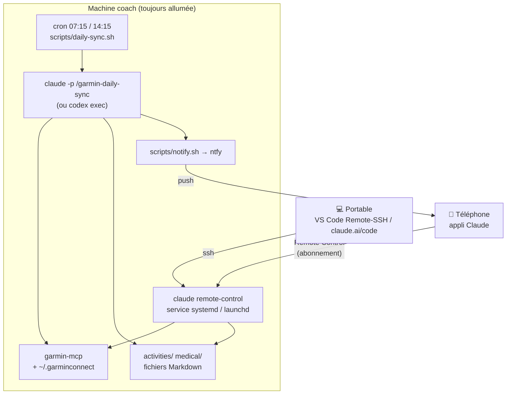

# Le coach dans la poche

Le projet fonctionne dans un IDE, sur un ordinateur. Cette page explique comment garder
le coach **toujours avec vous** — synchronisation Garmin automatique avec notification, et
dialogue avec le coach depuis le téléphone — **sans renoncer à votre abonnement**
Claude (Pro/Max) ou ChatGPT (Codex).

<!-- arc-video:coach-poche -->
<div class="arc-video-card" markdown>

[](video/coach-poche/index.html)

<div markdown>

<span class="arc-video__meta">En vidéo · Étape 10 · 1 min 40</span>

**[Le coach dans la poche](video/coach-poche/index.html)** — La machine coach, la synchronisation automatique (horaires ou veille), la notification push, Remote Control et les commandes courtes, le tableau de bord mobile, et ce qui n'est pas possible.

[Regarder](video/coach-poche/index.html) · [English](video/coach-poche/index.html?lang=en) · [Toutes les vidéos](videos.md)

</div>

</div>
<!-- /arc-video -->


!!! note "Écrite pour `[data].source = "garmin"` (défaut)"
    Cette page (et `/garmin-daily-sync`) suppose la source Garmin par défaut —
    rien n'y change avec `[data].source = "intervals"` (#68) sinon les outils
    MCP appelés en coulisses (voir [Configuration Intervals.icu](intervals-setup.md)
    et la table de correspondance dans `AGENTS.md`) : machine « coach »,
    cron/launchd, notification push et Remote Control fonctionnent à
    l'identique.

## Ce qui n'est pas possible (et pourquoi)

!!! warning "Pas de « front » mobile maison"
    Une appli ou un bot (Telegram, PWA, Agent SDK…) qui appellerait le modèle **ne peut
    pas** utiliser votre abonnement. Depuis avril 2026, Anthropic bloque l'authentification
    par abonnement pour tout outil tiers (OpenCode a dû retirer cette possibilité), et la
    connexion « Sign in with ChatGPT » d'OpenAI est réservée à Codex CLI/App. Un front
    maison implique donc une **clé API facturée au token** : c'est le principe du
    [chat du tableau de bord](dashboard/chat.md), une option à activer explicitement
    (plafond de dépense quotidien, clé isolée dans `llm.env`), qui ne remplace pas
    Remote Control.

    Une exception utile : un bot qui **n'appelle aucun modèle** n'a pas ce problème. Le
    [bot Telegram](telegram.md) (#174) répond en un geste à la notification — « séance faite »,
    RPE, douleur — par de simples écritures déterministes dans votre workspace : aucune clé
    d'API, aucun coût. Seule sa conversation libre (opt-in) passe par le chat facturé.

La seule voie qui préserve l'abonnement : utiliser les **surfaces distantes officielles**
des éditeurs, en gardant une **machine « coach »** où vivent le workspace (`activities/`,
`medical/`, `planning/`…), les tokens Garmin et le serveur MCP.

| Besoin | Solution officielle | Abonnement | Limites |
|---|---|---|---|
| Parler au coach depuis le téléphone | **Claude Code Remote Control** — `claude remote-control` tourne sur la machine coach, l'appli Claude (iOS/Android) ou claude.ai/code s'y connecte | ✅ Pro/Max/Team/Enterprise (clé API refusée) | Le processus doit rester lancé (service systemd/launchd fourni) |
| Idem avec Codex | **Codex Remote** — appli Codex sur macOS + appli ChatGPT | ✅ ChatGPT Plus/Pro | macOS uniquement (le mode CLI est expérimental) |
| Répondre au coach en un geste (RPE, douleur, séance faite) | **[Bot Telegram](telegram.md)** — boutons sous le résumé du daily-sync, écrits sans modèle dans le workspace | ✅ aucun modèle appelé, donc aucune clé | Telegram peut lire ces messages (voir la page dédiée) ; la conversation libre est une option facturée |
| Synchronisation automatique | **cron/launchd → `claude -p` ou `codex exec`** (CLI officiels, headless) | ✅ | — |
| Synchronisation automatique sans abonnement | **cron/launchd → `opencode run`** sur OpenRouter (ou toute API compatible OpenAI), ou `claude -p` avec clé API — voir [ci-dessous](#synchronisation-sur-openrouter-ou-toute-api-compatible-openai) | ❌ clé API, facturé au token | Plafond quotidien, clé dans `llm.env` |
| Machine éteinte | *Routines cloud* Claude (voir [plan B](#plan-b-cloud-anthropic-sans-machine-a-la-maison)) | ✅ Pro (5 exécutions/jour) / Max (15) | Workspace dans un dépôt GitHub, tokens Garmin en secrets |

!!! note "Pourquoi pas les « routines » ou les tâches planifiées de l'appli Claude ?"
    Les routines cloud s'exécutent dans une VM Anthropic (sans votre `garmin-mcp` ni vos
    fichiers), les tâches planifiées de l'appli de bureau ne tournent que si l'appli est
    ouverte, et les environnements auto-hébergés sont réservés aux plans Team/Enterprise.
    Sur une machine sans écran, le déclencheur fiable reste le **cron du système**.

## Architecture recommandée : la machine « coach »

Un ordinateur toujours allumé à la maison (Mac mini, mini-PC Linux, NAS, Raspberry Pi,
vieux portable) — 1 Go de RAM libre suffit.



- **Le workspace vit sur la machine coach** (source de vérité unique), idéalement dans
  votre dépôt privé séparé du moteur (`--workspace`, voir [Votre workspace privé](workspace.md)).
  Depuis le portable, vous continuez à travailler dans l'IDE via *VS Code Remote-SSH* ou
  claude.ai/code.
- **Interactif** : `claude remote-control` (mode serveur) tourne en service. Depuis
  l'appli Claude, vous ouvrez une session qui s'exécute *sur la machine coach* : agent
  `coach`, skills, serveur MCP `garmin`, fichiers du workspace. Les confirmations d'outils
  (push d'une séance dans le calendrier Garmin…) s'affichent sur le téléphone.
- **Automatique** : deux fois par jour (après la nuit, après la sortie du midi), le cron
  lance `claude -p "/garmin-daily-sync"` : le skill délègue à l'agent `coach` +
  `garmin-sync-efficiency`, ne récupère que les dates manquantes, persiste les fichiers MD
  et termine par un résumé de 5 lignes envoyé en notification push.

## Installation pas à pas

### 1. Préparer la machine coach

```bash
# Claude Code (obligatoire pour Remote Control et le runner "claude")
curl -fsSL https://claude.ai/install.sh | bash
claude          # puis /login → connexion avec votre compte claude.ai (PAS de clé API)
```

Sur une machine sans navigateur, `/login` affiche une URL à ouvrir depuis un autre appareil
et un code à coller. Vérifiez avec `claude auth status` (`"loggedIn": true`).

```bash
# Optionnel : Codex CLI comme exécuteur de la synchronisation
npm i -g @openai/codex
codex login --device-auth
```

### 2. Installer le projet et l'accès Garmin

```bash
git clone https://github.com/mmornati/ai-running-coach.git
cd ai-running-coach
./install.sh --ide claude                      # données dans ce dossier (exclues du dépôt)
# ou, données dans votre dépôt privé :
./install.sh --ide claude --workspace ~/mon-workspace
```

!!! tip "Raccourci : `--preset coach-server`"
    Les étapes 2, 4 et 5 de cette page (`--ide claude`, `--daily-sync`,
    `--remote-control`) sont exactement ce que compose le préréglage
    `--preset coach-server` (voir [Préréglages](quickstart.md#prereglages)) :

    ```bash
    ./install.sh --preset coach-server                        # ou --workspace ~/mon-workspace
    ```

    Une option explicite reste toujours prioritaire, par exemple pour sauter
    l'authentification interactive si vos tokens Garmin sont déjà copiés
    (voir plus bas) : `./install.sh --preset coach-server --no-auth`.

    Ce préréglage ne couvre que les étapes 2, 4 et 5 : l'**étape 3**
    (notifications push, `scripts/setup-ntfy.sh`) reste une commande séparée
    à lancer soi-même, comme documenté ci-dessous.

L'authentification Garmin (`garmin-mcp-auth`, MFA compris) fonctionne en SSH. Si vos tokens
existent déjà sur le portable, copiez simplement le dossier (permissions 600) :

```bash
rsync -az ~/.garminconnect/ machine-coach:~/.garminconnect/
```

Si vous migrez un workspace existant, copiez aussi les dossiers personnels — ils restent
exclus du dépôt (`.gitignore`) :

```bash
rsync -az --exclude .DS_Store activities medical nutrition planning rapports resources machine-coach:~/ai-running-coach/
```

`install.sh` **pré-approuve** le serveur MCP `garmin` du projet dans `~/.claude.json` :
sans cela, Claude Code le laisse « Pending approval » jusqu'à une session interactive, ce qui
bloque une machine sans écran. Vérifiez avec `claude mcp list` (→ `garmin … ✔ Connected`).

### 3. Notifications push (ntfy)

[ntfy](https://ntfy.sh) est gratuit, sans compte, avec une appli iOS/Android. Le script
choisit le serveur (public `ntfy.sh` ou le vôtre), le sujet, enregistre un éventuel token
**hors du dépôt** et envoie une notification de test :

```bash
scripts/setup-ntfy.sh
```

=== "ntfy.sh (public)"

    Le sujet fait office de secret : gardez celui proposé (`running-coach-xxxxxxxx`) ou
    choisissez-en un difficile à deviner. Dans l'appli ntfy : « + » → abonnez-vous au sujet.

=== "Serveur auto-hébergé"

    Avec `auth-default-access: deny-all`, créez un utilisateur et un token en écriture :

    ```bash
    docker exec -it ntfy ntfy user add --role=user coach
    docker exec -it ntfy ntfy access coach running-coach-xxxxxxxx write-only
    docker exec -it ntfy ntfy token add coach     # → tk_…
    ```

    Donnez ce token à `scripts/setup-ntfy.sh` : il est stocké dans
    `~/.config/ai-running-coach/ntfy.token` (chmod 600) et référencé par
    `ntfy_token_file` dans `config/workspace.user.toml`.

!!! tip "Alerte avant expiration des tokens Garmin (#32)"
    Une fois ntfy configuré, `scripts/daily-sync.sh` prévient automatiquement à
    l'approche de l'échéance estimée des tokens Garmin (par défaut J-14 puis
    J-3, au plus une notification par jour), avec la commande de renouvellement
    (`uv run garmin-mcp-auth`) — et bascule sur un message explicite si la
    synchronisation rencontre un vrai refus d'authentification (401). Réglages :
    `[notifications].token_alerts` / `token_alert_days` dans
    `config/workspace.toml` — détail dans [Dépannage](troubleshooting.md#alerte-push-avant-expiration-des-tokens-32).

!!! tip "Répondre depuis la notification : Telegram"
    ntfy est à sens unique. Pour répondre en un appui (RPE, douleur, « séance faite »),
    ajoutez le [bot Telegram](telegram.md) : `./install.sh --telegram`. Il complète ntfy
    (le résumé part sur les deux canaux) et n'a besoin d'aucune clé d'API.

### 4. Synchronisation automatique

```bash
./install.sh --daily-sync
```

Deux modes de déclenchement, choisis par `[sync].mode` dans `config/workspace.user.toml`
(relancez `./install.sh --daily-sync` après un changement) :

| Mode | Déclenchement | Pour qui |
|---|---|---|
| `schedule` (défaut) | Le LLM tourne aux heures fixes de `[sync].times` (`07:15`, `14:15`), qu'il y ait du neuf ou non. | Intervals.icu, ou un rythme très régulier. |
| `watch` | `scripts/garmin_watch.py` interroge Garmin toutes les `watch_interval_min` minutes **sans LLM** et ne lance la synchronisation que si une séance ou le sommeil du jour manque dans le workspace. | Garmin : réveils tardifs le week-end, séances du soir, voyages et fuseaux horaires. |

Testez sans attendre :

```bash
scripts/daily-sync.sh --dry-run   # affiche la commande
scripts/daily-sync.sh             # exécution réelle, journal dans logs/sync-YYYY-MM-DD.log
```

#### Mode `watch` : ne payer le LLM que quand Garmin a du neuf

Garmin ne propose pas de webhook aux particuliers : son
[Connect Developer Program](https://developer.garmin.com/gc-developer-program/) est
réservé aux entreprises et institutions. Le watcher interroge donc Garmin Connect à
intervalle régulier, avec la librairie `garminconnect` déjà installée par `garmin-mcp` et
les tokens de `~/.garminconnect`.

```toml
# config/workspace.user.toml
[sync]
mode = "watch"
```

À chaque passage :

1. **Un seul appel** (`get_device_last_used`) : heure du dernier envoi de la montre.
   Inchangée → fin du passage, zéro token.
2. Envoi nouveau → comparaison avec le workspace : séance récente sans
   `activities/*.md` portant son `garmin_activity_id` (`activity:<id>`), ou sommeil du
   jour calculé sans `medical/<jour>_health.md` (`morning`, sauf `morning_check = "off"`).
   La comparaison est refaite pendant `recheck_window_min` (90 min) : Garmin calcule le
   score de sommeil quelques minutes **après** l'envoi.
3. Du neuf → `daily-sync.sh --trigger morning,activity:<id>` après `settle_min` (10 min
   depuis l'envoi), jamais moins de `min_gap_min` (30 min) entre deux runs, au plus
   `max_runs_per_day` (6). Verrou, notifications et commit git restent ceux de
   `daily-sync.sh`.

| Garde-fou | Comportement |
|---|---|
| Garmin répond 429 / réseau coupé | Passages espacés : 15, 30, 60… jusqu'à 240 min. |
| Tokens refusés | Pas de LLM ; le run de repli s'en charge et relaie l'alerte de renouvellement. |
| Séance que l'agent n'arrive pas à persister | Abandonnée après 2 runs sans effet (journalisé), jamais de boucle. |
| Watcher muet (cron arrêté, python introuvable) | `fallback_times` (`21:30`) : un run complet si aucun daily-sync n'a eu lieu dans la journée (watcher, session mobile ou lancement manuel : `logs/sync-<jour>.log`) ; `coach_doctor.py` passe en ⚠ après 3 intervalles sans passage. |

```bash
scripts/garmin_watch.py --dry-run   # décide et affiche, ne lance rien
scripts/garmin_watch.py --status    # dernier passage, runs du jour, déclencheurs en attente
tail logs/watch.log                 # événements seulement (nouveautés, runs, erreurs)
```

Exemple de notification reçue :

```
🏃 Sync Garmin
Séances : 1 nouvelle — trail 12,3 km / 480 m D+ / FC moy 148 / HRR 28 bpm (2026-09-20)
Sommeil : 7 h 42, score 81
HRV : 62 ms — équilibré (baseline 58-66)
Readiness : 74
Alerte : aucune
```

**Variante `Pourquoi :` (#56).** Quand une `decision` (garde-fou, bilan
matinal rouge…) est active pour aujourd'hui ou demain, la 5<sup>e</sup> ligne
change d'étiquette — `Pourquoi :` au lieu d'`Alerte :`, jamais les deux à la
fois — et résume la raison de l'ajustement plutôt que de rester générique :

```
🏃 Sync Garmin
Séances : à jour
Sommeil : 5 h 10, score 41
HRV : 31 ms — effondrée (baseline 48-74)
Readiness : 22
Pourquoi : verdict rouge (HRV effondrée) — séance VO2max à revoir (r5_quality_after_red)
```

Pour utiliser Codex à la place de Claude Code : `runner = "codex"` dans
`config/workspace.user.toml` (section `[sync]`).

### 5. Le coach sur le téléphone (Remote Control)

```bash
./install.sh --remote-control     # ou : scripts/coach-remote.sh install
```

1. **Première fois** : Remote Control demande une confirmation unique (`Enable Remote
   Control? (y/n)`) qu'un service en arrière-plan ne peut pas accepter. Le script vous
   propose de lancer `claude remote-control` une fois au premier plan : répondez `y`,
   attendez l'URL/QR code, puis `Ctrl+C`. En SSH, utilisez `ssh -t` pour avoir un terminal.
2. Le service (`systemd --user` + `loginctl enable-linger` sur Linux, LaunchAgent sur macOS)
   démarre au boot et relance le serveur s'il s'arrête (il reprend ses sessions pendant
   ~4 h).
3. Sur le téléphone : **appli Claude → onglet Code** → la session « AI Running Coach »
   apparaît. Vous pouvez aussi scanner le QR code affiché au démarrage
   (`scripts/coach-remote.sh logs`).

```bash
scripts/coach-remote.sh status    # état + dernière URL de session
scripts/coach-remote.sh restart
scripts/coach-remote.sh uninstall
```

Exemples depuis le téléphone : *« Résume ma semaine »*, *« Analyse ma sortie de ce midi »*,
*« Décale la séance de jeudi à vendredi et mets-la dans Garmin »*, `/garmin-daily-sync`
pour forcer une synchronisation, ou `/log 2 gels + 500 ml au km 15, genou gauche 3/10, RPE 7`
juste après une sortie ([saisie libre](skills/log.md), #67).

!!! tip "Mode de permission"
    Le service démarre en `acceptEdits` : l'écriture des fichiers MD est automatique, mais
    les outils Garmin d'écriture (`schedule_workouts`, `upload_course`…) restent confirmés
    depuis le téléphone. Modifiez avec `--permission-mode` si besoin.

!!! warning "Envoyer des photos de chaussures depuis le téléphone : à valider"
    L'[inspection photo des chaussures](skills/gear-inspection.md) suppose que vous envoyiez
    des photos au coach. **Ce parcours n'est pas validé** : nous n'avons pas vérifié que
    Remote Control transmette des images à la session, ni que le coach puisse les enregistrer
    dans `gear/photos/` du workspace. En attendant, faites l'inspection depuis une session
    locale (IDE ou terminal) où l'image peut être jointe, ou décrivez l'usure par écrit
    (le coach le dit alors, et ne cite aucune photo). Contournement (non testé sur téléphone) : copiez les photos
    dans `gear/photos/` du workspace du serveur (synchronisation de fichiers du téléphone,
    `scp`… ; JPEG, PNG ou WebP — exportez les HEIC d'iPhone en JPEG), puis lancez `/inspection` depuis le téléphone : le coach les retrouve dans cette
    boîte de dépôt. Voir [Faire inspecter une paire](skills/inspection.md). Cette note sera
    levée une fois le parcours testé sur un vrai téléphone.

### 6. Voir ce que le coach a stocké

La notification résume ; le [tableau de bord](dashboard/index.md) montre tout — verdict
et bilan du matin, nouvelle séance et ses splits, courbe de forme, plan de la semaine,
rapports. Lancez-le sur le portable après un `git pull`, ou sur la machine coach et
consultez-le par un tunnel SSH : voir [Machine coach & mode headless](dashboard/headless.md).

## Et Codex ?

- **Synchronisation** : `runner = "codex"` — `scripts/daily-sync.sh` lance
  `codex exec --full-auto` avec le corps du skill `garmin-daily-sync` comme prompt.
- **Mobile** : *Codex Remote* (GA juin 2026) pilote depuis l'appli ChatGPT une session de
  l'**appli Codex sur macOS**. Sur une machine coach Linux, ce n'est pas disponible (le
  `codex remote-control` en CLI est expérimental) : utilisez Remote Control de Claude
  Code pour l'interactif et, si vous le souhaitez, Codex pour la synchronisation.

## Synchronisation sur OpenRouter (ou toute API compatible OpenAI)

Sans abonnement Claude, ou pour ne payer que ce que la synchronisation consomme, le cron
peut tourner sur une API : `scripts/daily-sync.sh` a un troisième exécuteur, `opencode`
([OpenCode](https://opencode.ai/docs/cli), `opencode run` en mode headless). Le mode
`watch` reste identique : il n'appelle le modèle que s'il y a du neuf.

```bash
./install.sh --llm openrouter                  # chat ET sync sur OpenRouter
./install.sh --llm openrouter --model mistralai/mistral-small
./install.sh --llm openai --model gpt-4.1-mini --base-url https://api.exemple.org/v1
./install.sh --llm anthropic                   # chat Sonnet 5.5, sync Haiku 4.5, clé API Anthropic
./install.sh --sync-budget 0.5                 # plafond quotidien (EUR) de la synchronisation
```

`--llm` écrit à la fois `[chat]` et `[sync]` de `config/workspace.user.toml`
(voir [Configuration](configuration.md#le-chat-avec-le-coach-chat)). Une valeur déjà
posée qui diffère est **remplacée avec un avertissement** « ancien → nouveau » et la
façon de revenir ; un rerun d'`install.sh` sans `--llm` n'y touche jamais. Aucun rechargement
du cron : `daily-sync.sh` relit le runner à chaque exécution.

`--llm anthropic` garde le runner `claude` mais bascule la synchronisation de l'**abonnement**
vers la **clé API facturée au token** : l'installation l'affiche (« abonnement → clé API
facturée au token ») et `[sync].daily_budget_eur` plafonne la dépense.

### Limites du runner `opencode`

Le run de synchronisation `opencode` tourne avec des permissions volontairement étroites
(config générée dans `.arc/sync/opencode.json`) :

- **Pas de passerelle leanproxy.** Les outils appelés à travers `leanproxy_invoke_tool` échappent
  aux permissions par outil ; la config refuse donc `leanproxy_*` en bloc, ce qui couperait aussi
  toute lecture Garmin. Avec un `.mcp.json` qui ne déclare que la passerelle, `daily-sync.sh`
  **échoue tout de suite** avec une notification « opencode + leanproxy non pris en charge pour
  la synchronisation » (au lieu de ne rien synchroniser en silence), et
  `coach_doctor.py --check llm_config` l'affiche en avertissement. Utilisez le **mode direct**
  (installation sans `--use-leanproxy`) ou le runner `claude`.
- **Ni bash ni accès web.** Sous `opencode`, la synchronisation ne peut lancer aucun script :
  les étapes qui en dépendent (prévisions météo, `arc_index.py energy` — ligne de dépense
  modèle) sont **sautées**. Le reste (activités, sommeil, HRV, fichiers au contrat) fonctionne.

### La clé API

La clé n'est **jamais** dans le TOML ni dans votre profil de shell : elle vit dans
`~/.config/ai-running-coach/llm.env` (mode 600, créé par l'installation avec une ligne
d'exemple commentée). Ouvrez-le et ajoutez la ligne :

```bash
OPENROUTER_API_KEY=<votre clé>
```

`daily-sync.sh` lit ce fichier, ne retient que la variable nommée par `[sync].api_key_env`
et ne la donne **qu'au process du runner** ; le service du chat la reçoit par
`EnvironmentFile=` (systemd) ou en la lisant lui-même (launchd). `scripts/coach_doctor.py
--check llm_config` vérifie sa présence et son mode sans jamais l'afficher.

!!! warning "Ne jamais exporter `ANTHROPIC_API_KEY` globalement"
    Remote Control exige l'authentification par abonnement claude.ai : dès que
    `ANTHROPIC_API_KEY` est défini dans l'environnement de `claude`, il la refuse
    (« Remote Control requires claude.ai subscription auth »). Gardez la clé Anthropic
    dans `llm.env` : seuls la sync et le chat la lisent, chacun dans son process.

### Modèles par défaut

| | OpenRouter | API Anthropic |
|---|---|---|
| Chat | `openrouter/deepseek/deepseek-v4.1-flash` | `claude-sonnet-5-5` |
| Synchronisation | `openrouter/deepseek/deepseek-v4.1-flash` | `claude-haiku-4-5` |

La synchronisation est répétitive et très cadrée (récupérer les dates manquantes, écrire
les fichiers au contrat, produire le bloc `resume`) : un modèle léger suffit, et
`arc_index.py --validate` rattrape les écarts. Après un run `opencode`, les fichiers
écrits sont validés et un écart figure dans la notification (`⚠ hors contrat arc`) — un
modèle qui casserait le contrat toutes les nuits doit se voir. Le chat, lui, demande un
modèle plus solide ; si un modèle DeepSeek vous déçoit dans la durée (appels d'outils
longs), passez à `--model` ou à `--llm anthropic`.

!!! note "Pourquoi DeepSeek v4.1 Flash"
    Huit modèles OpenRouter ont été comparés en conditions réelles : comparatif, coûts
    mesurés et estimation mensuelle dans
    [Le chat avec le coach](dashboard/chat.md#quel-modele-sur-openrouter). L'ancien
    `deepseek/deepseek-chat` (V3) est à éviter : il annonçait des écritures jamais faites.

### Budget

`[sync].daily_budget_eur` (défaut 0,5 €, `./install.sh --sync-budget EUR`) plafonne la
dépense du jour, cumulée dans `logs/.sync-spend-AAAA-MM-JJ`. Il ne s'applique que si le
runner **rapporte son coût** : `opencode` et `claude` en mode API. Une fois atteint, le run
est sauté (code 0) et **une** notification par jour l'annonce. Les fournisseurs facturent en
dollars, convertis avec `[chat].usd_eur_rate`. Sur abonnement (`claude`/`codex` sans clé),
aucun plafond n'existe.

### Vos données de santé et le fournisseur

La synchronisation envoie au modèle votre HRV, votre sommeil, vos blessures. Sur
OpenRouter, restreignez le routage aux fournisseurs qui **ne conservent pas et
n'entraînent pas** sur vos données (réglages *Privacy* du compte et option de routage
`provider` avec `data_collection: "deny"`, voir la documentation OpenRouter). Évitez
l'API directe d'un fournisseur dont vous n'avez pas lu les conditions de conservation.

### Erreurs propres au fournisseur

Une clé refusée (401) ou un compte sans crédit (402) déclenche leur **propre**
notification (`🔑 … clé openrouter refusée`, `💳 … crédits épuisés`), jamais confondue avec
un refus d'authentification Garmin. Voir le
[dépannage](troubleshooting.md#synchronisation-sur-une-api-openrouter-anthropic).

## Plan B : cloud Anthropic, sans machine à la maison

Si aucune machine ne peut rester allumée, les **routines** et **sessions cloud** de Claude
Code (Pro/Max) tournent dans une VM Anthropic — avec des contraintes :

1. Le workspace doit vivre dans un **dépôt GitHub privé** (dossiers personnels + ce projet).
2. Un **script d'environnement** installe `uv` + `garmin-mcp` et restaure
   `~/.garminconnect/` depuis un secret d'environnement (ex. `GARMIN_TOKENS_B64`) ;
   `garmin-mcp` accepte `GARMIN_EMAIL`/`GARMIN_PASSWORD` mais ne peut pas répondre au MFA,
   donc les tokens restent le bon véhicule. Ajoutez `*.garmin.com` et `wttr.in` à la liste
   réseau autorisée.
3. Une **routine** (`/schedule`) exécute `/garmin-daily-sync` chaque matin et **commite**
   les fichiers MD ; le dialogue interactif passe par une session cloud depuis l'onglet Code
   de l'appli Claude, sur le même dépôt/environnement.

Risques à connaître : quotas de routines (5/jour Pro, 15/jour Max), tokens Garmin à
renouveler tous les ~6 mois depuis un ordinateur, et Garmin peut limiter les IP de
datacenter (à valider une fois). C'est pourquoi la machine coach reste le choix recommandé.

## Limites et dépannage

| Symptôme | Cause / solution |
|---|---|
| La session est « hors ligne » sur le téléphone | Le processus `claude remote-control` est arrêté : `scripts/coach-remote.sh status` puis `restart`. Les sessions restent reprenables ~4 h. |
| `claude mcp list` → `garmin … Pending approval` | Relancez `./install.sh --ide claude` (pré-approbation dans `~/.claude.json`) ou lancez `claude` une fois dans le projet et approuvez. |
| `Remote Control requires claude.ai subscription auth` | `ANTHROPIC_API_KEY` est défini ou vous êtes connecté par clé API : retirez la variable, `claude` → `/login`. |
| Le service démarre puis s'arrête en boucle | Confirmation unique jamais acceptée : lancez `claude remote-control` une fois au premier plan. |
| `❌ Sync Garmin échouée` | Voir `logs/sync-YYYY-MM-DD.log`. Cause fréquente : tokens Garmin expirés → `uv run garmin-mcp-auth`. |
| Pas de notification | `scripts/notify.sh "test"` ; vérifiez `provider`, `ntfy_topic`, le token (serveur `deny-all`) et l'abonnement au sujet dans l'appli. |
| Sur Linux, le service meurt à la déconnexion SSH | `loginctl enable-linger $USER` (fait par `install`). |
| `🔑 … clé … refusée`, `💳 … crédits … épuisés`, `💸 … budget atteint` | Sync sur une API : voir [Synchronisation sur OpenRouter](#synchronisation-sur-openrouter-ou-toute-api-compatible-openai) et le [dépannage](troubleshooting.md#synchronisation-sur-une-api-openrouter-anthropic). |
| Le portable et la machine coach ont chacun un workspace | Gardez une seule source de vérité (la machine coach) et travaillez dessus en Remote-SSH ; sinon synchronisez les dossiers avec `rsync`. |
