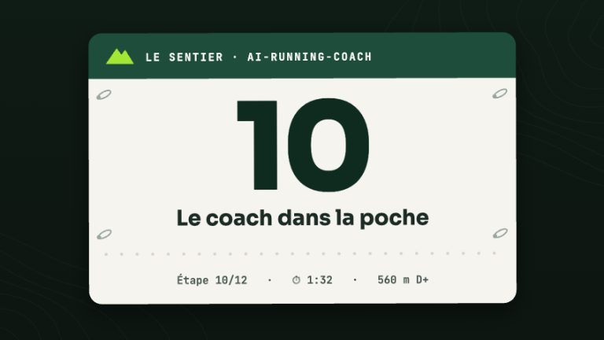

# Skill : Sync quotidienne (headless)

> **Description** : prompt d'orchestration versionné pour la synchronisation Garmin **sans surveillance** — lancé par le cron (`scripts/daily-sync.sh`), depuis le téléphone (`/garmin-daily-sync` dans une session Remote Control) ou depuis l'IDE.

<!-- arc-video:coach-poche -->
<div class="arc-video-card" markdown>

[](../video/coach-poche/index.html)

<div markdown>

<span class="arc-video__meta">En vidéo · Étape 10 · 1 min 40</span>

**[Le coach dans la poche](../video/coach-poche/index.html)** — La machine coach, la synchronisation automatique (horaires ou veille), la notification push, Remote Control et les commandes courtes, le tableau de bord mobile, et ce qui n'est pas possible.

[Regarder](../video/coach-poche/index.html) · [English](../video/coach-poche/index.html?lang=en) · [Toutes les vidéos](../videos.md)

</div>

</div>
<!-- /arc-video -->


## Quand l'utiliser

- Automatiquement, aux heures de `[sync].times`, ou dès que Garmin a du neuf avec `[sync].mode = "watch"` (voir [Le coach dans la poche](../mobile.md#4-synchronisation-automatique))
- À la main, pour forcer une synchronisation : `/garmin-daily-sync`

## Ce qu'il fait (et ne fait pas)

Il **n'ajoute aucune logique** : il délègue à l'agent `coach` et au skill
[`garmin-sync-efficiency`](garmin-sync-efficiency.md), en mode headless :

1. Ne pose jamais de question
2. Ne récupère que les dates dont le fichier MD manque (`[sync].lookback_days`, défaut 2)
3. Persiste `activities/` et `medical/` selon les conventions du workspace
4. Termine par un bloc ```` ```resume ```` de 5 lignes maximum, extrait mot pour mot par
   `scripts/daily-sync.sh` pour la notification push (ntfy)
5. Quand une `decision` (garde-fou, #52/#53) existe pour aujourd'hui OU pour demain —
   sa `date` est celle de la séance concernée, pas forcément celle du run — la 5<sup>e</sup>
   ligne devient `Pourquoi :` (raison de l'ajustement, #56) au lieu de `Alerte :` —
   jamais les deux, jamais inventée sans fichier `decision` à l'appui
6. Matériel hors chaussures (#134) : la ligne `Alerte :` porte aussi « Matériel : <nom> a atteint
   son seuil (…) », une seule fois par franchissement et sans fichier d'état, pour les déclencheurs
   en km/h/séances des séances de tout sport synchronisées dans ce run (`arc_index.py equipment
   --activities`) ; aucune séance nouvelle = rien. Les déclencheurs en jours n'alertent jamais ici
   (aucun horodatage fiable du dernier passage) : ils se lisent dans le tableau de bord, `/week`,
   le rapport hebdomadaire et les rappels du coach

6. **Matériel (#133, source Garmin)** : pour chaque séance **nouvelle** (un seul
   `get_activity_gear` par séance, jamais pour une séance déjà synchronisée), le matériel
   attaché par la montre alimente `gear_id` **si une puce du profil porte le `garmin: <uuid>`
   correspondant** ; la règle (déclaration de l'athlète > matériel Garmin > `(par défaut)`) est exécutée par `arc_index.py gear-attribution`. Un `gear_id` déjà déclaré est
   conservé ; un matériel Garmin sans puce n'est **jamais** attribué (mentionné sur la ligne
   `Alerte :`, une fois par run ; `gear_source: "garmin_unmapped"` l'exclut de la paire par défaut ;
   une puce `(ignorée)` fait taire l'alerte). Aucune écriture côté Garmin (`add_gear_to_activity`) en headless, jamais. Voir
   [Synchronisation du matériel Garmin](../garmin-setup.md#synchronisation-du-materiel-garmin).

## Fichier source

`skills/garmin-daily-sync/SKILL.md`
