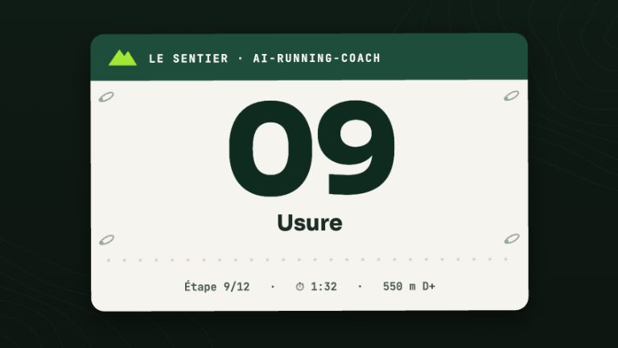

# Skill : `/inspection` — faire inspecter une paire

> **Description** : Commande courte pour lancer l'inspection photo d'**une** paire de chaussures : désigner la paire, recevoir les photos, puis laisser [`gear-inspection`](gear-inspection.md) lire l'usure, comparer avec la précédente et tout ranger dans `gear/`.

<!-- arc-video:materiel -->

En vidéo · Étape 09 · 1 min 47

**[Usure](../video/materiel/index.html)** — Du kilométrage à l'inspection photo : alerte de seuil, verdict en quatre couleurs, indices de foulée (jamais un diagnostic), foulée mesurée, kits et bilan de carrière.

[Regarder](../video/materiel/index.html) · [English](../video/materiel/index.html?lang=en) · [Toutes les vidéos](../videos.md)

<!-- /arc-video -->

## Faire inspecter une paire, pas à pas

### 1. Quand le faire

- le [tableau de bord](../dashboard/views.md#materiel) affiche « **Inspection conseillée** » sur une paire (environ 200 km depuis la dernière inspection, ou seuil d'alerte franchi) ;
- le coach vous la **propose** dans une conversation (jamais imposée, jamais pendant la synchronisation automatique) ;
- à la demande, quand vous voyez une usure inhabituelle ou avant de retirer une paire.

### 2. Comment la lancer

| Vous écrivez | Ce qui se passe |
|---|---|
| `/inspection` | Le coach liste vos paires actives avec leur rappel (« ≈ 210 km depuis la dernière », « jamais inspectée », « seuil d'alerte franchi ») et **propose la plus urgente** |
| `/inspection pegasus` | Il retrouve la paire par son `id:`, son nom, son identifiant dérivé du nom ou son `garmin:` |
| « Je veux inspecter mes Pegasus » | Même chose en langage naturel |

Si vous n'avez encore déclaré aucune paire, le coach renvoie vers la syntaxe du profil
(`planning/Runner_Profile.md`, « Matériel & lieux » → `### Chaussures`) ou, avec Garmin comme source de données (`[data].source = "garmin"`, défaut), vers la simulation de
[reprise du matériel Garmin](../garmin-setup.md#rattraper-le-materiel-de-lhistorique) (elle ne modifie rien sans `--apply`).
Si toutes vos paires sont retirées ou ignorées, le coach le dit (il ne prétend pas qu'il n'y en a aucune).

### 3. Désigner la paire

Une inspection porte sur **une paire**. Si votre texte correspond à plusieurs paires (deux Pegasus)
ou à aucune, le coach **vous demande** en listant les candidats : il ne choisit jamais à votre place
et ne crée pas de paire à partir de ce que vous avez écrit.

- Une paire **retirée** : le coach vous le dit et propose d'abord son **bilan de carrière** ; une dernière inspection reste possible.
- Une paire **ignorée** : elle n'est pas suivie, donc pas de rappel ; le coach ne l'inspecte que si vous insistez.

### 4. Envoyer les photos

Le coach vous donne le protocole en une liste : les **deux semelles à plat**, une **vue latérale** par
chaussure, une **vue arrière** sur surface plane, la **tige**, et une **pièce ou une règle** dans le
cadre (sans elle, aucune mesure en millimètres).

| Comment | Résultat |
|---|---|
| **Copier les photos** (n'importe quel nom) dans `gear/photos/` de votre workspace, puis dire « c'est fait » | **Chemin recommandé**, valable quel que soit le client : le coach les repère, les renomme et les cite dans l'inspection |
| **Terminal Claude Code** : donner le chemin du fichier | Le coach lit l'image depuis ce chemin et peut la ranger dans `gear/photos/` |
| **Application de bureau Claude, VS Code, autres IDE** (Copilot, OpenCode, Gemini CLI…) | Même règle partout : déposez les fichiers dans `gear/photos/` ou donnez leur chemin ; une image collée est lue mais pas enregistrée |
| **Image collée** dans la conversation | Le coach la **voit** et peut inspecter, mais elle ne peut pas être enregistrée : `photos` reste absent du fichier d'inspection, et il le dit |
| **Téléphone (Remote Control)** | Envoi d'images **à valider** : voir [Le coach dans la poche](../mobile.md) ; en attendant, copiez les photos dans `gear/photos/` du serveur (synchronisation de fichiers, `scp`…) puis lancez `/inspection` depuis le téléphone |

Les photos déposées dans `gear/photos/` et citées par aucune inspection sont des **candidates** :
si la paire n'est pas évidente, le coach demande à laquelle elles appartiennent, puis les renomme
`AAAA-MM-JJ_<gear_id>_<vue>.<ext>` (`semelles`, `profil`, `arriere`, `tige` ; extension d'origine conservée),
**dans ce dossier uniquement**. Il n'écrase jamais un fichier existant (deux vues du même type :
`_profil-gauche` / `_profil-droite`, sinon `_profil-2`…) et ne supprime jamais une photo.

!!! warning "Formats : JPEG, PNG ou WebP uniquement"
    Les photos d'iPhone au format **HEIC** (et TIFF…) ne sont pas prises en charge : exportez-les
    en JPEG avant de les déposer. Le coach liste les fichiers qu'il a ignorés et vous explique pourquoi.

### 5. Ce que vous obtenez

Un verdict 🟢🟡🟠🔴 écrit en toutes lettres et justifié visuellement, la comparaison avec la
dernière inspection de la même paire, des **indices** de foulée (jamais un diagnostic), et ce qui n'a
pas pu être évalué. Sans photo ni description écrite de l'usure, le coach **n'écrit rien** et
redemande. Détail : [Inspection des chaussures](gear-inspection.md).

### 6. Où c'est rangé

`gear/AAAA-MM-JJ_<gear_id>_inspection.md` (bloc `arc` `gear_inspection`), photos dans
`gear/photos/` (gitignoré, jamais dans le dépôt public). Après l'écriture, la vue
[Matériel](../dashboard/views.md#materiel) du tableau de bord montre l'inspection dans l'historique
de la paire, avec ses vignettes, et le rappel « Inspection conseillée » disparaît.

## Garde-fous

- Commande **interactive** : jamais lancée en mode headless, jamais proposée par `/garmin-daily-sync`.
- Comme les autres commandes courtes, elle ne propose **jamais** `/coach-setup`.
- Aucune donnée de santé lue : indépendante de `[health].morning_check` et de `[data].source`.

## Fichier source

`skills/inspection/SKILL.md`
