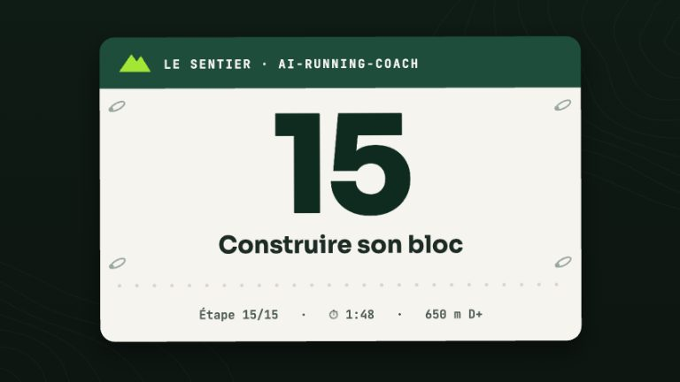

# Renforcement : bibliothèque d'exercices et programmes

<!-- arc-video:bloc -->
<div class="arc-video-card" markdown>

[](video/bloc/index.html)

<div markdown>

<span class="arc-video__meta">En vidéo · Étape 15 · 1 min 48</span>

**[Construire son bloc](video/bloc/index.html)** — Un bloc d'entraînement qui ne s'invente plus : gabarits de périodisation, squelette semaine par semaine relu par les garde-fous, frise du bloc sur le tableau de bord, renforcement par phase et prévention ciblée.

[Regarder](video/bloc/index.html) · [English](video/bloc/index.html?lang=en) · [Toutes les vidéos](videos.md)

</div>

</div>
<!-- /arc-video -->

Le coach ne réinvente plus ses séances de renforcement : il puise dans une
**bibliothèque livrée avec le moteur** (`config/strength/exercises.json` et
`config/strength/programmes.json`, en français) et laisse un script faire le calcul
déterministe — choix du programme, repli selon votre matériel, charge allégée à
l'affûtage, charge utile Garmin. Story #191 de l'épopée #173.

!!! warning "Approximations du projet"
    Tous les nombres (séries, répétitions, tempos, repos, séances par semaine, règles de
    placement, facteur d'affûtage) sont des **approximations du projet** : des points de
    départ prudents et génériques, pas des prescriptions. Votre profil, votre bilan matinal,
    les garde-fous et l'avis d'un professionnel de santé priment toujours. La bibliothèque
    **ne pose aucun diagnostic** et ne traite aucune blessure ; les notes de précaution sont
    génériques. En cas de douleur : on s'arrête et on consulte.

## La commande

```bash
python3 scripts/arc_index.py strength                                   # catalogue (phases, usages, programmes)
python3 scripts/arc_index.py strength --phase specific                  # programme de la phase « spécifique »
python3 scripts/arc_index.py strength --use descente --phase development
python3 scripts/arc_index.py strength --phase base --equipment dumbbell,step --text
python3 scripts/arc_index.py strength --use hanches --garmin-json       # charge utile Garmin (aucune écriture)
```

- `--phase` : `base`, `development`, `specific`, `taper`, `recovery` (ou leur libellé
  français, ou l'emphase du [gabarit de périodisation](plans.md)). Avec un gabarit, c'est son
  **emphase** qui compte : la phase spécifique des gabarits route vise `entretien` (et non la
  pliométrie) — le coach passe alors `--phase entretien`.
- `--use` : `descente`, `cheville`, `hanches`, `pied`.
- `--equipment` : `none`, `elastic`, `dumbbell`, `step`, `box` (liste séparée par des
  virgules ; `none` — le poids du corps — est toujours disponible). Sans cette option, la
  commande lit la puce **Équipement** de votre profil (`[athlete].profile`, par défaut
  `planning/Runner_Profile.md`) : mots entiers, accents et pluriels tolérés (« haltères »,
  « élastiques », « marche », « banc », « salle de sport »…), négations simples écartées
  (« pas d'haltères ») ; « aucun », « rien » ou « poids du corps » seuls = poids du corps. Si elle
  est vide ou n'a pas de mot reconnu, le matériel est dit **inconnu** : aucun repli n'est
  appliqué et la sortie contient une `question` — le coach vous la pose, il ne devine pas.
- Sortie : JSON par défaut ; `--text` pour une version lisible (celle qui sert de
  description à un événement intervals.icu, une ligne par exercice) ; `--garmin-json` pour la
  charge utile Garmin. Lecture seule, sans index, sans appel réseau.

## Les programmes

Programmes **par phase** — les emphases sont celles des gabarits de périodisation (champ
`strength` de `config/plans/*.json`, voir [Gabarits de périodisation](plans.md)) :

| Phase | Emphase | Programme | Séances / sem. | Fatigue |
|---|---|---|---|---|
| Base | `force_maximale` | `base_force_generale` — force, charges lourdes progressives (6 à 8 répétitions, RPE 8) | 1-2 | modérée |
| Développement | `force_endurance` | `developpement_force_pliometrie` — force-endurance (10 à 15 répétitions, RPE 7), introduction à la pliométrie | 1-2 | modérée |
| Spécifique | `pliometrie_excentrique` | `specifique_excentrique_pliometrie` — excentrique et pliométrie courte | 1-2 | élevée |
| Affûtage | `entretien` | `affutage_entretien` — entretien à faible volume, aucune nouveauté | 1 | faible |
| Récupération | `mobilite` | `recuperation_mobilite` — mobilité, sans charge | 2-3 | faible |

Programmes **par usage** :

| Usage | Programme | Fenêtre recommandée | Fatigue |
|---|---|---|---|
| `descente` | `usage_descente` — quadriceps et mollets en excentrique | développement, spécifique | élevée |
| `cheville` | `usage_cheville` — mollets, soléaire, releveurs, équilibre | toutes | faible |
| `hanches` | `usage_hanches` — fessiers, abducteurs, gainage latéral | toutes | faible |
| `pied` | `usage_pied` — activation du pied, équilibre | toutes | faible |

Combiner `--phase` et `--use` renvoie le programme d'usage, avec une alerte s'il est hors de
sa fenêtre. À l'affûtage, ses séries sont multipliées par 0,67 (arrondi, minimum 1) et la
pliométrie est retirée ; en phase de récupération, c'est le programme de mobilité qui est
proposé à la place.

Chaque exercice d'un programme porte séries, répétitions (ou secondes), repos, tempo
(`D-P-M` : descente-pause-montée, en secondes) et une consigne de charge en effort ressenti
(« 2 répétitions de réserve »), jamais une charge en kilos inventée.

## Placement dans la semaine

Chaque programme a un niveau de fatigue (faible, modérée, élevée) ; la sortie contient les
écarts minimaux correspondants (approximations du projet) :

| Fatigue | Avant une séance de qualité | Avant une sortie longue | Avant la course |
|---|---|---|---|
| élevée | 48 h | 48 h | 7 jours |
| modérée | 24 h | 36 h | 5 jours |
| faible | aucun | aucun | 2 jours |

Autrement dit : **jamais la veille d'une VMA ou d'une séance de qualité** pour les
programmes à fatigue élevée ou modérée ; le mieux est le jour d'une séance de qualité (après
elle) ou un jour facile. La fonction `check_placement` de `scripts/arc_strength.py` contrôle
un placement candidat. La sensation de fatigue de l'athlète prime.

## Matériel manquant

Si un exercice demande un matériel absent, il est remplacé par la première de ses
**régressions** utilisable (par exemple la descente de marche devient un squat à descente
lente sans marche) ; sans repli, il est retiré. Les remplacements et retraits figurent dans
la sortie (`substitutions`, `dropped`) : rien n'est silencieux.

## Pousser la séance

Le coach pousse la séance par le chemin existant (voir
[Planification Garmin](skills/garmin-workout-scheduling.md)) : les règles de confirmation
sont **inchangées** — jamais d'écriture Garmin sans « oui » explicite dans la conversation,
jamais en mode headless. `--garmin-json` rend deux charges utiles :

- `workout_data` : le DTO structuré du skill (boucle `RepeatGroupDTO` par exercice, étapes en
  répétitions ou en temps, repos), à pousser par `schedule_workouts` ;
- `create_strength_workout` : les arguments de l'outil simplifié du serveur `garmin-mcp`. Cet
  outil ne peut pas porter la clé d'exercice Garmin (son `name` sert aussi d'`exerciseName`) :
  il n'envoie que la `category` ; le nom français reste dans la description.

Avec `[data].source = "intervals"` (ou sans correspondance Garmin), la version `--text`
sert de `description` de l'événement (skill `intervals-icu-best-practices`).

### Correspondance Garmin vérifiée

Chaque correspondance est un couple (`category`, `exercise`) **exact** du catalogue public de
Garmin Connect (`https://connect.garmin.com/web-data/exercises/Exercises.json`, 47 catégories,
1531 exercices, relevé le 2026-10-04), recoupé avec `garminconnect/exercises.py` de
python-garminconnect et avec le serveur `garmin-mcp` épinglé par `install.sh`, qui valide la
`category` contre ce même catalogue. La liste blanche est dans le code
(`GARMIN_VERIFIED` de `scripts/arc_strength.py`) ; un couple absent de cette liste fait échouer
la validation de la bibliothèque. Un exercice sans équivalent vérifié porte `garmin: null` (colonne
« texte seul ») : il part sans `category` ni `exerciseName`, son nom français dans la description.
La correspondance choisit la variante **la plus proche**, pas toujours le même mouvement.

## Prévention ciblée

Une douleur que vous avez **déclarée** (`/log`, le parcours « Douleur » de Telegram, ou un bilan
`medical`) peut être reliée à une routine douce de la bibliothèque. Story #192 de l'épopée #173.

```bash
python3 scripts/arc_index.py prevention                       # 14 derniers jours, JSON
python3 scripts/arc_index.py prevention --days 21 --text      # plus long, lisible
python3 scripts/arc_index.py prevention --acute mollet        # vous la décrivez vive, nouvelle ou gonflée
python3 scripts/arc_index.py prevention --known mollet        # vous confirmez une gêne connue, non aiguë, stable
python3 scripts/arc_index.py prevention --equipment elastic   # sinon : puce « Équipement » du profil
```

La commande lit les déclarations `pain` de `medical/*_health.md` (index dérivé), ramène chaque
zone saisie en texte libre à une **zone** du vocabulaire normalisé — accents, pluriels et
synonymes tolérés (« Tendon d'Achille gauche », « voute plantaire », « lombaires »…) — puis rend,
par zone, un statut :

| Statut | Sens |
|---|---|
| `prevention_ok` | gêne légère, connue et stable : une **routine douce** est proposée (2 séries, effort facile, sans impact, sans pliométrie ni excentrique dédié) |
| `observe` | gêne légère pas encore confirmée (une seule déclaration, ou deux à moins de 2 jours d'écart) : **aucun exercice**, trois questions (nouvelle ? vive ? gonflement ?) |
| `consult` | aucun exercice ; `consult_level` = `urgent` ou `advised`, avec les raisons |
| `no_data` | aucune douleur déclarée sur la fenêtre, ou zone non reconnue : rien n'est inventé, le coach demande |

Les **zones** reconnues sont : tendon d'Achille, cheville, mollet, tibia, genou (face avant ou
externe), hanche, fessier, ischio-jambiers, pied (voûte, talon) et bas du dos. Seules des
**zones anatomiques** sont nommées : jamais une pathologie, jamais un traitement. Chaque zone
renvoie à un sous-ensemble doux de la bibliothèque (correspondance dans
`config/strength/prevention.json`, programmes d'usage cheville / hanches / pied quand ils
existent) et à une règle de progression : rester au niveau doux tant que la gêne est déclarée,
n'avancer d'un cran qu'après 14 jours sans gêne.

### Règles de sécurité (déterministes)

Appliquées dans cet ordre, **avant** toute proposition. Tous les seuils sont des
**approximations du projet**, jamais un diagnostic ni un protocole publié :

1. **Score ≥ seuil de consultation** (`[injury_risk].pain_consult_threshold`, 7/10 par défaut) :
   aucun exercice, consultation d'un professionnel de santé recommandée (même formulation que
   `/log` et Telegram).
2. **Douleur aiguë** (nouvelle, vive, avec gonflement : mots-clés dans la zone déclarée, ou
   `--acute`) : aucun exercice de charge, consultation. Le contrat des données ne porte qu'une
   zone et un score : sans signal, le coach **demande** si la douleur est nouvelle ou vive,
   l'absence de signal ne vaut pas preuve de bénignité.
3. **Drapeau de risque de blessure** (#57, `consult` ou niveau `high`) : toutes les routines sont
   bloquées, il n'est jamais assoupli.
4. **Score > 3/10, douleur qui s'aggrave** (au moins un point de plus entre la première et la
   dernière déclaration) **ou qui dure plus de 7 jours** : aucun exercice, avis professionnel
   conseillé.
5. **Gêne légère pas encore confirmée** (une seule déclaration, ou déclarations à moins de 2 jours
   d'écart) : statut `observe`, **aucun exercice**. Le coach vous pose trois questions — est-ce
   nouveau ? vif ou brutal ? avec un gonflement ? Un « oui » mène à `--acute` (consultation) ; si
   **vous** confirmez une gêne connue, non aiguë et stable, il relance avec `--known` ; sinon la
   routine n'arrive qu'avec une deuxième déclaration au moins 2 jours plus tard, sans hausse.
6. **Seulement une gêne légère (≤ 3/10), confirmée et stable** : routine douce de prévention.

Une zone dont la dernière déclaration est à 0/10 est considérée comme résolue — sauf si la fenêtre
contient un score au-dessus du seuil de consultation ou une douleur aiguë : la recommandation de
consulter reste alors affichée. Un drapeau de risque de blessure qui n'a pas pu être évalué n'est
jamais supposé bas : aucune routine.

Choix par zone, exercice par exercice (approximations du projet, volontairement prudentes) : pas
d'étirement appuyé pour le tendon d'Achille ni le mollet, ni chaise murale, squat ou fente pour le
genou, ni balancier ample, flexion glissante ou nordique pour les ischio-jambiers, aucun impact pour
le tibia ; le « niveau suivant » affiché n'est jamais un exercice excentrique dédié ni de la
pliométrie.

### Qui décide

- Si l'agent `medical` est dans `[agents].enabled`, **c'est lui qui décide** et le coach relaie,
  sans jamais assouplir (`decision_owner: "medical"`).
- Sinon, le coach applique ces règles et dit toujours **« ce n'est pas un avis médical »**
  (`decision_owner: "coach"`).
- Rien n'est poussé automatiquement : une douleur saisie par `/log` ou Telegram permet au coach
  de **proposer** la routine à la prochaine interaction. Un éventuel envoi vers la montre garde la
  règle habituelle (confirmation explicite, jamais en mode headless).

## Sources

Deux revues, vérifiées par Crossref, citées pour la **direction** seulement — un entraînement de
force peut améliorer l'économie de course et la performance des coureurs d'endurance — jamais
pour un dosage :

- Blagrove RC, Howatson G, Hayes PR. *Effects of Strength Training on the Physiological
  Determinants of Middle- and Long-Distance Running Performance: A Systematic Review.*
  Sports Med. 2018;48(5):1117-1149. doi:10.1007/s40279-017-0835-7
- Beattie K, Kenny IC, Lyons M, Carson BP. *The Effect of Strength Training on Performance in
  Endurance Athletes.* Sports Med. 2014;44(6):845-865. doi:10.1007/s40279-014-0157-y

## La bibliothèque

Liste complète des exercices, avec l'identifiant à utiliser, la cible, le matériel et la
correspondance Garmin. Les consignes, progressions, régressions et précautions sont dans
`config/strength/exercises.json`.

### Force, hanches et gainage

| Exercice | Identifiant | Cible | Matériel | Garmin |
|---|---|---|---|---|
| Squat au poids du corps | `squat_poids_du_corps` | quadriceps, fessiers | aucun | `SQUAT` / `AIR_SQUAT` |
| Squat gobelet (haltère) | `squat_gobelet` | quadriceps, fessiers | haltères | `SQUAT` / `GOBLET_SQUAT` |
| Squat à descente lente (excentrique) | `squat_excentrique_lent` | quadriceps_excentrique, fessiers | aucun | `SQUAT` / `AIR_SQUAT` |
| Chaise murale (isométrique) | `chaise_murale` | quadriceps | aucun | `SQUAT` / `BODY_WEIGHT_WALL_SQUAT` |
| Montée de marche | `montee_de_marche` | quadriceps, fessiers, equilibre | marche | `SQUAT` / `STEP_UP` |
| Montée de marche lestée | `montee_de_marche_lestee` | quadriceps, fessiers | marche, haltères | `SQUAT` / `DUMBBELL_STEP_UP` |
| Descente de marche contrôlée (excentrique) | `descente_de_marche_excentrique` | quadriceps_excentrique, fessiers | marche | texte seul |
| Fente arrière | `fente_arriere` | quadriceps, fessiers, equilibre | aucun | `LUNGE` / `LUNGE` |
| Fente arrière lestée | `fente_arriere_lestee` | quadriceps, fessiers | haltères | `LUNGE` / `DUMBBELL_REVERSE_LUNGE` |
| Fente bulgare (pied arrière surélevé) | `fente_bulgare` | quadriceps, fessiers, equilibre | haltères, box/banc | `LUNGE` / `DUMBBELL_BULGARIAN_SPLIT_SQUAT` |
| Fente latérale | `fente_laterale` | adducteurs, quadriceps, fessiers | aucun | `LUNGE` / `SIDE_LUNGE` |
| Pont fessier | `pont_fessier` | fessiers, ischio_jambiers | aucun | `HIP_RAISE` / `HIP_RAISE` |
| Pont fessier unilatéral | `pont_fessier_unilateral` | fessiers, ischio_jambiers, gainage | aucun | `HIP_RAISE` / `SINGLE_LEG_HIP_RAISE` |
| Pont fessier unilatéral, pied surélevé | `pont_fessier_pied_sureleve` | fessiers, ischio_jambiers | box/banc | `HIP_RAISE` / `SINGLE_LEG_HIP_RAISE_WITH_FOOT_ON_BENCH` |
| Soulevé de terre roumain à une jambe (haltère) | `souleve_de_terre_roumain_unilateral` | ischio_jambiers, fessiers, equilibre | haltères | `DEADLIFT` / `SINGLE_LEG_ROMANIAN_DEADLIFT_WITH_DUMBBELL` |
| Good morning avec élastique (charnière de hanche) | `bonjour_elastique` | ischio_jambiers, fessiers | élastique | `LEG_CURL` / `BAND_GOOD_MORNING` |
| Flexion de jambes glissante (ischio-jambiers) | `flexion_jambe_glissante` | ischio_jambiers | aucun | `LEG_CURL` / `SLIDING_LEG_CURL` |
| Flexion de jambes glissante à une jambe | `flexion_jambe_glissante_unilaterale` | ischio_jambiers | aucun | `LEG_CURL` / `SINGLE_LEG_SLIDING_LEG_CURL` |
| Nordique assisté (ischio-jambiers, excentrique) | `nordique_assiste` | ischio_jambiers | aucun | texte seul |
| Montée sur pointes (mollets) | `mollet_debout` | mollet_gastrocnemien | aucun | `CALF_RAISE` / `STANDING_CALF_RAISE` |
| Montée sur pointe à une jambe | `mollet_unipodal` | mollet_gastrocnemien | aucun | `CALF_RAISE` / `SINGLE_LEG_STANDING_CALF_RAISE` |
| Montée sur pointe à une jambe, lestée | `mollet_unipodal_lestee` | mollet_gastrocnemien, soleaire | haltères, marche | `CALF_RAISE` / `SINGLE_LEG_STANDING_DUMBBELL_CALF_RAISE` |
| Montée sur pointe genou fléchi (soléaire) | `soleaire_genou_flechi` | soleaire | aucun | `CALF_RAISE` / `SINGLE_LEG_BENT_KNEE_CALF_RAISE` |
| Descente de pointe excentrique sur marche | `mollet_excentrique_marche` | mollet_gastrocnemien, soleaire | marche | `CALF_RAISE` / `SINGLE_LEG_STANDING_CALF_RAISE` |
| Flexion dorsale de cheville avec élastique | `tibial_elastique` | tibial_anterieur | élastique | `WARM_UP` / `ANKLE_DORSIFLEXION_WITH_BAND` |
| Relevé de pointes dos au mur | `tibial_mur` | tibial_anterieur | aucun | texte seul |
| Marche sur pointes avec haltères | `marche_pointes_halteres` | mollet_gastrocnemien, intrinseques_pied, gainage | haltères | `CARRY` / `FARMERS_WALK_ON_TOES` |
| Coquille (clam shell) avec élastique | `coquille_elastique` | abducteurs_hanche, fessiers | élastique | `BANDED_EXERCISES` / `CLAM_SHELLS` |
| Marche latérale avec élastique | `marche_laterale_elastique` | abducteurs_hanche, fessiers | élastique | `BANDED_EXERCISES` / `LATERAL_BAND_WALKS` |
| Abduction de hanche allongé sur le côté | `abduction_allongee_cote` | abducteurs_hanche, fessiers | aucun | `HIP_STABILITY` / `SIDE_LYING_LEG_RAISE` |
| Extension de hanche à quatre pattes | `extension_hanche_quadrupedie` | fessiers, gainage | aucun | `HIP_STABILITY` / `QUADRUPED_HIP_EXTENSION` |
| Planche (gainage ventral) | `planche` | gainage | aucun | `PLANK` / `PLANK` |
| Planche latérale | `planche_laterale` | gainage, abducteurs_hanche | aucun | `PLANK` / `SIDE_PLANK` |
| Planche latérale avec jambe levée | `planche_laterale_jambe_levee` | gainage, abducteurs_hanche | aucun | `PLANK` / `SIDE_PLANK_WITH_LEG_LIFT` |
| Insecte mort (dead bug) | `insecte_mort` | gainage | aucun | `HIP_STABILITY` / `DEAD_BUG` |

### Pliométrie

| Exercice | Identifiant | Cible | Matériel | Garmin |
|---|---|---|---|---|
| Saut squat | `saut_squat` | pliometrie, quadriceps, fessiers | aucun | `PLYO` / `BODY_WEIGHT_JUMP_SQUAT` |
| Rebonds sur les chevilles (pogos) | `rebonds_cheville` | pliometrie, mollet_gastrocnemien | aucun | texte seul |
| Saut latéral (patineur) | `saut_lateral` | pliometrie, abducteurs_hanche, equilibre | aucun | `PLYO` / `LATERAL_LEAP_AND_HOP` |
| Fente sautée alternée | `fente_sautee_alternee` | pliometrie, quadriceps, fessiers | aucun | `PLYO` / `ALTERNATING_JUMP_LUNGE` |
| Saut sur box | `saut_sur_box` | pliometrie, quadriceps, fessiers | box/banc | `PLYO` / `BOX_JUMP` |

### Mobilité

| Exercice | Identifiant | Cible | Matériel | Garmin |
|---|---|---|---|---|
| Étirement des mollets | `etirement_mollet` | mollet_gastrocnemien, soleaire, mobilite_cheville | aucun | `WARM_UP` / `STRETCH_CALF` |
| Mobilité de cheville genou au mur | `mobilite_cheville_genou_mur` | mobilite_cheville | aucun | texte seul |
| Étirement des fléchisseurs de hanche (fente) | `etirement_flechisseurs_hanche` | mobilite_hanche, quadriceps | aucun | `WARM_UP` / `STRETCH_LUNGING_HIP_FLEXOR` |
| Étirement des ischio-jambiers | `etirement_ischio` | ischio_jambiers, mobilite_hanche | aucun | `WARM_UP` / `STRETCH_HAMSTRING` |
| Étirement des quadriceps | `etirement_quadriceps` | quadriceps, mobilite_hanche | aucun | `WARM_UP` / `STRETCH_QUAD` |
| Posture du pigeon (fessiers, rotateurs de hanche) | `pigeon` | mobilite_hanche, fessiers | aucun | `WARM_UP` / `STRETCH_PIGEON_POSE` |
| Mobilité de hanche 90/90 | `mobilite_90_90` | mobilite_hanche | aucun | `WARM_UP` / `STRETCH_90_90` |
| Rotation thoracique | `rotation_thoracique` | mobilite_thoracique | aucun | `WARM_UP` / `THORACIC_ROTATION` |
| Balancier de jambes (échauffement dynamique) | `balancier_jambes` | mobilite_hanche, ischio_jambiers | aucun | `WARM_UP` / `FORWARD_AND_BACKWARD_LEG_SWINGS` |

### Pied et équilibre

| Exercice | Identifiant | Cible | Matériel | Garmin |
|---|---|---|---|---|
| Pied court (activation du pied) | `pied_court` | intrinseques_pied | aucun | texte seul |
| Rapprocher une serviette avec les orteils | `serviette_orteils` | intrinseques_pied | aucun | texte seul |
| Équilibre unipodal | `equilibre_unipodal` | equilibre, intrinseques_pied, fessiers | aucun | texte seul |

